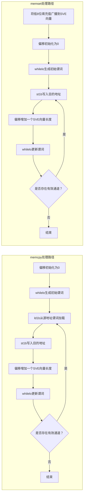

# SVE memcall inline优化

SVE memcall inline优化是 openEuler GCC 12 针对`memcpy`和`memset`的 AArch64 代码生成优化，用于将符合条件的内存操作内联展开为 SVE 循环。

## 1 优化原理

当 GCC 为`memcpy`或`memset`生成库函数调用时，调用点通常通过`bl`记录返回地址并转入库函数，库函数再通过`ret`返回。除实际的内存访问外，这一过程还包含函数调用和返回的控制转移。根据库函数实现及寄存器使用情况，被调用函数还可能使用`stp`、`ldp`等指令保存和恢复寄存器。上述开销相对固定，因此在小尺寸内存操作中占比更高。库函数调用与 SVE 内联展开的执行路径对比如下：

```text
传统库函数调用                         SVE 内联展开
─────────────────                    ─────────────────

调用方                               调用方
  │                                    │
  ├─ 参数准备                           ├─ 生成谓词
  │                                    ├─ 谓词控制的 SVE 内存访问
  ├─ bl memcpy / memset ─────┐         ├─ 循环推进
  │                          │         ├─ 谓词判断
  │             memcpy / memset()      │
  │             ├─ 可能保存寄存器        ▼
  │             ├─ 内存复制或填充      后续代码
  │             ├─ 可能恢复寄存器
  │             └─ ret
  │                          │
  ◀──────────────────────────┘
  │
  ▼
后续代码

额外路径：bl / ret，以及可能的 stp / ldp
```

SVE memcall inline优化将符合条件的内存操作直接展开在调用点内，减少了`bl`、`ret`以及可能的寄存器保存和恢复开销。将内存操作内联后，还需要处理操作长度并非 SVE 向量长度整数倍的情况。SVE 的向量长度无关编程模型为此提供了统一的处理方式：每轮循环按照运行时有效的 SVE 向量长度推进，并通过谓词标记参与本轮内存访问的有效字节通道。SVE 谓词处理尾部数据的过程如下：

```text
待处理数据：22 Byte
假设本次运行的 SVE 向量长度：16 Byte

第 1 轮（偏移为 0）
数据：  [0][1][2][3][4][5][6][7] ... [14][15]
谓词：   ✓  ✓  ✓  ✓  ✓  ✓  ✓  ✓       ✓   ✓
        └────────── 16 Byte ──────────┘

                    ↓ SVE 内存访问

第 2 轮（偏移为 16）
数据：  [16][17][18][19][20][21][--][--] ... [--]
谓词：    ✓   ✓   ✓   ✓   ✓   ✓   ×   ×        ×
         └── 有效数据 ──┘      └── 关闭的通道 ──┘

                    ↓ SVE 内存访问

仅访问有效的 6 Byte，无需生成单独的标量尾循环
```

示例中，第一轮处理完整的 16 Byte，第二轮仅启用对应剩余 6 Byte 的通道，关闭的通道不发起内存访问。由此，同一循环既能适配不同的 SVE 向量长度，也能处理不足一个向量长度的尾部数据，而不需要额外的标量尾循环。

## 2 技术架构

### 2.1 内联入口与生效条件

GCC 将可识别的`memcpy`和`memset`转换为块内存操作，并分别通过`cpymemdi`和`setmemdi`进入 AArch64 后端展开流程。SVE memcall inline优化在该阶段检查内联条件，符合条件时进入 SVE 循环生成流程。

基础生效条件如下：

- **内存操作类型**：仅处理`memcpy`和`memset`，不处理`memmove`。
- **目标指令集**：目标处理器必须支持 SVE。
- **特性开关**：需要启用`-maarch64-sve-memcall-inlining`。
- **内存对齐**：使用严格对齐模式时，编译器已知的内存对齐不得低于 16 字节。

不满足上述基础条件时，该内存操作不使用 SVE 内联优化，继续由 GCC 原有的`memcpy`或`memset`代码生成逻辑处理。

### 2.2 长度判定与回退

内联阈值是包含式上限，操作长度等于阈值时仍可进入 SVE 内联循环。编译期已知长度和运行时长度的处理方式如下：

| 长度类型 | 运行时长度检查 | 代码生成方式 |
| --- | --- | --- |
| 编译期已知，长度不超过阈值 | 不适用 | 生成 SVE 内联循环 |
| 编译期已知，长度超过阈值 | 不适用 | 使用 GCC 12 原有的`memcpy`或`memset`代码生成逻辑 |
| 运行时确定 | 开启 | 长度不超过阈值时执行 SVE 内联循环，超过阈值时直接调用对应库函数 |
| 运行时确定 | 关闭 | 不生成阈值检查和库函数回退路径，全部使用 SVE 内联循环 |

在本文给出的`-march=armv8-a+sve`和默认阈值配置下，编译期已知且超过阈值的操作最终生成库函数调用。

### 2.3 SVE 循环代码生成

`memcpy`和`memset`共用谓词生成和循环推进方式，数据处理流程如下：



*图1 `memcpy`和`memset`的 SVE 处理路径*

循环开始前和每轮末尾通过`whilelo`根据当前偏移和操作长度生成谓词。循环偏移每轮按运行时 SVE 向量长度递增，更新后的谓词仍包含有效通道时继续执行下一轮。`memcpy`使用`ld1b`从源地址加载数据，再使用`st1b`写入目的地址；`memset`先将填充值的低 8 位广播到 SVE 向量，再在谓词控制下使用`st1b`完成写入。

## 3 配置与使用

### 3.1 启用特性

编译时需要在目标架构选项中启用 SVE，并开启 SVE memcall inline优化：

```bash
gcc -O2 -march=armv8-a+sve \
  -maarch64-sve-memcall-inlining \
  source.c -o output
```

### 3.2 编译选项

| 编译选项或参数 | 默认值 | 作用 |
| --- | --- | --- |
| `-maarch64-sve-memcall-inlining` | 关闭 | 启用 SVE memcall inline优化 |
| `-mno-aarch64-sve-memcall-inlining` | — | 关闭 SVE memcall inline优化 |
| `--param=aarch64-sve-memcall-size-threshold=N` | 4096 | 设置常量长度操作进入 SVE 循环的长度上限；开启运行时长度检查时，同时作为变量长度操作的回退阈值，单位为字节 |
| `-maarch64-sve-memcall-runtime-check` | 开启 | 为变量长度操作生成阈值检查，超过阈值时调用库函数 |
| `-mno-aarch64-sve-memcall-runtime-check` | — | 不生成运行时长度检查，变量长度操作全部使用 SVE 循环 |

运行时长度检查选项仅在`-maarch64-sve-memcall-inlining`开启时生效。

### 3.3 调整内联阈值

使用`--param=aarch64-sve-memcall-size-threshold=N`设置内联阈值。例如，将阈值设置为 64 字节：

```bash
gcc -O2 -march=armv8-a+sve \
  -maarch64-sve-memcall-inlining \
  --param=aarch64-sve-memcall-size-threshold=64 \
  source.c -o output
```

该优化适用于热点路径中小尺寸`memcpy`和`memset`较多的场景，不适用于大尺寸内存操作频繁的场景。大尺寸内存操作使用 SVE 循环时会产生性能劣化，建议根据实际负载中`memcpy`和`memset`的长度分布调整阈值。变量长度操作的尺寸分布较广时，建议保持运行时长度检查开启，使超过阈值的操作回退为库函数调用。
