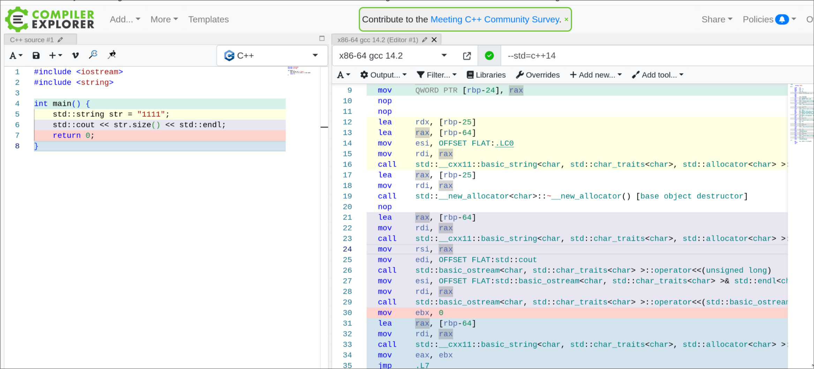
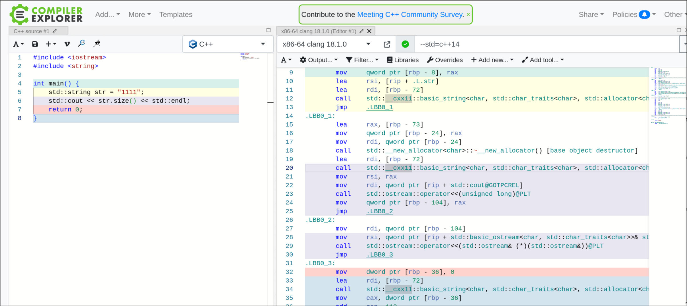
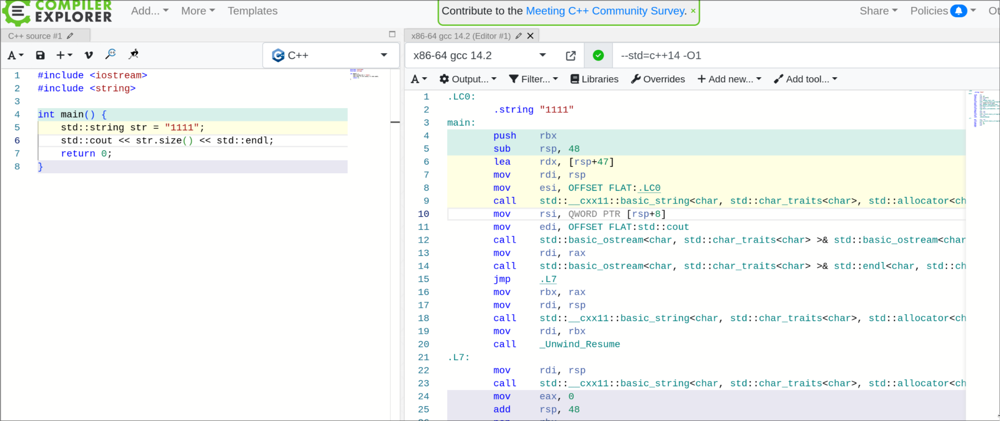
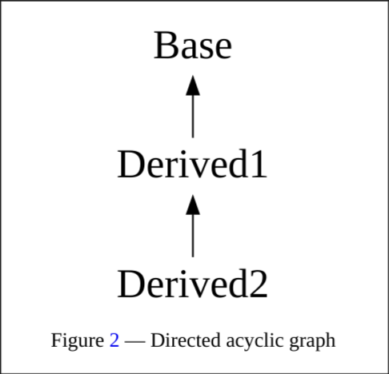

# C++ 14 标准中的 unspecified behavior

## GCC 与 LLVM  的行为一致

### 1. 成员函数的地址未指定

#### 描述

尚未指定 C++ 标准库中的任何成员函数是否被定义为内联函数 (7.1.2)。 实现可能在类内声明额外的非虚成员函数签名：

- 通过向成员函数签名添加默认值参数；[注：实现不能向虚函数、全局函数或非成员函数添加默认值参数。——注结束]
- 通过用两个或更多具有等效行为的成员函数签名替换带有默认值的成员函数签名；
- 通过为成员函数名添加一个成员函数签名。

对C++标准库中描述的成员函数签名的调用表现得如同实现未声明任何额外的成员函数签名。

[member.functions#address_of_member_function,unspecified](https://timsong-cpp.github.io/cppwp/n4140/member.functions#address_of_member_function,unspecified)

#### 代码

```cpp
#include <iostream>
#include <string>

int main() {
    std::string str = "1111";
    std::cout << str.size() << std::endl;
    return 0;
}
```

#### 结果





未加优化选项时，`std::string::size()` 会直接作为函数调用。




加了 `-O1` 优化之后，`std::string::size()` 的函数调用会直接被优化掉。

### 2. 具有不同访问控制的非静态数据成员的分配顺序

#### 描述

Nonstatic data members of a (non-union) class with the same access control (Clause 11) are allocated so that later members have higher addresses within a class object. The order of allocation of non-static data members with different access control is unspecified (Clause 11). Implementation alignment requirements might cause two adjacent members not to be allocated immediately after each other; so might requirements for space for managing virtual functions (10.3) and virtual base classes (10.1).

具有相同访问控制（第 11 节）的（非联合）类的非静态数据成员被分配时，后面的成员在类对象中的地址会更高。具有不同访问控制的非静态数据成员的分配顺序是未指定的（第 11 节）。实现对齐要求可能导致两个相邻的成员并不是紧接在一起分配的；虚函数（第 10.3 节）和虚基类（第 10.1 节）管理空间的要求也可能导致这种情况。 

访问控制指的是 `public`, `private` 和 `protected`

[class.mem#allocation,unspecified](https://timsong-cpp.github.io/cppwp/n4140/class.mem#allocation,unspecified)

#### 代码

```cpp
#include <iostream>

class Class {
public:
  int a;
  double b;
  void out() {
    std::cout << "a: " << &this->a << std::endl;
    std::cout << "b: " << &this->b << std::endl;
    std::cout << "c: " << &this->c << std::endl;
    std::cout << "d: " << &this->d << std::endl;
    std::cout << "e: " << &this->e << std::endl;
    std::cout << "f: " << &this->f << std::endl;
  }

private:
  int c;
  float d;

protected:
  int e;
  bool f;
};

int main() {
  Class obj;
  obj.out();
  return 0;
}
```

#### 结果

```bash
$ make cmp
g++ --std=c++14 -O3 2_acontrol.cpp -o test_gcc
./test_gcc > gcc_out
clang++ --std=c++14 -O3 2_acontrol.cpp -o test_clang
./test_clang > clang_out
./compare.sh
GCC 和 LLVM 输出不一致
a: 0x7ffddf808610
b: 0x7ffddf808618
c: 0x7ffddf808620
d: 0x7ffddf808624
e: 0x7ffddf808628
f: 0x7ffddf80862c

a: 0x7ffc73492af0
b: 0x7ffc73492af8
c: 0x7ffc73492b00
d: 0x7ffc73492b04
e: 0x7ffc73492b08
f: 0x7ffc73492b0c
```

从结果可以看出，GCC 和 LLVM 的实现是一致的。

### 3. 分配函数的调用与 `new` 初始化中表达式的求值顺序

#### 描述

The invocation of the allocation function is indeterminately sequenced with respect to the evaluations of expressions in the new-initializer.

分配函数的调用与 `new` 初始化中表达式的求值顺序是不确定的。

已分配对象的初始化在新表达式的值计算之前进行。如果分配函数返回空指针或通过异常退出，未指定 `new` 初始化中的表达式是否会被求值。

[expr.new#constructor,unspecified_argument_to](https://timsong-cpp.github.io/cppwp/n4140/expr.new#constructor,unspecified_argument_to)

```cpp
#include <iostream>
#include <functional>
#include <cstdlib>

void* operator new(std::size_t size) {
    std::cout << "size: " << size << std::endl;

    if (size > 0) {
        std::cout << "failure" << std::endl;
        return nullptr;
    }
    return std::malloc(size);
}

class A {
public:
    A(std::function<void()> side_effect) {
        side_effect();
        std::cout << "constructor called" << std::endl;
    }
    ~A() {
        std::cout << "destructor called" << std::endl;
    }
};

int main() {
    try {
        std::function<void()> side_effect = []() {
            std::cout << "effect in new-initializer" << std::endl;
        };
        A* a = new A(side_effect);
        delete a;
    } catch (const std::bad_alloc& e) {
        std::cout << "caught std::bad_alloc exception: " << e.what() << std::endl;
    }
    
    return 0;
}
```

```bash
$ make cmp
g++ --std=c++14 3_new_con_order.cpp -o test_gcc
3_new_con_order.cpp: In function ‘void* operator new(std::size_t)’:
3_new_con_order.cpp:11:16: warning: ‘operator new’ must not return NULL unless it is declared ‘throw()’ (or ‘-fcheck-new’ is in effect)
   11 |         return nullptr;
      |                ^~~~~~~
./test_gcc > gcc_out
clang++ --std=c++14 3_new_con_order.cpp -o test_clang
3_new_con_order.cpp:11:9: warning: null returned from function that requires a non-null return value [-Wnonnull]
   11 |         return nullptr;
      |         ^      ~~~~~~~
3_new_con_order.cpp:11:9: warning: 'operator new' should not return a null pointer unless it is declared 'throw()' or
      'noexcept' [-Wnew-returns-null]
2 warnings generated.
./test_clang > clang_out
./compare.sh
GCC 和 LLVM 输出一致
size: 1
failure
effect in new-initializer
constructor called
```

GCC 和 LLVM 实现一致，即会进行表达式的求值

### 4. 求值顺序

#### 描述

Given any two evaluations A and B, evaluations A and B are indeterminately sequenced when either A is sequenced before B or B is sequenced before A, but it is unspecified which.

给定任意两个求值 A 和 B，当 A 在 B 之前排序或 B 在 A 之前排序，但未指定哪个在前时，求值 A 和 B 是不确定排序的。

不确定排序的求值不能重叠，但任一可以先执行。

[intro.execution#evaluation,unspecified_order_of](https://timsong-cpp.github.io/cppwp/n4140/intro.execution#evaluation,unspecified_order_of)

#### 代码

```cpp
#include <iostream>

int main(void) {
    int a = 1, b = 2;
    std::cout << "(a + 1) * (b + 2): \n" << (a + 1) * (b + 2) << std::endl;
    return 0;
}
```

#### 结果

```bash
$ objdump --disassemble=main test_gcc 

test_gcc:     file format elf64-x86-64


Disassembly of section .init:

Disassembly of section .plt:

Disassembly of section .plt.got:

Disassembly of section .plt.sec:

Disassembly of section .text:

0000000000001189 <main>:
    1189:	f3 0f 1e fa          	endbr64
    118d:	55                   	push   %rbp
    118e:	48 89 e5             	mov    %rsp,%rbp
    1191:	48 83 ec 10          	sub    $0x10,%rsp
    1195:	c7 45 f8 01 00 00 00 	movl   $0x1,-0x8(%rbp)
    119c:	c7 45 fc 02 00 00 00 	movl   $0x2,-0x4(%rbp)
    11a3:	48 8d 05 5b 0e 00 00 	lea    0xe5b(%rip),%rax        # 2005 <_ZStL19piecewise_construct+0x1>
    11aa:	48 89 c6             	mov    %rax,%rsi
    11ad:	48 8d 05 8c 2e 00 00 	lea    0x2e8c(%rip),%rax        # 4040 <_ZSt4cout@GLIBCXX_3.4>
    11b4:	48 89 c7             	mov    %rax,%rdi
    11b7:	e8 b4 fe ff ff       	call   1070 <_ZStlsISt11char_traitsIcEERSt13basic_ostreamIcT_ES5_PKc@plt>
    11bc:	48 89 c2             	mov    %rax,%rdx
    11bf:	8b 45 f8             	mov    -0x8(%rbp),%eax
    11c2:	8d 48 01             	lea    0x1(%rax),%ecx
    11c5:	8b 45 fc             	mov    -0x4(%rbp),%eax
    11c8:	83 c0 02             	add    $0x2,%eax
    11cb:	0f af c1             	imul   %ecx,%eax
    11ce:	89 c6                	mov    %eax,%esi
    11d0:	48 89 d7             	mov    %rdx,%rdi
    11d3:	e8 b8 fe ff ff       	call   1090 <_ZNSolsEi@plt>
    11d8:	48 8b 15 f9 2d 00 00 	mov    0x2df9(%rip),%rdx        # 3fd8 <_ZSt4endlIcSt11char_traitsIcEERSt13basic_ostreamIT_T0_ES6_@GLIBCXX_3.4>
    11df:	48 89 d6             	mov    %rdx,%rsi
    11e2:	48 89 c7             	mov    %rax,%rdi
    11e5:	e8 96 fe ff ff       	call   1080 <_ZNSolsEPFRSoS_E@plt>
    11ea:	b8 00 00 00 00       	mov    $0x0,%eax
    11ef:	c9                   	leave
    11f0:	c3                   	ret

Disassembly of section .fini:

$ objdump --disassemble=main test_clang

test_clang:     file format elf64-x86-64


Disassembly of section .text:

00000000000025e0 <main>:
    25e0:	f3 0f 1e fa          	endbr64
    25e4:	55                   	push   %rbp
    25e5:	48 89 e5             	mov    %rsp,%rbp
    25e8:	48 83 ec 10          	sub    $0x10,%rsp
    25ec:	c7 45 fc 00 00 00 00 	movl   $0x0,-0x4(%rbp)
    25f3:	c7 45 f8 01 00 00 00 	movl   $0x1,-0x8(%rbp)
    25fa:	c7 45 f4 02 00 00 00 	movl   $0x2,-0xc(%rbp)
    2601:	48 8b 3d e0 21 00 00 	mov    0x21e0(%rip),%rdi        # 47e8 <_ZNSt3__14coutE@Base>
    2608:	48 8d 35 35 e7 ff ff 	lea    -0x18cb(%rip),%rsi        # d44 <_IO_stdin_used+0x4>
    260f:	e8 3c 00 00 00       	call   2650 <_ZNSt3__1lsB8se180100INS_11char_traitsIcEEEERNS_13basic_ostreamIcT_EES6_PKc>
    2614:	48 89 c7             	mov    %rax,%rdi
    2617:	8b 75 f8             	mov    -0x8(%rbp),%esi
    261a:	83 c6 01             	add    $0x1,%esi
    261d:	8b 45 f4             	mov    -0xc(%rbp),%eax
    2620:	83 c0 02             	add    $0x2,%eax
    2623:	0f af f0             	imul   %eax,%esi
    2626:	e8 75 0e 00 00       	call   34a0 <_ZNSt3__113basic_ostreamIcNS_11char_traitsIcEEElsEi@plt>
    262b:	48 89 c7             	mov    %rax,%rdi
    262e:	48 8d 35 9b 00 00 00 	lea    0x9b(%rip),%rsi        # 26d0 <_ZNSt3__14endlB8se180100IcNS_11char_traitsIcEEEERNS_13basic_ostreamIT_T0_EES7_>
    2635:	e8 66 00 00 00       	call   26a0 <_ZNSt3__113basic_ostreamIcNS_11char_traitsIcEEElsB8se180100EPFRS3_S4_E>
    263a:	31 c0                	xor    %eax,%eax
    263c:	48 83 c4 10          	add    $0x10,%rsp
    2640:	5d                   	pop    %rbp
    2641:	c3                   	ret

Disassembly of section .init:

Disassembly of section .fini:

Disassembly of section .plt:

Disassembly of section .plt.sec:
```

从汇编中可确定，GCC 和 LLVM 的求值顺序一致。

### 5. object 的初始化

#### 描述

if the initialization of an object obj1 refers to an object obj2 of namespace scope potentially requiring dynamic initialization and defined later in the same translation unit, it is unspecified whether the value of obj2 used will be the value of the fully initialized obj2 (because obj2 was statically initialized) or will be the value of obj2 merely zero-initialized.

如果对象 obj1 的初始化引用了命名空间范围的对象 obj2，该对象可能需要动态初始化，并且稍后在同一翻译单元中定义，则未指定所使用的 obj2 的值是完全初始化的 obj2 的值（因为 obj2 是静态初始化的）还是仅仅是零初始化的 obj2 的值

[basic.start.init#3.2](https://timsong-cpp.github.io/cppwp/n4140/basic.start.init#3.2)

#### 代码

```cpp
#include <iostream>

inline double fd() { return 1.0; }

extern double d1;
double d2 = d1;
double d1 = fd();

int main() {
    std::cout << "d1: " << d1 << std::endl;
    std::cout << "d2: " << d2 << std::endl;
    return 0;
}
```

#### 结果

```bash
$ make cmp
g++ --std=c++14 5_variable.cpp -o test_gcc
./test_gcc > gcc_out
clang++ --std=c++14 5_variable.cpp -o test_clang
./test_clang > clang_out
./compare.sh
GCC 和 LLVM 输出一致
d1: 1
d2: 0
```

GCC 和 LLVM 对该行为的实现一致。

### 6. 构造函数的调用相对于 new-initializer 中表达式的求值

#### 描述

The invocation of the allocation function is indeterminately sequenced with respect to the evaluations of expressions in the new-initializer.

构造函数的调用相对于 new-initializer 中表达式的求值是不确定的。分配对象的初始化在 new 表达式的值计算之前进行排序。如果构造函数返回空指针或使用异常退出，则未指定是否计算 new 初始化程序中的表达式。

[expr.new#new,unspecified_constructor_and](https://timsong-cpp.github.io/cppwp/n4140/expr.new#new,unspecified_constructor_and)

#### 代码

```cpp
#include <iostream>
#include <new>

bool initializer_evaluated = false;

int side_effect_function() {
    std::cout << "side_effect_function called" << std::endl;
    initializer_evaluated = true;
    return 42;
}

void* operator new(std::size_t size) throw(std::bad_alloc) {
    std::cout << "operator new called with size: " << size << std::endl;
    throw std::bad_alloc();
}

class Class {
public:
    Class(int value) {
        std::cout << "MyClass constructor called with value: " << value << std::endl;
    }
};

int main() {
    try {
        std::cout << "Attempting to create MyClass instance" << std::endl;
        Class* obj = new Class(side_effect_function());
    } catch (const std::bad_alloc& e) {
        std::cout << "Caught std::bad_alloc exception" << std::endl;
    }
    std::cout << "initializer_evaluated: " << std::boolalpha << initializer_evaluated << std::endl;
    return 0;
}
```

#### 结果

```bash
$ make cmp
g++ --std=c++14 8_con_new_order.cpp -o test_gcc
8_con_new_order.cpp:15:38: warning: dynamic exception specifications are deprecated in C++11 [-Wdeprecated]
   15 | void* operator new(std::size_t size) throw(std::bad_alloc) {
      |                                      ^~~~~
./test_gcc > gcc_out
clang++ --std=c++14 8_con_new_order.cpp -o test_clang
./test_clang > clang_out
./compare.sh
GCC 和 LLVM 输出一致
Attempting to create MyClass instance
operator new called with size: 1
Caught std::bad_alloc exception
initializer_evaluated: false
```

GCC 和 LLVM 对该行为的实现一致。

### 7. new 对 malloc 的调用

#### 描述

Within the loop, the function first attempts to allocate the requested storage. Whether the attempt involves a call to the Standard C library function malloc is unspecified.

在循环内，函数首先尝试分配请求的存储空间。未指定该尝试是否涉及对标准 C 库函数 malloc 的调用。

[new.delete.single#unspecified](https://timsong-cpp.github.io/cppwp/n4140/new.delete.single#unspecified)

#### 代码

```c
#include <string>

int main(void) {
    auto str = new std::string("aaa");
}
```

#### 结果

```bash
$ make cmp
g++ --std=c++14 9_new_malloc.cpp -o test_gcc
./test_gcc > gcc_out
clang++ --std=c++14 9_new_malloc.cpp -o test_clang
./test_clang > clang_out
./compare.sh
GCC 和 LLVM 输出一致
```

GCC 和 LLVM 对该行为的实现没有体现出差别

### 8. `type_info` 相关

#### 描述

The class type_info describes type information generated by the implementation. Objects of this class effectively store a pointer to a name for the type, and an encoded value suitable for comparing two types for equality or collating order. The names, encoding rule, and collating sequence for types are all unspecified and may differ between programs.

类 type_info 描述了实现生成的类型信息。此类的对象有效地存储指向类型名称的指针，以及适合比较两个类型是否相等或整理顺序的编码值。类型的名称、编码规则和整理顺序均未指定并且程序之间可能有所不同。

[type.info#unspecified](https://timsong-cpp.github.io/cppwp/n4140/type.info#unspecified)

#### 代码

```c
#include <iostream>
#include <typeinfo>
#include <string>

class A {};
class B {};

int main() {
    const std::type_info& infoA = typeid(A);
    const std::type_info& infoB = typeid(B);
    const std::type_info& infoInt = typeid(int);

    std::cout << "Type name of class A: " << infoA.name() << std::endl;
    std::cout << "Type name of class B: " << infoB.name() << std::endl;
    std::cout << "Type name of int: " << infoInt.name() << std::endl;

    if (infoA == infoB) {
        std::cout << "A and B are the same type" << std::endl;
    } else {
        std::cout << "A and B are different types" << std::endl;
    }

    if (infoA.before(infoB)) {
        std::cout << "A comes before B" << std::endl;
    } else {
        std::cout << "B comes before A" << std::endl;
    }

    return 0;
}
```

#### 结果

```bash
$ make cmp
g++ --std=c++14 10_type_info.cpp -o test_gcc
./test_gcc > gcc_out
clang++ --std=c++14 10_type_info.cpp -o test_clang
./test_clang > clang_out
./compare.sh
GCC 和 LLVM 输出一致
Type name of class A: 1A
Type name of class B: 1B
Type name of int: i
A and B are different types
A comes before B
```

GCC 和 LLVM 对该行为的实现表现一致

### 9. `std::partial_sort` 相关

#### 描述

Places the first middle - first sorted elements from the range [first,last) into the range [first,middle). The rest of the elements in the range [middle,last) are placed in an unspecified order. 

该函数的作用：将范围 [first,last) 中第一个中间 - 先排序的元素放入范围 [first,middle) 中。 [middle,last) 范围内的其余元素按未指定的顺序放置。

[partial.sort#unspecified](https://timsong-cpp.github.io/cppwp/n4140/partial.sort#unspecified)

#### 代码

```cpp
#include <iostream>
#include <algorithm>
#include <vector>
#include <cstdlib>

template<typename T>
void print_vector(const std::vector<T>& vec, const std::string& label) {
    std::cout << label << ": ";
    for (const auto& v : vec) {
        std::cout << v << " ";
    }
    std::cout << std::endl;
}

int main() {
    std::vector<int> vec = {10, 2, 9, 4, 8, 6, 7, 3, 5, 1};
    
    print_vector(vec, "Original array");

    std::partial_sort(vec.begin(), vec.begin() + 5, vec.end());

    print_vector(vec, "Partially sorted array (first 5 elements sorted)");

    std::partial_sort(vec.begin(), vec.begin() + 5, vec.end());

    print_vector(vec, "Array after second partial_sort");

    return 0;
}
```

#### 结果

```bash
$ make cmp
g++ --std=c++14 11_partial_sort.cpp -o test_gcc
./test_gcc > gcc_out
clang++ --std=c++14 11_partial_sort.cpp -o test_clang
./test_clang > clang_out
./compare.sh
GCC 和 LLVM 输出一致
Original array: 10 2 9 4 8 6 7 3 5 1 
Partially sorted array (first 5 elements sorted): 1 2 3 4 5 10 9 8 7 6 
Array after second partial_sort: 1 2 3 4 5 10 9 8 7 6 
```

GCC 和 LLVM 对该行为的实现没有差别

### 10. `std::pbackfail` 相关

#### 描述

If the function can succeed in more than one of these ways, it is unspecified which way is chosen. 

如果该函数可以通过多种方式成功，则未指定选择哪种方式。

[stringbuf.virtuals#unspecified](https://timsong-cpp.github.io/cppwp/n4140/stringbuf.virtuals#unspecified)

#### 代码

```c
#include <iostream>
#include <streambuf>
#include <string>

class CustomStreambuf : public std::streambuf {
public:
  CustomStreambuf(const std::string &data1, const std::string &data2)
      : data1(data1), data2(data2), currentData(&this->data1), dataIndex(0) {
    setg(nullptr, nullptr, nullptr);
  }

protected:
  int_type underflow() override {
    if (gptr() == egptr()) {
      if (currentData == &data1) {
        std::cout << "Reading from data1\n";
        setg(const_cast<char *>(data1.data()), const_cast<char *>(data1.data()),
             const_cast<char *>(data1.data()) + data1.size());
        currentData = &data2;
      } else if (currentData == &data2) {
        std::cout << "Reading from data2\n";
        setg(const_cast<char *>(data2.data()), const_cast<char *>(data2.data()),
             const_cast<char *>(data2.data()) + data2.size());
        currentData = &data1;
      }
      return traits_type::to_int_type(*gptr());
    }
    return traits_type::eof();
  }

private:
  std::string data1;
  std::string data2;
  const std::string *currentData;
  std::size_t dataIndex;
};

int main() {
  std::string data1 = "Hello, ";
  std::string data2 = "world!";

  CustomStreambuf customBuf(data1, data2);
  std::istream inputStream(&customBuf);

  int x = 15;
  char ch;
  while (inputStream.get(ch) && --x != 0) {
    std::cout << ch;
  }

  return 0;
}
```

#### 结果

```bash
$ make cmp
g++ --std=c++14 12_stringbuf.cpp -o test_gcc
./test_gcc > gcc_out
clang++ --std=c++14 12_stringbuf.cpp -o test_clang
./test_clang > clang_out
./compare.sh
GCC 和 LLVM 输出一致
Reading from data1
Hello, Reading from data2
world!Reading from data1
```

GCC 和 LLVM 对该行为的实现没有表现出区别


### 11. 对于 `T sum() const;`

#### 描述

If the array has length 0, the behavior is undefined. If the array has length 1, sum() returns the value of element 0. Otherwise, the returned value is calculated by applying operator+= to a copy of an element of the array and all other elements of the array in an unspecified order.

如果数组的长度为 0，则行为未定义。如果数组的长度为 1，则 sum() 返回元素 0 的值。否则，返回值是通过对数组的一个元素的副本以及数组中所有其他元素按未指定的顺序应用运算符 `+=` 来计算的。

[valarray.members#unspecified_behavior](https://timsong-cpp.github.io/cppwp/n4140/valarray.members#unspecified_behavior)

对于 `sum` 中的 `+=` 计算顺序区别与结果无关。GCC 和 LLVM 的结果不会出现差别。

### 12. 预处理部分

#### 描述

源文件被分解为预处理标记 (2.4) 和空格字符序列（包括注释）。源文件不得以部分预处理标记或部分注释结尾。每个注释都由一个空格字符替换。换行符保留。除换行符之外的每个非空空格字符序列是否保留或由一个空格字符替换尚未指定。将源文件的字符划分为预处理标记的过程取决于上下文。[参见 #include 预处理指令中 < 的处理。]

The source file is decomposed into preprocessing tokens ([lex.pptoken]) and sequences of white-space characters (including comments). A source file shall not end in a partial preprocessing token or in a partial comment. Each comment is replaced by one space character. New-line characters are retained. Whether each nonempty sequence of white-space characters other than new-line is retained or replaced by one space character is unspecified. The process of dividing a source file's characters into preprocessing tokens is context-dependent. [ Example: see the handling of < within a #include preprocessing directive.  — end example ]

[lex.phases#1.3](https://timsong-cpp.github.io/cppwp/n4140/lex.phases#1.3)

#### 代码

```cpp
#include <iostream>
auto main(void) -> int {
    int             a = 0;
    int             b = 0;
    std::cout << "a: " << a << "b: " << b << std::endl;
    return 0;
}
```

#### 结果

```bash
$ g++ -E 16_block.cpp -o gcc_out
$ clang++ -E 16_block.cpp -o gcc_out
$ cat gcc_out
...
auto main(void) -> int {
    int a = 0;
    int b = 0;
    std::cout << "a: " << a << "b: " << b << std::endl;
    return 0;
}
```

GCC 和 LLVM 的实现对此是一致的

### 13. std::type_info 的细节

#### 描述

`typeid` 表达式的结果是静态类型 `const std::type_info` [type.info](https://timsong-cpp.github.io/cppwp/n4140/type.info) 和动态类型 `const std::type_info` 或 `const name` 的左值，其中 `name` 是从 `std::type_info` 公开派生的实现定义类，它保留了 [type.info](https://timsong-cpp.github.io/cppwp/n4140/type.info) 中描述的行为。左值引用的对象的生命周期延伸到程序结束。程序结束时是否为 `std::type_info` 对象调用析构函数尚未指定。

The result of a typeid expression is an lvalue of static type const std::type_info ([type.info](https://timsong-cpp.github.io/cppwp/n4140/type.info)) and dynamic type const std::type_info or const name where name is an implementation-defined class publicly derived from std :: type_info which preserves the behavior described in [type.info]((https://timsong-cpp.github.io/cppwp/n4140/type.info)) The lifetime of the object referred to by the lvalue extends to the end of the program. Whether or not the destructor is called for the std::type_info object at the end of the program is unspecified.

[expr.typeid#1](https://timsong-cpp.github.io/cppwp/n4140/expr.typeid#1)

难以通过一些简单方式查看其是否会在退出的时候调用了析构函数。`std::type_info` 的构造函数被  `delete`。其析构函数是否被调用不会影响到开发者的工作。

### 14. scoped enumeration 的细节

#### 描述

范围枚举类型 ([dcl.enum](https://timsong-cpp.github.io/cppwp/n4140/dcl.enum)) 的值可以显式转换为整数类型。当该类型为 `cv` bool 时，如果原始值为零，则结果值为 false，对于所有其他值，结果值为 true。对于其余整数类型，如果原始值可以用指定类型表示，则值保持不变。否则，结果值未指定。范围枚举类型的值也可以显式转换为浮点类型；结果与从原始值转换为浮点类型的结果相同。

A value of a scoped enumeration type ([dcl.enum](https://timsong-cpp.github.io/cppwp/n4140/dcl.enum)) can be explicitly converted to an integral type. When that type is cv bool, the resulting value is false if the original value is zero and true for all other values. For the remaining integral types, the value is unchanged if the original value can be represented by the specified type. Otherwise, the resulting value is unspecified. A value of a scoped enumeration type can also be explicitly converted to a floating-point type; the result is the same as that of converting from the original value to the floating-point type.

[expr.static.cast#9](https://timsong-cpp.github.io/cppwp/n4140/expr.static.cast#9)

#### 代码

```cpp
#include <iostream>
#include <limits>

enum class LargeEnum : unsigned long long {
    SmallValue = 1,
    LargeValue = std::numeric_limits<unsigned long long>::max()
};

int main() {
    LargeEnum e1 = LargeEnum::SmallValue;
    LargeEnum e2 = LargeEnum::LargeValue;

    int intValue1 = static_cast<int>(e1);
    int intValue2 = static_cast<int>(e2);
    float floatValue1 = static_cast<float>(e1);
    float floatValue2 = static_cast<float>(e2);

    std::cout << "SmallValue as int: " << intValue1 << std::endl;
    std::cout << "LargeValue as int: " << intValue2 << std::endl;
    std::cout << "SmallValue as float: " << floatValue1 << std::endl;
    std::cout << "LargeValue as float: " << floatValue2 << std::endl;

    return 0;
}
```

#### 结果

```bash
$ make cmp
g++ --std=c++14 20_enum.cpp -o test_gcc
./test_gcc > gcc_out
clang++ --std=c++14 20_enum.cpp -o test_clang
./test_clang > clang_out
./compare.sh
GCC 和 LLVM 输出一致
SmallValue as int: 1
LargeValue as int: -1
SmallValue as float: 1
LargeValue as float: 1.84467e+19
```

GCC 和 LLVM 对此的实现一致。

### 15. 指针的右值转换

#### 描述

如果 T1 和 T2 都是函数类型或都是对象类型，则“指向 T1 类型  X 成员的指针”类型的纯右值可以显式转换为不同类型“指向 T2 类型 Y 成员的指针”的纯右值。 null 成员指针值 ([conv.mem](https://timsong-cpp.github.io/cppwp/n4140/conv.mem)) 转换为目标类型的 null 成员指针值。此转换的结果未指定，但以下情况除外：

将“指向成员函数的指针”类型的纯右值转换为不同的指向成员函数类型的指针并返回到其原始类型会生成指向成员值的原始指针。

将“指向类型 T1 的 X 的数据成员的指针”类型的纯右值转换为“指向类型 T2 的 Y 的数据成员的指针”类型（其中 T2 的对齐要求并不比 T1 的对齐要求更严格），并返回到其原始值type 产生指向成员值的原始指针。

[expr.reinterpret.cast#10](https://timsong-cpp.github.io/cppwp/n4140/expr.reinterpret.cast#10)

#### 代码

```cpp
#include <iostream>

class X {
public:
    int data_member;
    void member_function() {
        std::cout << "X::member_function()" << std::endl;
    }
};

class Y {
public:
    double data_member;
    void member_function() {
        std::cout << "Y::member_function()" << std::endl;
    }
};

int main() {
    int X::*pXData = &X::data_member;
    double Y::*pYData = reinterpret_cast<double Y::*>(pXData);
    int X::*pXDataBack = reinterpret_cast<int X::*>(pYData);

    std::cout << "Data member pointer conversion:" << std::endl;
    if (pXData == pXDataBack) {
        std::cout << "Conversion to Y and back to X yields original pointer (data member)." << std::endl;
    } else {
        std::cout << "Conversion to Y and back did not yield the original pointer (data member)." << std::endl;
    }

    void (X::*pXFunc)() = &X::member_function;
    void (Y::*pYFunc)() = reinterpret_cast<void (Y::*)()>(pXFunc);
    void (X::*pXFuncBack)() = reinterpret_cast<void (X::*)()>(pYFunc);

    std::cout << "Member function pointer conversion:" << std::endl;
    if (pXFunc == pXFuncBack) {
        std::cout << "Conversion to Y and back to X yields original pointer (member function)." << std::endl;
    } else {
        std::cout << "Conversion to Y and back did not yield the original pointer (member function)." << std::endl;
    }

    return 0;
}
```

#### 结果

```bash
$ make cmp
g++ --std=c++14 22_convert.cpp -o test_gcc
./test_gcc > gcc_out
clang++ --std=c++14 22_convert.cpp -o test_clang
./test_clang > clang_out
./compare.sh
GCC 和 LLVM 输出一致
Data member pointer conversion:
Conversion to Y and back to X yields original pointer (data member).
Member function pointer conversion:
Conversion to Y and back to X yields original pointer (member function).
```

### 16. `&` 运算符重载

#### 描述

如果 `&` 应用于不完整类类型的左值并且完整类型声明了`operator&()`，则未指定该运算符是否具有内置含义或调用该运算符函数。 `&` 的操作数不应是位字段。

If & is applied to an lvalue of incomplete class type and the complete type declares operator&(), it is unspecified whether the operator has the built-in meaning or the operator function is called. The operand of & shall not be a bit-field.

[expr.unary.op#5](https://timsong-cpp.github.io/cppwp/n4140/expr.unary.op#5)

#### 代码

```cpp
#include <iostream>

class IncompleteClass;

void test(IncompleteClass& obj);

class IncompleteClass {
public:
    int* operator&() {
        std::cout << "Custom operator&() called" << std::endl;
        return nullptr;
    }
};

void test(IncompleteClass& obj) {
    std::cout << "Address of obj: " << &obj << std::endl;
}

int main() {
    IncompleteClass obj;
    test(obj);
    return 0;
}
```

#### 结果

```bash
$ make cmp
g++ --std=c++14 23_op.cpp -o test_gcc
./test_gcc > gcc_out
clang++ --std=c++14 23_op.cpp -o test_clang
./test_clang > clang_out
./compare.sh
GCC 和 LLVM 输出不一致
Address of obj: Custom operator&() called
0

Address of obj: Custom operator&() called
(nil)
```

GCC 和 LLVM 对此的实现一致

### 17. 引用是否需要存储

#### 描述

未指定引用是否需要存储（[basic.stc](https://timsong-cpp.github.io/cppwp/n4140/basic.stc)）。

[dcl.ref#4](https://timsong-cpp.github.io/cppwp/n4140/dcl.ref#4)

#### 代码

```cpp
#include <iostream>

int main() {
    int a = 10;
    int& ref_a = a;

    std::cout << "Size of int: " << sizeof(a) << " bytes" << std::endl;
    std::cout << "Size of int reference: " << sizeof(ref_a) << " bytes" << std::endl;

    return 0;
}
```

#### 结果

```bash
$ make cmp
g++ --std=c++14 24_reference.cpp -o test_gcc
./test_gcc > gcc_out
clang++ --std=c++14 24_reference.cpp -o test_clang
./test_clang > clang_out
./compare.sh
GCC 和 LLVM 输出一致
Size of int: 4 bytes
Size of int reference: 4 bytes
```

GCC 和 LLVM 对此的实现一致

### 18. 派生对象中，基类子对象的分配顺序

#### 描述

在派生程度最高的对象 ([intro.object](https://timsong-cpp.github.io/cppwp/n4140/intro.object)) 中，基类子对象的分配顺序未指定。[注意：派生类及其基类子对象可以用有向无环图 (DAG) 表示，其中箭头表示“直接派生自”。子对象的 DAG 通常称为“子对象格”。箭头不需要在内存中有物理表示。 — 结束注释]



[class.derived#5](https://timsong-cpp.github.io/cppwp/n4140/class.derived#5)

#### 代码

```cpp
#include <iostream>

struct Base1 {
    Base1() {
        std::cout << "Base1 constructor, this = " << this << std::endl;
    }
    virtual ~Base1() {
        std::cout << "Base1 destructor, this = " << this << std::endl;
    }
};

struct Base2 {
    Base2() {
        std::cout << "Base2 constructor, this = " << this << std::endl;
    }
    virtual ~Base2() {
        std::cout << "Base2 destructor, this = " << this << std::endl;
    }
};

struct Derived : public Base1, public Base2 {
    Derived() {
        std::cout << "Derived constructor, this = " << this << std::endl;
    }
    ~Derived() {
        std::cout << "Derived destructor, this = " << this << std::endl;
    }
};

int main() {
    std::cout << "Creating Derived object:" << std::endl;
    Derived d;

    std::cout << "Size of Derived: " << sizeof(Derived) << " bytes" << std::endl;
    std::cout << "Address of Base1 subobject: " << static_cast<Base1*>(&d) << std::endl;
    std::cout << "Address of Base2 subobject: " << static_cast<Base2*>(&d) << std::endl;

    return 0;
}
```

#### 结果

```bash
$ make cmp
g++ --std=c++14 25_condecon.cpp -o test_gcc
./test_gcc > gcc_out
clang++ --std=c++14 25_condecon.cpp -o test_clang
./test_clang > clang_out
./compare.sh
GCC 和 LLVM 输出不一致
Creating Derived object:
Base1 constructor, this = 0x7ffec3162ce0
Base2 constructor, this = 0x7ffec3162ce8
Derived constructor, this = 0x7ffec3162ce0
Size of Derived: 16 bytes
Address of Base1 subobject: 0x7ffec3162ce0
Address of Base2 subobject: 0x7ffec3162ce8
Derived destructor, this = 0x7ffec3162ce0
Base2 destructor, this = 0x7ffec3162ce8
Base1 destructor, this = 0x7ffec3162ce0

Creating Derived object:
Base1 constructor, this = 0x7ffc024183b8
Base2 constructor, this = 0x7ffc024183c0
Derived constructor, this = 0x7ffc024183b8
Size of Derived: 16 bytes
Address of Base1 subobject: 0x7ffc024183b8
Address of Base2 subobject: 0x7ffc024183c0
Derived destructor, this = 0x7ffc024183b8
Base2 destructor, this = 0x7ffc024183c0
Base1 destructor, this = 0x7ffc024183b8
```

GCC 和 LLVM 的实现一致。

### 19. const 对象的构造

#### 描述


在构造 const 对象期间，如果通过不是直接或间接从构造函数的 this 指针获得的 glvalue 访问该对象或其任何子对象的值，则这样获得的对象或子对象的值是未指定的。

During the construction of a const object, if the value of the object or any of its subobjects is accessed through a glvalue that is not obtained, directly or indirectly, from the constructor's this pointer, the value of the object or subobject thus obtained is unspecified.

[class.ctor#12](https://timsong-cpp.github.io/cppwp/n4140/class.ctor#12)

#### 代码

```cpp
#include <iostream>

struct C;
void no_opt(C*);

struct C {
  int c;
  C() : c(0) { no_opt(this); }
};

const C cobj;

void no_opt(C* cptr) {
  int i = cobj.c * 100;
  cptr->c = 1;
  std::cout << cobj.c * 100 << '\n';
}

int main() {
    C tt;
    no_opt(&tt);
    return 0;
}
```

#### 结果

```bash
$ make cmp
g++ --std=c++14 26_const.cpp -o test_gcc
./test_gcc > gcc_out
clang++ --std=c++14 26_const.cpp -o test_clang
./test_clang > clang_out
./compare.sh
GCC 和 LLVM 输出一致
100
100
100
```

GCC 和 LLVM 的实现一致

## GCC 和 LLVM 的实现不一致

### 1. 后缀表达式和实参的评估

#### 描述

The evaluations of the postfix expression and of the arguments are all unsequenced relative to one another. All side effects of argument evaluations are sequenced before the function is entered.

后缀表达式和实参的评估相对于彼此是无序的。实参评估的所有副作用在进入函数之前排序

- 后缀表达式：指的是函数调用的表达式中的所有操作数和它们的求值。这包括函数名、参数列表等。
- 实参：指的是函数调用时传递给函数的实际参数。
- 副作用：指的是表达式的求值导致的状态变化，例如修改变量的值或调用有副作用的函数

[expr.call#evaluation,unspecified_order_of_argument](https://timsong-cpp.github.io/cppwp/n4140/expr.call#evaluation,unspecified_order_of_argument)

#### 代码

```c
#include <iostream>

int f1(int *x) {
  *x = 1;
  return 1;
}
int f2(int *x) {
  *x = 2;
  return 1;
}

int func(int a, int b) { return a + b; }

int main(void) {
  int x = 1;
  std::cout << "func(): " << func(f1(&x), f2(&x)) << std::endl;
  std::cout << "x: " << x << std::endl;
  return 0;
}
```

#### 结果

```bash
$ make cmp
g++ --std=c++14 6_func_ag_order.cpp -o test_gcc
./test_gcc > gcc_out
clang++ --std=c++14 6_func_ag_order.cpp -o test_clang
./test_clang > clang_out
./compare.sh
GCC 和 LLVM 输出不一致
func(): 2
x: 1

func(): 2
x: 2
```

GCC 和 LLVM 对该行为的实现并不一致。

### 2. 函数指针转换

#### 描述

函数指针可以显式转换为不同类型的函数指针。通过指向与函数定义中使用的类型不同的函数类型 ([dcl.fct](https://timsong-cpp.github.io/cppwp/n4140/dcl.fct)) 的指针调用函数的效果未定义。除了将“指向 T1 的指针”类型的 prvalue 转换为“指向 T2 的指针”类型（其中 T1 和 T2 是函数类型）并返回其原始类型会产生原始指针值外，这种指针转换的结果未指定。[有关指针转换的更多详细信息，另请参阅 [conv.ptr](https://timsong-cpp.github.io/cppwp/n4140/conv.ptr)。]

A function pointer can be explicitly converted to a function pointer of a different type. The effect of calling a function through a pointer to a function type ([dcl.fct](https://timsong-cpp.github.io/cppwp/n4140/dcl.fct)) that is not the same as the type used in the definition of the function is undefined. Except that converting a prvalue of type “pointer to T1” to the type “pointer to T2” (where T1 and T2 are function types) and back to its original type yields the original pointer value, the result of such a pointer conversion is unspecified. [ Note: see also [conv.ptr](https://timsong-cpp.github.io/cppwp/n4140/conv.ptr) for more details of pointer conversions.  — end note ]

[expr.reinterpret.cast#6](https://timsong-cpp.github.io/cppwp/n4140/expr.reinterpret.cast#6)

#### 代码

```cpp
#include <iostream>

void func1(int a) {
    std::cout << "func1 called with int: " << a << std::endl;
}

double func2(double a) {
    std::cout << "func2 called with double: " << a << std::endl;
    return a;
}

int main() {
    void (*pFunc1)(int) = &func1;
    double (*pFunc2)(double) = &func2;

    auto pFunc1ToDouble = reinterpret_cast<double (*)(double)>(pFunc1);
    void (*pFunc1Back)(int) = reinterpret_cast<void (*)(int)>(pFunc1ToDouble);

    std::cout << "Converting pFunc1 to a different type and back:" << std::endl;
    if (pFunc1 == pFunc1Back) {
        std::cout << "Successfully convert" << std::endl;
        pFunc1Back(42);
    } else {
        std::cout << "Failed to convert" << std::endl;
    }

    std::cout << "Calling func1 through a different function pointer type:" << std::endl;
    pFunc1ToDouble(3.14);

    return 0;
}
```

#### 结果

```bash
$ make cmp
g++ --std=c++14 21_funcpointer.cpp -o test_gcc
./test_gcc > gcc_out
clang++ --std=c++14 21_funcpointer.cpp -o test_clang
./test_clang > clang_out
./compare.sh
GCC 和 LLVM 输出不一致
Converting pFunc1 to a different type and back:
Successfully convert
func1 called with int: 42
Calling func1 through a different function pointer type:
func1 called with int: -1178577136

Converting pFunc1 to a different type and back:
Successfully convert
func1 called with int: 42
Calling func1 through a different function pointer type:
func1 called with int: 956238096
```

GCC 和 LLVM 的实现并不一致

### 3. lamdba 表达式的 `&`

#### 描述

如果实体被隐式捕获且捕获默认值为 =，或者如果实体被显式捕获且捕获形式不是 & 标识符或 & 标识符初始化器，则该实体通过复制捕获。对于通过复制捕获的每个实体，在闭包类型中声明一个未命名的非静态数据成员。这些成员的声明顺序未指定。如果实体不是对对象的引用，则此类数据成员的类型是相应捕获实体的类型，否则是引用类型。[如果捕获的实体是对函数的引用，则相应的数据成员也是对函数的引用。] 匿名联合的成员不得通过复制捕获。

An entity is captured by copy if it is implicitly captured and the capture-default is = or if it is explicitly captured with a capture that is not of the form & identifier or & identifier initializer. For each entity captured by copy, an unnamed non-static data member is declared in the closure type. The declaration order of these members is unspecified. The type of such a data member is the type of the corresponding captured entity if the entity is not a reference to an object, or the referenced type otherwise. [ Note: If the captured entity is a reference to a function, the corresponding data member is also a reference to a function.  — end note ] A member of an anonymous union shall not be captured by copy.

[expr.prim.lambda#15](https://timsong-cpp.github.io/cppwp/n4140/expr.prim.lambda#15)

#### 代码

```cpp
#include <iostream>
#include <cstring>

template<typename T>
void print_layout(const T& lambda) {
    const unsigned char* raw = reinterpret_cast<const unsigned char*>(&lambda);
    std::cout << "the lambda layout: ";
    for (size_t i = 0; i < sizeof(lambda); ++i) {
        std::cout << static_cast<int>(raw[i]) << " ";
    }
    std::cout << std::endl;
}

int main() {
    int x = 10;
    double y = 20.5;
    char z = 'A';

    auto lambda = [=]() {
        std::cout << "x = " << x << ", y = " << y << ", z = " << z << std::endl;
    };

    std::cout << "Lambda size: " << sizeof(lambda) << " bytes" << std::endl;
    print_layout(lambda);

    return 0;
}
```

#### 结果

```bash
$ make cmp
g++ --std=c++14 17_lamdba.cpp -o test_gcc
./test_gcc > gcc_out
clang++ --std=c++14 17_lamdba.cpp -o test_clang
./test_clang > clang_out
./compare.sh
GCC 和 LLVM 输出不一致
Lambda size: 24 bytes
Lambda object layout (in bytes): 10 0 0 0 0 0 0 0 0 0 0 0 0 128 52 64 65 147 235 31 106 121 0 0 

Lambda size: 24 bytes
Lambda object layout (in bytes): 10 0 0 0 68 117 0 0 0 0 0 0 0 128 52 64 65 234 161 128 68 117 0 0 
```

GCC 和 LLVM 编译的结果对此的表现的并不一致。

### 4. lamdba 捕获

#### 描述

如果实体被隐式或显式捕获但未被复制捕获，则该实体被引用捕获。对于被引用捕获的实体，闭包类型中是否声明了其他未命名的非静态数据成员尚未确定。匿名联合的成员不得被引用捕获。

An entity is captured by reference if it is implicitly or explicitly captured but not captured by copy. It is unspecified whether additional unnamed non-static data members are declared in the closure type for entities captured by reference. A member of an anonymous union shall not be captured by reference.

[expr.prim.lambda#16](https://timsong-cpp.github.io/cppwp/n4140/expr.prim.lambda#16)

#### 代码

```cpp
#include <iostream>
#include <typeinfo>

int main() {
  int x = 42;
  int &y = x;
  int a = 2;
  double b = 2.2;

  auto lambda = [x, &y]() {
    std::cout << "Captured x: " << x << ", y: " << y << std::endl;
  };

  lambda();

  std::cout << "Lambda type: " << typeid(lambda).name() << std::endl;
  auto ptr = reinterpret_cast<const unsigned char *>(&lambda);
  for (int i = 0; i < sizeof(lambda); ++i) {
    std::cout << static_cast<int>(ptr[i]) << " ";
  }

  return 0;
}
```

#### 结果

```bash
$ make cmp
g++ --std=c++14 -g3 18_lamdba.cpp -o test_gcc
./test_gcc > gcc_out
clang++ --std=c++14 -g3 18_lamdba.cpp -o test_clang
./test_clang > clang_out
./compare.sh
GCC 和 LLVM 输出不一致
Captured x: 42, y: 42
Lambda type: Z4mainEUlvE_
42 0 0 0 253 127 0 0 172 117 49 100 253 127 0 0 
Captured x: 42, y: 42
Lambda type: Z4mainE3$_0
42 0 0 0 55 115 0 0 116 142 66 247 255 127 0 0
```

GCC 和 LLVM 编译的软件表现并不一致。

### 5. `strstreambuf` 类的 `strstreambuf(void* (*palloc_arg)(size_t), void (*pfree_arg)(void*));`

#### 描述

Constructs an object of class strstreambuf, initializing the base class with streambuf(). The postconditions of this function are indicated in Table.

构造一个strstreambuf类的对象，用streambuf()初始化基类。该函数的后置条件如表所示

|Element|Value|
|:--|:--|
|strmode|dynamic|	
|alsize|an unspecified value|
|palloc|palloc_arg|
|pfree|pfree_arg|

[depr.strstreambuf.cons#unspecified](https://timsong-cpp.github.io/cppwp/n4140/depr.strstreambuf.cons#unspecified)

#### 代码

```cpp
#include <iostream>
#include <strstream>
#include <cstdlib>

void* custom_alloc(size_t size) {
    std::cout << "Custom allocation of size: " << size << std::endl;
    return std::malloc(size);
}

void custom_free(void* ptr) {
    std::cout << "Custom free called" << std::endl;
    std::free(ptr);
}

int main() {
    std::strstreambuf buf(custom_alloc, custom_free);

    std::ostream os(&buf);
    os << "Testing custom allocation in strstreambuf" << std::endl;

    std::istream is(&buf);
    std::string output;
    is >> output;
    
    std::cout << "Output from strstreambuf: " << output << std::endl;

    return 0;
}
```

#### 结果

```bash
$ make cmp
g++ --std=c++14 13_streambuf.cpp -o test_gcc
In file included from /usr/lib/gcc/x86_64-pc-linux-gnu/13/include/g++-v13/backward/strstream:50,
                 from 13_streambuf.cpp:2:
/usr/lib/gcc/x86_64-pc-linux-gnu/13/include/g++-v13/backward/backward_warning.h:32:2: warning: #warning This file includes at least one deprecated or antiquated header which may be removed without further notice at a future date. Please use a non-deprecated interface with equivalent functionality instead. For a listing of replacement headers and interfaces, consult the file backward_warning.h. To disable this warning use -Wno-deprecated. [-Wcpp]
   32 | #warning \
      |  ^~~~~~~
./test_gcc > gcc_out
clang++ --std=c++14 13_streambuf.cpp -o test_clang
13_streambuf.cpp:19:10: warning: 'strstreambuf' is deprecated [-Wdeprecated-declarations]
   19 |     std::strstreambuf buf(custom_alloc, custom_free);
      |          ^
/usr/include/c++/v1/strstream:147:7: note: 'strstreambuf' has been explicitly marked deprecated here
  147 | class _LIBCPP_DEPRECATED _LIBCPP_EXPORTED_FROM_ABI strstreambuf : public streambuf {
      |       ^
/usr/include/c++/v1/__config:974:49: note: expanded from macro '_LIBCPP_DEPRECATED'
  974 | #      define _LIBCPP_DEPRECATED __attribute__((__deprecated__))
      |                                                 ^
1 warning generated.
./test_clang > clang_out
./compare.sh
GCC 和 LLVM 输出不一致
Custom allocation of size: 16
Custom allocation of size: 32
Custom free called
Custom allocation of size: 64
Custom free called
Output from strstreambuf: Testing
Custom free called

Custom allocation of size: 4096
Output from strstreambuf: Testing
Custom free called
```

GCC 和 LLVM 对该行为的实现并不一致。

### 6. `strstreambuf` 类重写的 `int_type overflow(int_type c = EOF);`

#### 描述

To make a write position available, the function reallocates (or initially allocates) an array object with a sufficient number of elements n to hold the current array object (if any), plus at least one additional write position. How many additional write positions are made available is otherwise unspecified. If palloc is not a null pointer, the function calls (*palloc)(n) to allocate the new dynamic array object. Otherwise, it evaluates the expression new charT[n]. In either case, if the allocation fails, the function returns EOF. Otherwise, it sets allocated in strmode.

为了使写入位置可用，该函数重新分配（或初始分配）一个数组对象，该数组对象具有足够数量的元素 n 来保存当前数组对象（如果有），以及至少一个额外的写入位置。否则未指定有多少个额外的写入位置可用。如果 palloc 不是空指针，函数调用 (*palloc)(n) 来分配新的动态数组对象。否则，它计算表达式 new charT[n]。无论哪种情况，如果分配失败，函数都会返回 EOF。否则，它会在 strmode 中设置分配

[depr.strstreambuf.virtuals#unspecified](https://timsong-cpp.github.io/cppwp/n4140/depr.strstreambuf.virtuals#unspecified)

#### 代码

```cpp
#include <iostream>
#include <strstream>
#include <cstdlib>

void* custom_alloc(size_t size) {
    std::cout << "Custom allocation of size: " << size << std::endl;
    return std::malloc(size);
}

void custom_free(void* ptr) {
    std::cout << "Custom free called" << std::endl;
    std::free(ptr);
}

int main() {
    std::strstreambuf buf(custom_alloc, custom_free);

    std::ostream os(&buf);

    os << "aaaaaaaaaaaaaaaaaaaaaaaaaaaaaaaaaaaaaaaaaaaaaaaaaaaaaaaaaaaaaaaaaaaaaaaaaaaaaaaaaaaaaaaaaaaaaaaaaaaaaaaaaaaaaaaaaaaaaaaaaaaaaaaaaaaaaaaaaaaaaaaaaaaaaaaaaaaaaaaaaaaaaaaaaaaaaaaaaaaaaaaaaaaaaaaaaaaaaaaaaaaaaaaaaaaaaaaaaaaaaaaaaaaaaaaaaaaaaaaaaaaaaaaaaaaaaaaaaaaaaaaaaaaaaaaaaaaaaaaaaaaaaaaaaaaaaaaaaaaaaaaaaaaaaaaaaaaaaaaaaaaaaaaaaaaaaaaaaaaaaaaaaaaaaaaaaaaaaaaaaaaaaaaaaaaaaaaaaaaaaaaaaaaaaaaaaaaaaaaaaaaaaaaaaaaaaaaaaaaaaaaaaaaaaaaaaaaaaaaaaaaaaaaaaaaaaaaaaaaaaaaaaaaaaaaaaaaaaaaaaaaaaaaaaaaaaaaaaaaaaaaaaaaaaaaaaaaaaaaaaaaaaaaaaaaaaaaaaaaaaaaaaaaaaaaaaaaaaaaaaaaaaaaaaaaaaaaaaaaaaaaaaaaaaaaaaaaaaaaaaaaaaaaaaaaaaaaaaaaaaaaaaaaaaaaaaaaaaaaaaaaaaaaaaaaaaaaaaaaaaaaaaaaaaaaaaaaaaaaaaaaaaaaaaaaaaaaaaaaaaaaaaaaaaaaaaaaaaaaaaaaaaaaaaaaaaaaaaaaaaaaaaaaaaaaaaaaaaaaaaaaaaaaaaaaaaaaaaaaaaaaaaaaaaaaaaaaaaaaaaaaaaaaaaaaaaaaaaaaaaaaaaaaaaaaaaaaaaaaaaaaaaaaaaaaaaaaaaaaaaaaaaaaaaaaaaaaaaaaaaaaaaaaaaaaaaaaaaaaaaaaaaaaaaaaaaaaaaaaaaaaaaaaaaaaaaaaaaaaaaaaaaaaaaaaaaaaaaaaaaaaaaaaaaaaaaaaaaaaaaaaaaaaaaaaaaaaaaaaaaaaaaaaaaaaaaaaaaaaaaaaaaaaaaaaaaaaaaaaaaaaaaaaaaaaaaaaaaaaaaaaaaaaaaaaaaaaaaaaaaaaaaaaaaaaaaaaaaaaaaaaaaaaaaaaaaaaaaaaaaaaaaaaaaaaaaaaaaaaaaaaaaaaaaaaaaaaaaaaaaaaaaaaaaaaaaaaaaaaaaaaaaaaaaaaaaaaaaaaaaaaaaaaaaaaaaaaaaaaaaaaaaaaaaaaaaaaaaaaaaaaaaaaaaaaaaaaaaaaaaaaaaaaaaaaaaaaaaaaaaaaaaaaaaaaaaaaaaaaaaaaaaaaaaaaaaaaaaaaaaaaaaaaaaaaaaaaaaaaaaaaaaaaaaaaaaaaaaaaaaaaaaaaa"
    "aaaaaaaaaaaaaaaaaaaaaaaaaaaaaaaaaaaaaaaaaaaaaaaaaaaaaaaaaaaaaaaaaaaaaaaaaaaaaaaaaaaaaaaaaaaaaaaaaaaaaaaaaaaaaaaaaaaaaaaaaaaaaaaaaaaaaaaaaaaaaaaaaaaaaaaaaaaaaaaaaaaaaaaaaaaaaaaaaaaaaaaaaaaaaaaaaaaaaaaaaaaaaaaaaaaaaaaaaaaaaaaaaaaaaaaaaaaaaaaaaaaaaaaaaaaaaaaaaaaaaaaaaaaaaaaaaaaaaaaaaaaaaaaaaaaaaaaaaaaaaaaaaaaaaaaaaaaaaaaaaaaaaaaaaaaaaaaaaaaaaaaaaaaaaaaaaaaaaaaaaaaaaaaaaaaaaaaaaaaaaaaaaaaaaaaaaaaaaaaaaaaaaaaaaaaaaaaaaaaaaaaaaaaaaaaaaaaaaaaaaaaaaaaaaaaaaaaaaaaaaaaaaaaaaaaaaaaaaaaaaaaaaaaaaaaaaaaaaaaaaaaaaaaaaaaaaaaaaaaaaaaaaaaaaaaaaaaaaaaaaaaaaaaaaaaaaaaaaaaaaaaaaaaaaaaaaaaaaaaaaaaaaaaaaaaaaaaaaaaaaaaaaaaaaaaaaaaaaaaaaaaaaaaaaaaaaaaaaaaaaaaaaaaaaaaaaaaaaaaaaaaaaaaaaaaaaaaaaaaaaaaaaaaaaaaaaaaaaaaaaaaaaaaaaaaaaaaaaaaaaaaaaaaaaaaaaaaaaaaaaaaaaaaaaaaaaaaaaaaaaaaaaaaaaaaaaaaaaaaaaaaaaaaaaaaaaaaaaaaaaaaaaaaaaaaaaaaaaaaaaaaaaaaaaaaaaaaaaaaaaaaaaaaaaaaaaaaaaaaaaaaaaaaaaaaaaaaaaaaaaaaaaaaaaaaaaaaaaaaaaaaaaaaaaaaaaaaaaaaaaaaaaaaaaaaaaaaaaaaaaaaaaaaaaaaaaaaaaaaaaaaaaaaaaaaaaaaaaaaaaaaaaaaaaaaaaaaaaaaaaaaaaaaaaaaaaaaaaaaaaaaaaaaaaaaaaaaaaaaaaaaaaaaaaaaaaaaaaaaaaaaaaaaaaaaaaaaaaaaaaaaaaaaaaaaaaaaaaaaaaaaaaaaaaaaaaaaaaaaaaaaaaaaaaaaaaaaaaaaaaaaaaaaaaaaaaaaaaaaaaaaaaaaaaaaaaaaaaaaaaaaaaaaaaaaaaaaaaaaaaaaaaaaaaaaaaaaaaaaaaaaaaaaaaaaaaaaaaaaaaaaaaaaaaaaaaaaaaaaaaaaaaaaaaaaaaaaaaaaaaaaaaaaaaaaaaaaaaaaaaaaaaaaaaaaaaaaaaaaaaaaaaaaaaaaaaaaaaaaaaaaaaaaaaaaaaaaaaaaaaaaaaaaa"
    "aaaaaaaaaaaaaaaaaaaaaaaaaaaaaaaaaaaaaaaaaaaaaaaaaaaaaaaaaaaaaaaaaaaaaaaaaaaaaaaaaaaaaaaaaaaaaaaaaaaaaaaaaaaaaaaaaaaaaaaaaaaaaaaaaaaaaaaaaaaaaaaaaaaaaaaaaaaaaaaaaaaaaaaaaaaaaaaaaaaaaaaaaaaaaaaaaaaaaaaaaaaaaaaaaaaaaaaaaaaaaaaaaaaaaaaaaaaaaaaaaaaaaaaaaaaaaaaaaaaaaaaaaaaaaaaaaaaaaaaaaaaaaaaaaaaaaaaaaaaaaaaaaaaaaaaaaaaaaaaaaaaaaaaaaaaaaaaaaaaaaaaaaaaaaaaaaaaaaaaaaaaaaaaaaaaaaaaaaaaaaaaaaaaaaaaaaaaaaaaaaaaaaaaaaaaaaaaaaaaaaaaaaaaaaaaaaaaaaaaaaaaaaaaaaaaaaaaaaaaaaaaaaaaaaaaaaaaaaaaaaaaaaaaaaaaaaaaaaaaaaaaaaaaaaaaaaaaaaaaaaaaaaaaaaaaaaaaaaaaaaaaaaaaaaaaaaaaaaaaaaaaaaaaaaaaaaaaaaaaaaaaaaaaaaaaaaaaaaaaaaaaaaaaaaaaaaaaaaaaaaaaaaaaaaaaaaaaaaaaaaaaaaaaaaaaaaaaaaaaaaaaaaaaaaaaaaaaaaaaaaaaaaaaaaaaaaaaaaaaaaaaaaaaaaaaaaaaaaaaaaaaaaaaaaaaaaaaaaaaaaaaaaaaaaaaaaaaaaaaaaaaaaaaaaaaaaaaaaaaaaaaaaaaaaaaaaaaaaaaaaaaaaaaaaaaaaaaaaaaaaaaaaaaaaaaaaaaaaaaaaaaaaaaaaaaaaaaaaaaaaaaaaaaaaaaaaaaaaaaaaaaaaaaaaaaaaaaaaaaaaaaaaaaaaaaaaaaaaaaaaaaaaaaaaaaaaaaaaaaaaaaaaaaaaaaaaaaaaaaaaaaaaaaaaaaaaaaaaaaaaaaaaaaaaaaaaaaaaaaaaaaaaaaaaaaaaaaaaaaaaaaaaaaaaaaaaaaaaaaaaaaaaaaaaaaaaaaaaaaaaaaaaaaaaaaaaaaaaaaaaaaaaaaaaaaaaaaaaaaaaaaaaaaaaaaaaaaaaaaaaaaaaaaaaaaaaaaaaaaaaaaaaaaaaaaaaaaaaaaaaaaaaaaaaaaaaaaaaaaaaaaaaaaaaaaaaaaaaaaaaaaaaaaaaaaaaaaaaaaaaaaaaaaaaaaaaaaaaaaaaaaaaaaaaaaaaaaaaaaaaaaaaaaaaaaaaaaaaaaaaaaaaaaaaaaaaaaaaaaaaaaaaaaaaaaaaaaaaaaaaaaaaaaaaaaaaaaaaaaaaaaaaaaaaaaaaaaaaaaaaaaaaaaa"
    "aaaaaaaaaaaaaaaaaaaaaaaaaaaaaaaaaaaaaaaaaaaaaaaaaaaaaaaaaaaaaaaaaaaaaaaaaaaaaaaaaaaaaaaaaaaaaaaaaaaaaaaaaaaaaaaaaaaaaaaaaaaaaaaaaaaaaaaaaaaaaaaaaaaaaaaaaaaaaaaaaaaaaaaaaaaaaaaaaaaaaaaaaaaaaaaaaaaaaaaaaaaaaaaaaaaaaaaaaaaaaaaaaaaaaaaaaaaaaaaaaaaaaaaaaaaaaaaaaaaaaaaaaaaaaaaaaaaaaaaaaaaaaaaaaaaaaaaaaaaaaaaaaaaaaaaaaaaaaaaaaaaaaaaaaaaaaaaaaaaaaaaaaaaaaaaaaaaaaaaaaaaaaaaaaaaaaaaaaaaaaaaaaaaaaaaaaaaaaaaaaaaaaaaaaaaaaaaaaaaaaaaaaaaaaaaaaaaaaaaaaaaaaaaaaaaaaaaaaaaaaaaaaaaaaaaaaaaaaaaaaaaaaaaaaaaaaaaaaaaaaaaaaaaaaaaaaaaaaaaaaaaaaaaaaaaaaaaaaaaaaaaaaaaaaaaaaaaaaaaaaaaaaaaaaaaaaaaaaaaaaaaaaaaaaaaaaaaaaaaaaaaaaaaaaaaaaaaaaaaaaaaaaaaaaaaaaaaaaaaaaaaaaaaaaaaaaaaaaaaaaaaaaaaaaaaaaaaaaaaaaaaaaaaaaaaaaaaaaaaaaaaaaaaaaaaaaaaaaaaaaaaaaaaaaaaaaaaaaaaaaaaaaaaaaaaaaaaaaaaaaaaaaaaaaaaaaaaaaaaaaaaaaaaaaaaaaaaaaaaaaaaaaaaaaaaaaaaaaaaaaaaaaaaaaaaaaaaaaaaaaaaaaaaaaaaaaaaaaaaaaaaaaaaaaaaaaaaaaaaaaaaaaaaaaaaaaaaaaaaaaaaaaaaaaaaaaaaaaaaaaaaaaaaaaaaaaaaaaaaaaaaaaaaaaaaaaaaaaaaaaaaaaaaaaaaaaaaaaaaaaaaaaaaaaaaaaaaaaaaaaaaaaaaaaaaaaaaaaaaaaaaaaaaaaaaaaaaaaaaaaaaaaaaaaaaaaaaaaaaaaaaaaaaaaaaaaaaaaaaaaaaaaaaaaaaaaaaaaaaaaaaaaaaaaaaaaaaaaaaaaaaaaaaaaaaaaaaaaaaaaaaaaaaaaaaaaaaaaaaaaaaaaaaaaaaaaaaaaaaaaaaaaaaaaaaaaaaaaaaaaaaaaaaaaaaaaaaaaaaaaaaaaaaaaaaaaaaaaaaaaaaaaaaaaaaaaaaaaaaaaaaaaaaaaaaaaaaaaaaaaaaaaaaaaaaaaaaaaaaaaaaaaaaaaaaaaaaaaaaaaaaaaaaaaaaaaaaaaaaaaaaaaaaaaaaaaaaaaaaaaaaaaaaa" << std::endl;

    return 0;
}
```

#### 结果

```bash
$ make cmp
g++ --std=c++14 14_strstreambuf.cpp -o test_gcc
In file included from /usr/lib/gcc/x86_64-pc-linux-gnu/13/include/g++-v13/backward/strstream:50,
                 from 14_strstreambuf.cpp:2:
/usr/lib/gcc/x86_64-pc-linux-gnu/13/include/g++-v13/backward/backward_warning.h:32:2: warning: #warning This file includes at least one deprecated or antiquated header which may be removed without further notice at a future date. Please use a non-deprecated interface with equivalent functionality instead. For a listing of replacement headers and interfaces, consult the file backward_warning.h. To disable this warning use -Wno-deprecated. [-Wcpp]
   32 | #warning \
      |  ^~~~~~~
./test_gcc > gcc_out
clang++ --std=c++14 14_strstreambuf.cpp -o test_clang
14_strstreambuf.cpp:19:10: warning: 'strstreambuf' is deprecated [-Wdeprecated-declarations]
   19 |     std::strstreambuf buf(custom_alloc, custom_free);
      |          ^
/usr/include/c++/v1/strstream:147:7: note: 'strstreambuf' has been explicitly marked deprecated here
  147 | class _LIBCPP_DEPRECATED _LIBCPP_EXPORTED_FROM_ABI strstreambuf : public streambuf {
      |       ^
/usr/include/c++/v1/__config:974:49: note: expanded from macro '_LIBCPP_DEPRECATED'
  974 | #      define _LIBCPP_DEPRECATED __attribute__((__deprecated__))
      |                                                 ^
1 warning generated.
./test_clang > clang_out
./compare.sh
GCC 和 LLVM 输出不一致
Custom allocation of size: 16
Custom allocation of size: 32
Custom free called
Custom allocation of size: 64
Custom free called
Custom allocation of size: 128
Custom free called
Custom allocation of size: 256
Custom free called
Custom allocation of size: 512
Custom free called
Custom allocation of size: 1024
Custom free called
Custom allocation of size: 2048
Custom free called
Custom allocation of size: 4096
Custom free called
Custom allocation of size: 8192
Custom free called
Custom free called

Custom allocation of size: 4096
Custom allocation of size: 8192
Custom free called
Custom free called
```

GCC 和 LLVM 是实现并不一致。

### 7. 函数调用顺序

#### 描述

后缀表达式和参数的计算相对于彼此都是无序的。参数求值的所有副作用都会在输入函数之前排序

[expr.call#evaluation,unspecified_order_of_function_call](https://timsong-cpp.github.io/cppwp/n4140/expr.call#evaluation,unspecified_order_of_function_call)

#### 代码

```c
#include <iostream>

int f1(int *x) {
  *x = 1;
  return 1;
}
int f2(int *x) {
  *x = 2;
  return 1;
}

int func(int a, int b) { return a + b; }

int main(void) {
  int x = 1;
  std::cout << "func(): " << func(f1(&x), f2(&x)) << std::endl;
  std::cout << "x: " << x << std::endl;
  return 0;
}
```

#### 结果

```bash
$ make cmp
g++ --std=c++14 6_func_ag_order.cpp -o test_gcc
./test_gcc > gcc_out
clang++ --std=c++14 6_func_ag_order.cpp -o test_clang
./test_clang > clang_out
./compare.sh
GCC 和 LLVM 输出不一致
func(): 2
x: 1

func(): 2
x: 2
```

GCC 和 LLVM 对该行为的实现并不一致。