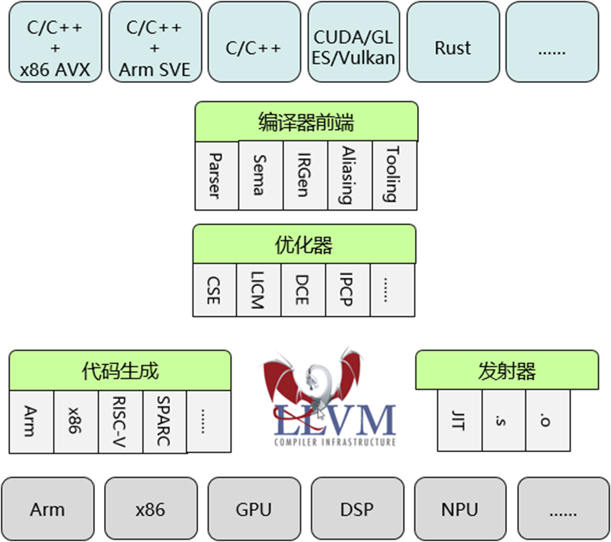

# LLVM构建openEuler技术白皮书
## 1、简介
## 2、LLVM编译器工具链介绍
[LLVM项目](https://llvm.org/)是一个[开源的编译器基础设施项目](https://github.com/llvm/llvm-project)，它提供了一套用于编译程序的工具链和库。近年来，LLVM项目越来越得到开发者的关注，社区非常活跃，商业公司纷纷基于LLVM项目推出商业编译器，OS社区也积极拥抱LLVM技术栈。[openEuler社区上的LLVM项目](https://gitee.com/openeuler/llvm-project)作为一个下游项目，致力于在开源LLVM基础上与openEuler协同创新，包括兼容性、性能和开发态安全编码特性，为openEuler上的编译器提供第二选择，并适配多种硬件平台，如鲲鹏、飞腾、龙芯等，充分释放多样性硬件算力。
### 2.1、LLVM架构描述
LLVM采用了模块化架构设计，将编译过程分为多个独立阶段，如前端、优化和后端。这种设计使得LLVM更加灵活和可扩展，有助于各阶段模块分别演进创新，而通过统一的IR表示又将不同的模块有机的结合起来。目前LLVM项目包含多个子项目，如clang、flang、llvm、mlir、lld等。LLVM 9.0版本之后采取Apache License。

图1 LLVM架构：模块化解耦架构，统一IR表示，助力架构级创新。

  

### 2.2、LLVM子项目介绍
### 2.3、基于Clang组装一个完整工具链
本章节参考[Assembling a Complete Toolchain](https://clang.llvm.org/docs/Toolchain.html)。
Clang只是C-family编程语言完整工具链中的一个组件。为了组装一个完整的工具链，需要额外的工具和运行时库。Clang被设计为与用于其目标平台的现有工具和库进行交互操作，并且LLVM项目为许多这些组件提供了替代方案。
下面描述类POSIX操作系统（如linux）上的Clang配置。
#### 2.3.1、工具
C-family编程语言的完整编译通常涉及以下工具：
* 预处理器(Preprocessor)
  * 执行 C 预处理器的操作：展开#include和#defines。
* 解析(Parsing)
  * 根据输入，解析和语义分析源语言，并构建一个源代码级中间表示(“AST”)。
* IR生成(IR generation)
  * 将源代码级中间表示转换为一个特定于优化器(optimizer)的中间表示(IR)，即LLVM IR。
* 编译器后端(Compiler backend)
  * 将中间表示转换为特定于目标的汇编代码。
* 汇编器(Assembler)
  * 将特定于目标的汇编代码转换为特定于目标的机器码目标文件。
* 链接器(Linker)
  * 将多个目标文件组合成一个映像（一个共享对象或一个可执行文件）。

Clang提供了除链接器之外的所有这些部分。当同一工具执行多个步骤时，通常将这些步骤合并在一起，以避免创建中间文件。
#### 2.3.2、Clang前端
Clang前端(clang -cc1)用于编译C-family语言。Clang前端的命令行接口被视为实现细节，故没有外部文档，并且可以在提示的情况下进行更改。
#### 2.3.3、汇编器
Clang既可以使用LLVM项目的集成汇编器，也可以使用外部特定于系统的汇编器（例如，GNU操作系统上的 GNU汇编器），作用是从汇编代码生成机器码。默认情况下，Clang在支持LLVM的所有目标机器上使用 LLVM的集成汇编器。如果想使用特定系统的汇编器，请使用`-fno-integrated-as`选项。
#### 2.3.4、链接器
Clang可以配置为使用几个不同的链接器其中一个：
* GNU ld
* GNU gold
* LLVM lld
* MSVC link.exe
[LLVM lld](https://lld.llvm.org/)原生支持链接时优化，使用gold时通过一个[链接器插件](https://llvm.org/docs/GoldPlugin.html)支持链接时优化。默认链接器在不同的目标机器上是不同的，可以通过`-fuse-ld=<linker name>`标志来切换。
#### 2.3.5、运行时库
C-family程序需要许多不同的运行时库提供不同的支持。Clang将隐式地链接每个运行时库的合适实现。
##### 2.3.5.1、编译器运行时
编译器运行时库提供编译器隐式调用的函数的定义，以支持底层硬件不支持的操作(例如，128位整数乘法)，或用在某些操作不适合用编译器内部实现的地方。
默认的运行时库是特定于目标架构的。对于GCC是主要编译器的目标，目前默认使用`libgcc_s`。在大多数其他目标上，默认情况下使用`compiler-rt`。
* compiler-rt (LLVM): [LLVM项目的编译器运行时库](https://compiler-rt.llvm.org/)提供了一组完整的运行时库函数。
* libgcc_s (GNU)：[GCC编译器的运行时库](https://gcc.gnu.org/onlinedocs/gccint/Libgcc.html)可以用来代替`compiler-rt`。但是，它缺少几个LLVM可能调用的函数，特别是在使用Clang的内置函数家族的`__builtin_*_overflow`时。

可以通过`rtlib=libgcc`或`--rtlib=libgcc`来切换编译器运行时库。
##### 2.3.5.2、原子库
如果您的程序使用了原子操作，编译器无法直接翻译到机器指令（因为没有合适的机器指令或不知道操作数如何适当对齐），将会生成对运行时库__atomic_*函数的调用。这些程序需要一个包含这些原子函数的运行时库。
* compiler-rt (LLVM)：LLVM项目的原子库的实现包含在`compiler-rt`中。
* libatomic (GNU)：libgcc_s不提供原子库的实现，事实上，GCC的[libatomic library](https://gcc.gnu.org/wiki/Atomic/GCCMM)在使用libgcc_s时被提供。
> 注意：
> 当Clang使用libgcc_s时，目前不会自动链接到`libatomic`。在使用非`compiler-rt`提供的原子操作时（如果您看到引用了__atomic_*函数的链接错误），可能需要手动添加`-latomic`来支持这种配置。
##### 2.3.5.3、Unwind库
Unwind库提供了一系列`_Unwind_*`函数，实现了`Itanium C++ ABI`([第I级](https://itanium-cxx-abi.github.io/cxx-abi/abi-eh.html#base-abi))的语言无关的堆栈Unwind操作部分，它是`C++ ABI`库的依赖项，有时是其他运行时的依赖项。
* libunwind (LLVM)：LLVM项目的Unwind库一种实现。
* libgcc_s (GNU)：libgcc_s有一个集成的Unwinder，不需要提供外部的Unwind库。
* libunwind (nongnu.org)：这是Unwind规范的另一个实现。请参阅[libunwind(nongnu.org)](https://www.nongnu.org/libunwind/)。
* libunwind (PathScale): 这是Unwind规范的另一个实现。请参阅[libunwind (pathscale)](https://github.com/pathscale/libunwind)。
##### 2.3.5.4、Sanitizer运行时库
Clang的sanitizers (-fsanitize=…)隐式地调用一个运行时库，以便维护程序执行的状态，并在检测到问题时发出诊断消息。
这些运行时的唯一支持实现由 LLVM 的compiler-rt提供。
#### 2.3.6、C标准库
Clang支持多种[C标准库实现](https://en.cppreference.com/w/c)。
#### 2.3.7、C++标准库
Clang支持使用LLVM项目的`libc++`或GCC的`libstdc++`C++标准库实现。
* libc++ (LLVM)：[libc++](https://libcxx.llvm.org/)是LLVM项目的C++标准库实现，旨在从C++ 11开始成为全面的C++标准实现。
* libstdc++ (GNU)：[libstdc++](https://gcc.gnu.org/onlinedocs/libstdc++/)是GCC 的C++标准库实现，Clang支持各种版本的`libstdc++`。

您可以通过`-stdlib=libc++`或`-stdlib=libstdc++`选项来切换C++标准库。

#### 2.3.8、C++ ABI库
C++ ABI库提供了Itanium C++ ABI库部分的实现，包括[Itanium c++ ABI文档中的支持功能](https://itanium-cxx-abi.github.io/cxx-abi/abi.html)和[异常处理支持的Level II](https://itanium-cxx-abi.github.io/cxx-abi/abi-eh.html#cxx-abi)。在编译C++代码时，Clang隐式地生成对这个库中函数和对象的引用。
> 注意
> 虽然同一个程序可能同时使用libstdc++和libc++（只要您不试图将C++标准库对象传递到边界之外），但是在一个程序中通常不可能有一个以上的C++ABI库。

* libc++ abi (LLVM)：[libc++abi](https://libcxxabi.llvm.org/)是LLVM项目对该规范的实现。
* libsupc++ (GNU)：libsupc++是GCC对该规范的实现。但是，只有在静态链接libstdc++时才使用这个库。libstdc++的动态库版本包含libsupc++的一个副本。
* libcxxrt (PathScale)：这是Itanium C++ ABI规范的另一个实现。

## 3、LLVM平行宇宙计划
### 3.1、项目描述
### 3.2、价值与意义
## 4、技术方案
## 5、关键技术挑战
## 6、应用场景
## 7、展望
