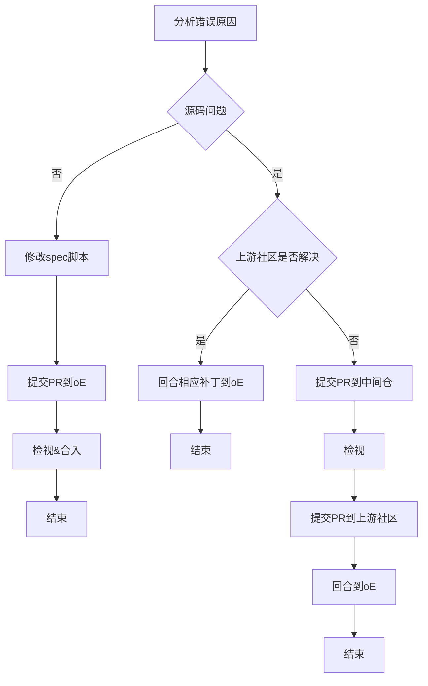

## 参与LLVM平行宇宙计划指导
首先，欢迎您关注并有意愿参与贡献，相信我们正在一起做一项伟大事业！

### 1、范围介绍
本文主要涉及兼容性问题修复工作的原则和指导，工程构建、问题列表跟踪等指导请参考[LLVM平行宇宙计划共享文档](https://docs.qq.com/doc/DZG9yRHJ3WlNvUGV2)。

### 1、软件包构建问题修复原则
总体上，问题修复秉持Upstream first原则，具体见下图：

### 2、PR提交规范
首先，在openEuler社区请遵守[社区PR提交指南](https://gitee.com/openeuler/community/blob/master/zh/contributors/pull-request.md)，在软件包上游社区请遵守相应上游社区的PR提交规范。
此外，由于LLVM平行宇宙相关的PR通常涉及编译构建问题，故增加如下规则：

#### 2.1 patch制作
* 请基于`git format-patch`方法制作统一格式的patch，便于检视。
以修改`source/test.c`为例，介绍一下制作方法：

第一步：在`source`目录下初始化git。
```abap
git init
```
第二步：本地提交test.c文件基线。
```abap
git add source/test.c
git commit -m "init"
```
第三步：修改`test.c`文件。
第四步：提交修改
```abap
git add source/test.c
git commit -m "modify"
```
第五步：生成patch。
```abap
git format-patch HEAD^   // 基于最近一个commit做patch
git format-patch HEAD^^   // 基于最近两个commit做patch
```

#### 2.2 PR描述
* 描述尽量清晰，包含为什么需要合入这个PR及希望检视人员额外了解的信息。至少包含两部分：
  * 提交PR的背景。可以写基于[这个oEEP](https://gitee.com/openeuler/TC/blob/master/oEEP/oEEP-0003%20LLVM%E5%B9%B3%E8%A1%8C%E5%AE%87%E5%AE%99%E8%AE%A1%E5%88%92--%E5%9F%BA%E4%BA%8ELLVM%E6%8A%80%E6%9C%AF%E6%A0%88%E6%9E%84%E5%BB%BAoE%E8%BD%AF%E4%BB%B6%E5%8C%85.md)，该PR的主要目标是使得当前软件包同时支持LLVM构建
  * 不影响当前的构建行为，并贴上自验证链接。
* 如果该PR是从上游社区backport回来的，**请在PR描述上写明上游社区的issue链接（如果有的话）和PR链接。**

#### 2.3 代码检视
* 首先，提交PR时，首先在PR题目上加上`[WIP]`，即告知maintainer/committer当前PR尚处于草稿状态。
* 然后，在LLVM平行宇宙微信群请求review；
* 如果已获得两个或两个以上[LLVM平行宇宙项目commiters](https://gitee.com/cf-zhao/compiler-docs/blob/master/LLVM%20Parallel%20Universe%20Project/%E5%8F%82%E4%B8%8E%E8%B4%A1%E7%8C%AE%E6%8C%87%E5%AF%BC.md#4llvm%E5%B9%B3%E8%A1%8C%E5%AE%87%E5%AE%99%E9%A1%B9%E7%9B%AEcommiters%E6%8C%81%E7%BB%AD%E5%A2%9E%E5%8A%A0%E4%B8%AD)的`lgtm`，则可以将PR题目中的`[WIP]`删去。
* 最后，寻求相关软件包的maintainer/committer检视并合入。

### 3、问题修复典型方法建议
本章包含通性问题的典型修复方法，建议修复相似问题时采用。如果您发现修复方法不妥，请劳烦协助修复，感谢！
#### 3.1、编译器在spec文件写死
如果spec文件中写死gcc，如：
```abap
gcc -Wall -fpie $RPM_OPT_FLAGS $CFLAGS $RPM_LD_FLAGS $LDFLAGS ifenslave.c -o ifenslave
```
修改为：
```c
%{__cc} -Wall -fpie $RPM_OPT_FLAGS $CFLAGS $RPM_LD_FLAGS $LDFLAGS ifenslave.c -o ifenslave
```

#### 3.2、问题修复示例
如果Makefile已设置编译器类型: CC=gcc，CXX=g++，可在spec设置CC、CXX值，传递给Makefile覆盖原来的值，如:
```
# Makefile

CC =  gcc
CXX = g++
```
```
# spec示例

%build
make
```
spec修改为:
```
# spec示例

%build
%if "%{?toolchain}" == "clang"
  %global make_opts CC=clang CXX=clang++
%endif
make %{?make_opts}
```

### 4、LLVM平行宇宙项目commiters（持续增加中）
 - 赵 川峰[@cf-zhao](https://gitee.com/cf-zhao) 邮箱: zhaochuanfeng@huawei.com
 - Jiacheng Zhou [@jchzhou](https://gitee.com/jchzhou) 邮箱：
 - 李 云飞[liyunfei33](https://gitee.com/liyunfei33) 邮箱: liyunfei33@huawei.com
 - 罗峰[@luofeng14](https://gitee.com/luofeng14) 邮箱：luofeng13@huawei.com
