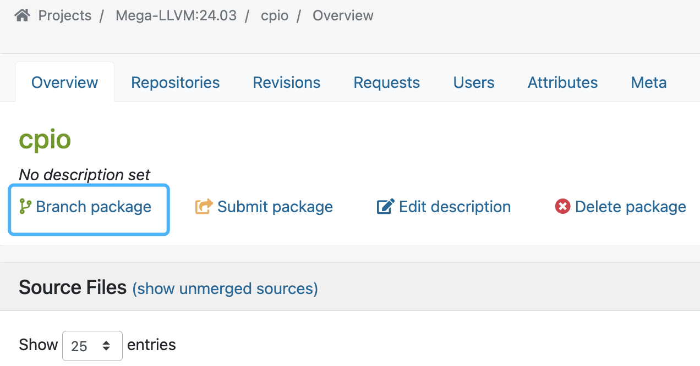
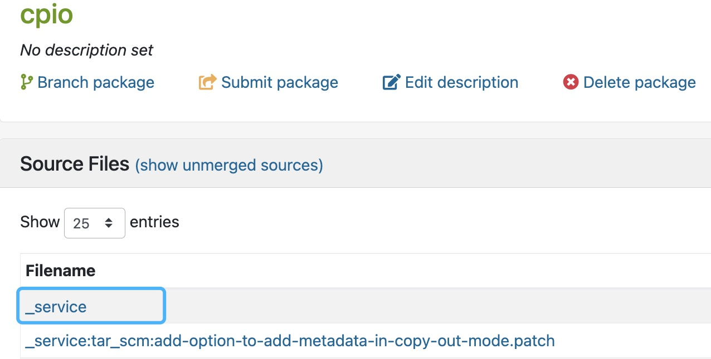
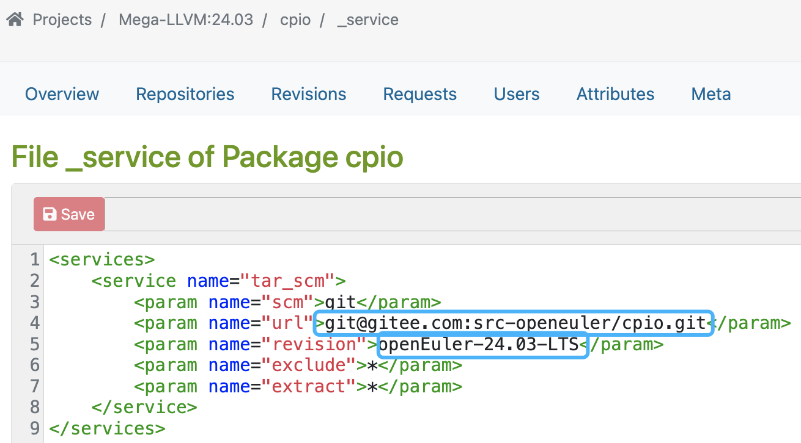
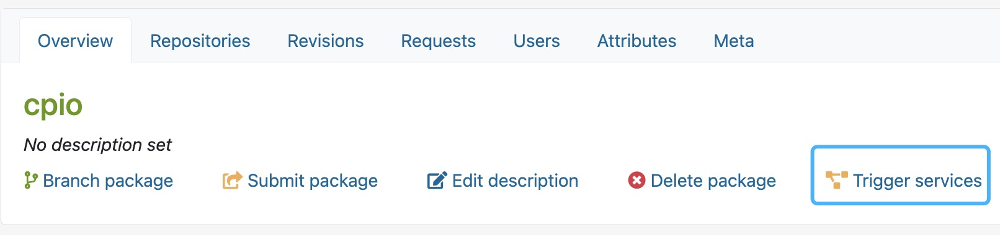

## 通过OBS平台复现构建问题方法指导

### OBS构建环境介绍
Open Build Service (OBS)是一个开源的构建环境，它提供了一种方便的方式来构建和打包软件。OBS的Project是一个逻辑上的容器，用于组织和管理相关的软件包。在一个Project中，可以包含多个Package，
这些Package可以是源代码、二进制文件、文档等。
在OBS中，用户可以创建自己的Project和Package，并将它们上传到build service中进行构建和打包。同时，用户也可以使用已经存在的Project和Package，以便更好地管理和共享软件包。
    
### 如何使用线上OBS验证环境
以Mega-LLVM:24.03为例，Mega工程是LLVM平行宇宙计划的OBS工程，其默认使用clang构建。

1. 首先进入线上[OBS构建环境](https://build.tarsier-infra.isrc.ac.cn/project/show/Mega-LLVM:24.03)，如果没有账号请注册一个。
2. 以cpio包为例，Branch "cpio"包到个人工程下。

<div align=center>
  
</div>

3. 修改代码仓为个人仓库地址。

<div align=center>
  
</div>

<div align=center>
  
</div>
<br/>
4. 点击"Trigger rebuild"触发构建。

<div align=center>
  
</div>  
<br/>
5. 等待构建成功。
  
### 如何使用线下OBS验证环境
OBS支持使用任意联网的构建机器进行构建验证调试。
1. 以Aarch64架构环境为例。请找一台联网机器，依赖安装包并且配置OBS平台账号。
```
yum install osc
```
配置文件
```
# ~/.config/osc/oscrc
[general]
apiurl = https://build.tarsier-infra.isrc.ac.cn/
no_verify = 1

[https://build.tarsier-infra.isrc.ac.cn/]
user=***
pass=***
```
2. 使用osc命令构建软件包
```
#!/bin/bash
# get obs _service
osc co Mega-LLVM:24:03/cpio

cd Mega-LLVM:24:03/cpio

# get source code files
osc up -S

# rename
mv _service service;
for file in `ls | grep -v .osc`;do new_file=${file##*:};mv $file $new_file;done || true

# useing osc to compile
osc build -j50  --nochecks  --root=$(pwd)/build-clang standard_aarch64 2>&1|tee clang-log
```
3. 生成patch、修改spec构建验证。

### 参考
- [常见问题修复、如何生成Patch，请参考参与贡献指导](https://gitee.com/openeuler/compiler-docs/blob/master/LLVM%20Parallel%20Universe%20Project/%E5%8F%82%E4%B8%8E%E8%B4%A1%E7%8C%AE%E6%8C%87%E5%AF%BC.md)
- [玩转openEuler系列之openEuler构建之OBS使用指导](https://www.bilibili.com/video/BV1YK411H7E2/)
