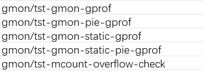
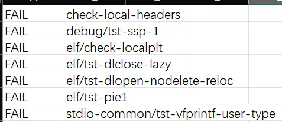

# llvm构建glibc相关问题分析

## linaro最新支持情况

Adhemerval Zanella 在 2024.4.17 将上游支持clang+lld构建的glibc分支rebase到glibc-2.39

[sourceware.org Git - glibc.git/shortlog](https://sourceware.org/git/?p=glibc.git;a=shortlog;h=refs/heads/azanella/clang)

共提交135个patch以支持x86和ARM构建，其中53个用于glibc构建，大部分用于处理warning差异

只有少量patch经过审阅提交到正式版本分支，主要是为fortify提供了clang编译支持

## 当前适配进展

计划在EulerOS上切换clang构建glibc

基于2403-LTS glibc 2.38+llvm17，共回合91个patch以支持构建和测试用例修复，llvm侧回合2个上游bugfix

用例总数1.4k，最终失败用例aarch64下15个，x86_64下19个

剩余失败用例经过分析，预计没有功能影响，为用例仅适配gcc行为，编译器差异导致

## 相关patch回合情况

glibc构建打通添加patch列表及用途

| patch | 上游链接 | 用途 | 备注 |
| --- | --- | --- | --- |
| backport-clang-0001-configure-remove-overly-restrictive-check-for-clang.patch | [https://sourceware.org/git/?p=glibc.git;a=commit;h=e8c753c2288c7cf4f5b7c007549a5c338704882a](https://sourceware.org/git/?p=glibc.git;a=commit;h=e8c753c2288c7cf4f5b7c007549a5c338704882a) | 去除configure中一些针对于gcc的宏和内嵌函数检查 |  |
| backport-clang-0002-Disable-__USE_EXTERN_INLINES-for-clang.patch | [https://sourceware.org/git/?p=glibc.git;a=commit;h=d2765f0fa2c6292ad25cfc6a74b91aa7ec0ea01a](https://sourceware.org/git/?p=glibc.git;a=commit;h=d2765f0fa2c6292ad25cfc6a74b91aa7ec0ea01a) | glibc的头文件中有函数属性在函数声明之后被重新定义的写法，clang不支持 |  |
| backport-clang-0003-argp-Expand-argp_usage-_option_is_short-and-_option_is_end.patch | [https://sourceware.org/git/?p=glibc.git;a=commit;h=35cdd59852251b2e69b3311ab1e22fccdb5e1a18](https://sourceware.org/git/?p=glibc.git;a=commit;h=35cdd59852251b2e69b3311ab1e22fccdb5e1a18) | 同上，但是这个改法没太看懂 |  |
| backport-clang-0004-aarch64-Use-64-bit-variable-to-access-the-special-registers.patch | [https://sourceware.org/git/?p=glibc.git;a=commit;h=efb33ce84a2cf0909f5fbaacdf4b455d26531aba](https://sourceware.org/git/?p=glibc.git;a=commit;h=efb33ce84a2cf0909f5fbaacdf4b455d26531aba) | error: value size does not match register size specified by the
constraint and modifier [-Werror,-Wasm-operand-widths] |  |
| backport-clang-0005-nptl-Fix-Wincompatible-pointer-types-on-clang.patch | [https://sourceware.org/git/?p=glibc.git;a=commit;h=fe8a949c64da3f4315692e3c07ddf9b495f51547](https://sourceware.org/git/?p=glibc.git;a=commit;h=fe8a949c64da3f4315692e3c07ddf9b495f51547) | error: incompatible pointer types passing 'struct pthread **' to parameter of type 'void **' [-Werror,-Wincompatible-pointer-types] |  |
| backport-clang-0006-Fix-inhibit_stack_protector-for-clang.patch | [https://sourceware.org/git/?p=glibc.git;a=commit;h=68cbe438b55b250c651f69d731e5cf08f03a11cd](https://sourceware.org/git/?p=glibc.git;a=commit;h=68cbe438b55b250c651f69d731e5cf08f03a11cd) | clang不支持写法 `__attribute__ ((__optimize__ ("")))` |  |
| backport-clang-0007-posix-Use-unsigned-to-check-for-_POSIX_VDISABLE.patch | [https://sourceware.org/git/?p=glibc.git;a=commit;h=2e9db2ac737ffdcf336a64223e8b77764003b7ce](https://sourceware.org/git/?p=glibc.git;a=commit;h=2e9db2ac737ffdcf336a64223e8b77764003b7ce) | clang不允许复数转为无符号 |  |
| backport-clang-0008-Add-clang-specific-warnings-suppress-macros.patch | [https://sourceware.org/git/?p=glibc.git;a=commit;h=e182dc08d71c8268495acc1a980a7fb57fa84103](https://sourceware.org/git/?p=glibc.git;a=commit;h=e182dc08d71c8268495acc1a980a7fb57fa84103) | 在glibc代码中添加了一个告警压制宏，用于压制一系列-Werror告警 | 下列标注“**告警压制**”的patch均为使用该宏将告警进行压制 |
| backport-clang-0009-resolv-Handle-Wsometimes-uninitialized-on-getaddrinfo.patch | [https://sourceware.org/git/?p=glibc.git;a=commit;h=817b755cceb2504121b37c4274bef36d6bc17adc](https://sourceware.org/git/?p=glibc.git;a=commit;h=817b755cceb2504121b37c4274bef36d6bc17adc) | -Wsometimes-uninitialized | 告警压制  |
| backport-clang-0010-sunrpc-Remove-extra-parenthesis-on-comparison.patch | [https://sourceware.org/git/?p=glibc.git;a=commitdiff;h=5d3b33803f19e208b4c8744120fb84082ec2c625](https://sourceware.org/git/?p=glibc.git;a=commitdiff;h=5d3b33803f19e208b4c8744120fb84082ec2c625) | equality comparison with extraneous parentheses[-Werror,-Wparentheses-equality] |  |
| backport-clang-0011-configure-Fix-check-for-fno-tree-loop-distribute-patterns.patch | [https://sourceware.org/git/?p=glibc.git;a=commit;h=d2161cbdbb438f7a167024e41711fb7775ef3fd1](https://sourceware.org/git/?p=glibc.git;a=commit;h=d2161cbdbb438f7a167024e41711fb7775ef3fd1) | -fno-tree-loop-distribute-patterns支持性检查的用例对clang失效 |  |
| backport-clang-0012-elf-Supress-clang-Wsometimes-uninitialized-on.patch | [https://sourceware.org/git/?p=glibc.git;a=commit;h=e4dfd4cc55f12243865ad94941c63aafb92c57a9](https://sourceware.org/git/?p=glibc.git;a=commit;h=e4dfd4cc55f12243865ad94941c63aafb92c57a9) |  -Wsometimes-uninitialized | 告警压制 |
| backport-clang-0013-Remove-include-h-install-rule.patch | [sourceware.org Git - glibc.git/commitdiff](https://sourceware.org/git/?p=glibc.git;a=commitdiff;h=1eae989cb7632760fd6f4008be73549da861b202) | limits.h依赖系统头，导致install时权限问题 | glibc2.39已合入 |
| backport-clang-0014-locale-Fix-implicit-conversion-on-collate_finish.patch | [sourceware.org Git - glibc.git/commit](https://sourceware.org/git/?p=glibc.git;a=commit;h=0c8480a2698e20996b5f0dc89bae9058a1f9ea87) | -Wconstant-conversion |  |
| backport-clang-0015-iconvdata-Remove-use-of-GNU-old-style-field-designator.patch | [https://sourceware.org/git/?p=glibc.git;a=commit;h=cd7206deed56fa8833ef8d46523476709e18635f](https://sourceware.org/git/?p=glibc.git;a=commit;h=cd7206deed56fa8833ef8d46523476709e18635f) | -Wgnu-designator |  |
| backport-clang-0016-catgets-Remove-catgets-config-h.patch | [sourceware.org Git - glibc.git/commit](https://sourceware.org/git/?p=glibc.git;a=commit;h=f68d36c788b423db7d15d67fe3c97951fb9a7fb6) | -Winclude-next-absolute-path |  |
| backport-clang-0017-math-Suppress-clang-warning-on-math_check_force_underflow.patch | [sourceware.org Git - glibc.git/commit](https://sourceware.org/git/?p=glibc.git;a=commit;h=7cfc8eda54c039472d21baee7cddfbbb8e695612) | -Wabsolute-value | 告警压制 |
| backport-clang-0018-math-use-fabs-on-__ieee754_lgamma_r.patch | [sourceware.org Git - glibc.git/commit](https://sourceware.org/git/?p=glibc.git;a=commit;h=9cdf90ef2c139b5f9935a09c6d0af0fe3f9a939a) | error: absolute value function 'fabsf' given an argument of type 'double' but has parameter of type 'float' which may cause truncation of value [-Werror,-Wabsolute-value] |  |
| backport-clang-0019-timezone-Fix-clang-operator-precedence-warning.patch |  | -Wbitwise-conditional-parentheses | 上游对这部分代码重构过，问题已解决[sourceware.org Git - glibc.git/commit](https://sourceware.org/git/?p=glibc.git;a=commit;h=1f94147a79fcb7211f1421b87383cad93986797f) |
| backport-clang-0020-support-Handle-clang-support-dtotimespec-c-on-dtotimespec.patch | [sourceware.org Git - glibc.git/commit](https://sourceware.org/git/?p=glibc.git;a=commit;h=774dfa5a5a2631a690ddeda24f652fa849fcbc57) | -Wimplicit-const-int-float-conversion |  |
| backport-clang-0021-support-Use-CHAR_MAX-as-maximum-value.patch | [sourceware.org Git - glibc.git/commitdiff](https://sourceware.org/git/?p=glibc.git;a=commitdiff;h=63f2998b839ecfcf3f08c2118184de378729ca2e) | error: result of comparison of constant -1 with expression of type 'char' is always false [-Werror,-Wtautological-constant-out-of-range-compare] |  |
| backport-clang-0022-x86-Define-__HAVE_FLOAT128-for-Clang-and-use-_*builtin*-f128.patch | [sourceware.org Git - glibc.git/commit](https://sourceware.org/git/?p=glibc.git;a=commit;h=cabd218e41d765204a9912589ee732b5b90a66e0) | builtin函数命名差异，clang支持`__builtin_*f128` 而不是`__builtin_*q` |  |
| backport-clang-0023-stdlib-longlong-h-Do-no-use-asm-input-cast-for-clang.patch | [sourceware.org Git - glibc.git/commit](https://sourceware.org/git/?p=glibc.git;a=commit;h=9a30e8cf4fa8d540b16cb08df3b6bd7fb3271131) | error: invalid use of a cast in a inline asm context requiring an  lvalue: remove the cast or build with -fheinous-gnu-extensions |  |
| backport-clang-0024-stdio-Fix-Wtautological-constant-out-of-range-compare-on.patch | [sourceware.org Git - glibc.git/commitdiff](https://sourceware.org/git/?p=glibc.git;a=commitdiff;h=a31deccd49a258d1fa4f415ede1ea0a1ea9ddc86) | -Wtautological-constant-out-of-range-compare |  |
| backport-clang-0025-math-Suppress-clang-Wincompatible-library-redeclaration-on.patch | [sourceware.org Git - glibc.git/commit](https://sourceware.org/git/?p=glibc.git;a=commit;h=5bcc666d76138514e280dcad63f505177abe94a1) | -Wincompatible-library-redeclaration 代码中使用不带__的名称重定义builtin函数，通过-fno-builtin-lround规避 |  |
| backport-clang-0026-x86-math-Avoid-the-use-of-**libgcc_cmp_return**-for.patch | [sourceware.org Git - glibc.git/commit](https://sourceware.org/git/?p=glibc.git;a=commit;h=01f529206cf8cd2ad8c49cc5ba7c80c5a839ef61) | `__libgcc_cmp_return__` gcc内部接口，用于无硬件支持下的高精度cmp |  |
| backport-clang-0027-x86-Use-msse2avx-iff-compiler-supports-it.patch | [sourceware.org Git - glibc.git/commit](https://sourceware.org/git/?p=glibc.git;a=commit;h=cc579bf118a04c9e3322cf44712b776fe9434d57) | -msse2avx clang不支持 |  |

测试用例构建打通添加的patch及用途

| patch | 上游链接 | 用途 | 备注 |
| --- | --- | --- | --- |
| backport-clang-0028-localedata-Use-hexadecimal-character-escape-on-tests.patch | [https://sourceware.org/git/?p=glibc.git;a=commit;h=edae9c07c2b3449103a76ae77cc12732f604c248](https://sourceware.org/git/?p=glibc.git;a=commit;h=edae9c07c2b3449103a76ae77cc12732f604c248) | clang不支持源文件中使用latin1字符，使用十六进制转义替代 |  |
| backport-clang-0029-localedata-Fix-clang-warnings-on-tests.patch | [https://sourceware.org/git/?p=glibc.git;a=commit;h=1b58f27cc062352285973103bf2f40e1a484fb4f](https://sourceware.org/git/?p=glibc.git;a=commit;h=1b58f27cc062352285973103bf2f40e1a484fb4f) | -Wformat | 告警压制 |
| backport-clang-0030-Use-frounding-math-iff-compiler-supports-it.patch | [https://sourceware.org/git/?p=glibc.git;a=commit;h=58f8b01276ed3cc692545855430dc43e4ebd3c31](https://sourceware.org/git/?p=glibc.git;a=commit;h=58f8b01276ed3cc692545855430dc43e4ebd3c31) | clang15不支持-frounding-math，17已支持 |  |
| backport-clang-0031-Use-ffloat-store-iff-compiler-supports-it.patch | [sourceware.org Git - glibc.git/commit](https://sourceware.org/git/?p=glibc.git;a=commit;h=0062fcb8bab9fcaddf129bedb0c4f06b1670ad34) | clang不支持-ffloat-store |  |
| backport-clang-0032-math-Define-CMPLX-F-L-for-clang.patch | [sourceware.org Git - glibc.git/commit](https://sourceware.org/git/?p=glibc.git;a=commit;h=054630d6fe6b131d04db22e74a653588b2bfa003) | gcc版本宏添加clang适配 |  |
| backport-clang-0033-math-Only-build-tests-for-_Complex-__int128-iff-compiler.patch | [sourceware.org Git - glibc.git/commit](https://sourceware.org/git/?p=glibc.git;a=commit;h=e66d55582371553254d4e1893c0a43faf7bce001) | clang不支持'_Complex __int128’ |  |
| backport-clang-0034-stdlib-Avoid-internal-definitions-for-tst-strtod5i.patch | [sourceware.org Git - glibc.git/commit](https://sourceware.org/git/?p=glibc.git;a=commit;h=eadc9db07b05cff9e9ab0d52d0c0028ac9d7ffd2) | /usr/bin/ld: /root/rpmbuild1/BUILD/glibc-2.38/stdlib/tst-strtod5i.c:89:(.text+0x154): undefined reference to `__copysign' clang会生成不支持的内嵌函数__copysign，添加宏避免内嵌函数生成 |  |
| backport-clang-0035-stdio-Suppress-Z-format-for-clang.patch | [sourceware.org Git - glibc.git/commit](https://sourceware.org/git/?p=glibc.git;a=commit;h=d57642f9fa4bb0a21c37ef0b19965c62c16ae46a) | -Wformat | 告警压制 |
| backport-clang-0036-stdio-Disable-bug23-3-on-clang.patch | [sourceware.org Git - glibc.git/commit](https://sourceware.org/git/?p=glibc.git;a=commit;h=e402c515c7b9c2cffc2579c009b0c4059b8dbf64) | 用例使用clang构建时进入无限循环，添加宏隔离规避 |  |
| backport-clang-0037-stdio-Disable-clang-warning-on-scanf13-test.patch | [sourceware.org Git - glibc.git/commit](https://sourceware.org/git/?p=glibc.git;a=commit;h=f86656747932c7e67b5aef0ee36aa05a08c66074) | -Wformat -Wfortify-sourc | 告警压制 |
| backport-clang-0038-stdio-Fix-clang-warnings-on-tests.patch | [sourceware.org Git - glibc.git/commit](https://sourceware.org/git/?p=glibc.git;a=commit;h=b3816426d9e35c6d15f901657b5beb1fdc3d51fa) | -Wformat | 告警压制 |
| backport-clang-0039-stdio-Suppress-Wformat-only-for-gcc-for-tst-sprintf-errno-c.patch | [sourceware.org Git - glibc.git/commit](https://sourceware.org/git/?p=glibc.git;a=commit;h=ac431c9b0266534b99c1c0228e8f3efb8b7b2e3b) | -Wformat | 告警压制 |
| backport-clang-0040-stdio-Suppress-clang-warnings-for-tst-unlockedio-c.patch | [sourceware.org Git - glibc.git/commit](https://sourceware.org/git/?p=glibc.git;a=commit;h=678c3915f6cffaa2233fa047c86115f14f2b42b3) | -Wliteral-conversion | 告警压制 |
| backport-clang-0041-stdio-Suppress-clang-warnings-for-tst-vprintf-width-i18n-c.patch | [sourceware.org Git - glibc.git/commit](https://sourceware.org/git/?p=glibc.git;a=commit;h=6cd43d274dd9022db14f0b40804640e11e4db658) | -Wformat | 告警压制 |
| backport-clang-0042-Handle-pragma-GCC-optimize-for-clang.patch | [sourceware.org Git - glibc.git/commit](https://sourceware.org/git/?p=glibc.git;a=commit;h=8eb85e1f8ac6ec5544e681d3d1e880e442b37310) | 不支持 pragma GCC，修改为pragma clang格式 |  |
| backport-clang-0043-Use-check-tests-with-trampolines-iff-compiler-supports-it.patch | [sourceware.org Git - glibc.git/commit](https://sourceware.org/git/?p=glibc.git;a=commit;h=6272e416053443fcb4b2220f4c8779286d6c60fe) | clang不支持trampolines，去除相关用例 |  |
| backport-clang-0044-malloc-Suppress-clang-warning-on-tst-memalign.patch | [sourceware.org Git - glibc.git/commit](https://sourceware.org/git/?p=glibc.git;a=commit;h=e3dd9164a1fdab2ba9130b1a2d32338f052a281c) | -Wnon-power-of-two-alignment -Wbuiltin-assume-aligned-alignment | 告警压制 |
| backport-clang-0045-malloc-Suppress-clang-warning-on-tst-aligned-alloc.patch | [sourceware.org Git - glibc.git/commit](https://sourceware.org/git/?p=glibc.git;a=commit;h=0f38a02254077d5bd42c3f88ccaef10e733a76e2) | -Wnon-power-of-two-alignment -Wbuiltin-assume-aligned-alignment | 告警压制 |
| backport-clang-0046-string-Suppress-clang-Wsuspicious-bzero-on-tester.patch | [sourceware.org Git - glibc.git/commit](https://sourceware.org/git/?p=glibc.git;a=commit;h=58235f6e00583efd2af47e4fa746cc9be9f19190) | -Wsuspicious-bzero -Wfortify-source | 告警压制 |
| backport-clang-0047-dirent-Remove-variable-lenght-array-structure-for.patch | [sourceware.org Git - glibc.git/commit](https://sourceware.org/git/?p=glibc.git;a=commit;h=790e19f1d14a247289e18842c9d8e7c0ca1d7b79) | ../sysdeps/unix/sysv/linux/tst-getdents64.c:111:18: error: fields must  have a constant size: 'variable length array in structure' extension  will never be supported |  |
| backport-clang-0048-posix-Suppress-clang-warning-on-bug-regex24.patch | [sourceware.org Git - glibc.git/commit](https://sourceware.org/git/?p=glibc.git;a=commit;h=0fe003b0235263f296e5c7463deadc9a7b797970) | -Wstring-plus-int | 告警压制 |
| backport-clang-0049-linux-Adequate-tst-clone3-to-c11-atomics.patch | [sourceware.org Git - glibc.git/commit](https://sourceware.org/git/?p=glibc.git;a=commit;h=8bf73ae7780e92f2898e04c8815bed15c513ff53) | ../sysdeps/unix/sysv/linux/tst-clone3.c:101:3: error: address argument to atomic operation must be a pointer to _Atomic type ('pid_t *' (aka 'int *') invalid)
101 |   wait_tid (&ctid, CTID_INIT_VAL);
|   ^         ~~~~~
../sysdeps/unix/sysv/linux/tst-clone3.c:51:21: note: expanded from macro 'wait_tid'
51 |     while ((__tid = atomic_load_explicit (ctid_ptr,                     \
|                     ^                     ~~~~~~~~
/usr/bin/../lib64/clang/17/include/stdatomic.h:141:30: note: expanded from macro 'atomic_load_explicit'
141 | #define atomic_load_explicit __c11_atomic_load
|                              ^
1 error generated. |  |
| backport-clang-0050-support-Suppress-clang-warning-on-tst-timespec.patch | [sourceware.org Git - glibc.git/commit](https://sourceware.org/git/?p=glibc.git;a=commit;h=56765bcfde33b07a0fd59951c8fe0b088146351d) | -Wimplicit-const-int-float-conversion | 告警压制 |
| backport-clang-0051-elf-Suppress-clang-warning-on-tst-unique4.patch | [sourceware.org Git - glibc.git/commit](https://sourceware.org/git/?p=glibc.git;a=commit;h=367d2d90444b50233aae754903898f4c15c181f0) | -Wundefined-var-template | 告警压制 |
| backport-clang-0052-elf-Suppress-clang-warning-on-tst-unique3.patch | [sourceware.org Git - glibc.git/commit](https://sourceware.org/git/?p=glibc.git;a=commit;h=a221274e314e48c3bd749ba3a491b430a864d29c) | -Wundefined-var-template | 告警压制 |
| backport-clang-0053-elf-Disable-unload4-test-on-clang.patch | [sourceware.org Git - glibc.git/commit](https://sourceware.org/git/?p=glibc.git;a=commit;h=5272f92fd5665b1cea37cda8d70cb888b9059c6e) | 用例使用clang构建时进入无限循环，添加宏隔离规避 |  |
| backport-clang-0054-math-Fix-clang-warnings-on-bug-tgmath1-c.patch | [sourceware.org Git - glibc.git/commit](https://sourceware.org/git/?p=glibc.git;a=commit;h=9193695399a8e6cf79a9825a7ef480f21e080583) | -Wabsolute-value | 告警压制 |
| backport-clang-0055-And-defines-to-attribute-noclone-iff-compiler.patch | [sourceware.org Git - glibc.git/commit](https://sourceware.org/git/?p=glibc.git;a=commit;h=96f8c9eefa06c2795aa3cfc689bfe801116d6221) | clang不支持`__attribute__ (__noclone__)` 添加configure检查 |  |
| backport-clang-0056-stdio-Disable-attribute-optimize-if-compiler-does-not.patch | [sourceware.org Git - glibc.git/commit](https://sourceware.org/git/?p=glibc.git;a=commit;h=b9801c945a677496d583bb76efa896bb954ca410) | clang不支持`__attribute__ ((optimize ))` 直接判断去除 |  |
| backport-clang-0057-x86-Fix-test-double-vlen-include-next.patch | [sourceware.org Git - glibc.git/commit](https://sourceware.org/git/?p=glibc.git;a=commit;h=932dda54e72f468f287ec3c8176598830757e334) | -Winclude-next-absolute-path |  |
| backport-clang-0058-x86_64-Disable-libmvec-tests-if-compiler-does-not-support.patch | [sourceware.org Git - glibc.git/commit](https://sourceware.org/git/?p=glibc.git;a=commit;h=22997a0a53a8d400bf0e62019f14f633383437a5) | clang不支持`__attribute__ ((__simd__))` 禁用相关用例 |  |
| backport-clang-0059-math-Fix-test-totalorderl-ldbl-96-exponent-setting.patch | [sourceware.org Git - glibc.git/commit](https://sourceware.org/git/?p=glibc.git;a=commit;h=4b7c2232917e57d3902213f387ac2bcd51f48d8f) | -Wbitfield-constant-conversion |  |
| backport-clang-0060-x86-Use-mfpmath-387-iff-compiler-supports-it.patch | [sourceware.org Git - glibc.git/commit](https://sourceware.org/git/?p=glibc.git;a=commit;h=942eea75573c400fb9d9c51f7cbcbdf38b603fe2) | clang不支持-mfpmath=387，去除选项并禁用相关用例 |  |
| backport-clang-0061-misc-Disable-some-atomic-tests-on-clang.patch | [sourceware.org Git - glibc.git/commitdiff](https://sourceware.org/git/?p=glibc.git;a=commitdiff;h=95458b51425e6bb23deaa209465cb636d132ed11) | 禁用了部分clang失败的atomic用例 | 可能存在风险 |
| backport-clang-0062-resolve-Fix-implicit-conversion-on-tst-resolv-invalid-cname.patch | [sourceware.org Git - glibc.git/commit](https://sourceware.org/git/?p=glibc.git;a=commit;h=f9d1356c695ae82b1209233f119d7b03da528e66) | -Wconstant-conversion |  |
| backport-clang-0063-Move-inhibit-stack-protector-to-its-own-header.patch | [sourceware.org Git - glibc.git/commit](https://sourceware.org/git/?p=glibc.git;a=commit;h=3fd243990decbecb032f6a4ea1c834d7d833c638) | 把backport-clang-0006-Fix-inhibit_stack_protector-for-clang.patch的修改放到了头文件里，在测试用例中生效 |  |
| backport-clang-0064-x86-Use-inhibit_stack_protector-on-tst-ifunc-isa-h.patch | [sourceware.org Git - glibc.git/commit](https://sourceware.org/git/?p=glibc.git;a=commit;h=5e66de71ee1840cf204ea9cb865edd1e7a9595ab) | 依赖0063 |  |

测试用例失败修复添加的patch及用途

| patch | 上游链接 | 用途 | 备注 |
| --- | --- | --- | --- |
| backport-clang-0065-cdefs-h-Add-clang-fortify-directives.patch | [https://sourceware.org/git/?p=glibc.git;a=commit;h=7a7093615c1b7ac937b1af7b76d0008f8e1ca189](https://sourceware.org/git/?p=glibc.git;a=commit;h=7a7093615c1b7ac937b1af7b76d0008f8e1ca189) | 支持clang构建fortify相关内容 | 已经合入了glibc2.40 |
| backport-clang-0066-libio-Improve-fortify-with-clang.patch | [https://sourceware.org/git?p=glibc.git;a=commit;h=29951991f5db1001c059f8ed7afa2c359cdc7f44](https://sourceware.org/git?p=glibc.git;a=commit;h=29951991f5db1001c059f8ed7afa2c359cdc7f44) | 支持clang构建fortify相关内容 | 已经合入了glibc2.40 |
| backport-clang-0067-string-Improve-fortify-with-clang.patch | [string: Improve fortify with clang](https://sourceware.org/git?p=glibc.git;a=commit;h=5e9696b26540d02639e0d16532e0f3d53c7e5cd0)
 | 支持clang构建fortify相关内容 | 已经合入了glibc2.40 |
| backport-clang-0068-stdlib-Improve-fortify-with-clang.patch | [unistd: Improve fortify with clang](https://sourceware.org/git?p=glibc.git;a=commit;h=ec307a10865a3e43f611b725fec952a93e4d1893)
 | 支持clang构建fortify相关内容 |  |
| backport-clang-0069-unistd-Improve-fortify-with-clang.patch | [sourceware.org Git - glibc.git/commit](https://sourceware.org/git?p=glibc.git;a=commit;h=ec307a10865a3e43f611b725fec952a93e4d1893) | 支持clang构建fortify相关内容 | 已经合入了glibc2.40 |
| backport-clang-0070-socket-Improve-fortify-with-clang.patch | [socket: Improve fortify with clang](https://sourceware.org/git?p=glibc.git;a=commit;h=4289b00d4393f490515527864cf09093f4f8c2c4) | 支持clang构建fortify相关内容 | 已经合入了glibc2.40 |
| backport-clang-0071-syslog-Improve-fortify-with-clang.patch | [syslog: Improve fortify with clang](https://sourceware.org/git?p=glibc.git;a=commit;h=471c3c7a4705f1a1852404959692b0ff2dbb4aaa)
 | 支持clang构建fortify相关内容 | 已经合入了glibc2.40 |
| backport-clang-0072-wcsmbs-Improve-fortify-with-clang.patch | [wcsmbs: Improve fortify with clang](https://sourceware.org/git?p=glibc.git;a=commit;h=68444c045077368446eced143510419c901e31b1)
 | 支持clang构建fortify相关内容 | 已经合入了glibc2.40 |
| backport-clang-0073-Only-use-finput-charset-ascii-iff-compiler-supports-it.patch | [Only use -finput-charset=ascii iff compiler supports it](https://sourceware.org/git?p=glibc.git;a=commit;h=8a082445f819697811eef589ef246204316335ac)
 | [check-installed-headers-c问题patch](llvm%E6%9E%84%E5%BB%BAglibc%E7%9B%B8%E5%85%B3%E9%97%AE%E9%A2%98%E5%88%86%E6%9E%90.md)  |  |
| backport-clang-0074-malloc-Disable-malloc-builtins-on-tests.patch | [malloc: Disable malloc builtins on tests](https://sourceware.org/git?p=glibc.git;a=commit;h=4fbc210a64404d78059759eb58cdaeda78d3d2fd) | [malloc相关问题](llvm%E6%9E%84%E5%BB%BAglibc%E7%9B%B8%E5%85%B3%E9%97%AE%E9%A2%98%E5%88%86%E6%9E%90.md)  |  |
| backport-clang-0075-aarch64-Fix-gmon-profiling-with-clang.patch | [aarch64: Fix gmon profiling with clang](https://sourceware.org/git?p=glibc.git;a=commit;h=0efd2ddf2a599ab191c98fb86febbfc31cb93a57) | [gmon相关问题patch](llvm%E6%9E%84%E5%BB%BAglibc%E7%9B%B8%E5%85%B3%E9%97%AE%E9%A2%98%E5%88%86%E6%9E%90.md)  |  |
| backport-clang-0076-math-Do-not-use-builtin_fpclassify-on-clang.patch | [math: Do not use __builtin_fpclassify on clang](https://sourceware.org/git?p=glibc.git;a=commit;h=b04dd4757fb4fcd8f6fc2ca21bf065992390d3a9) |  |  |
| backport-clang-0077-math-Do-not-use-builtin_isnan-on-clang.patch | [math: Do not use __builtin_isnan on clang](https://sourceware.org/git?p=glibc.git;a=commit;h=fa7fa397d3090a4d7883439140d50ae1f6f8617b) |  |  |
| backport-clang-0078-math-Do-not-use-builtin_isinf-on-clang.patch | [math: Do not use __builtin_isinf on clang](https://sourceware.org/git?p=glibc.git;a=commit;h=645ebc4942a7edc5d4ddf31ce9ee5dfbe3c751a2) |  |  |
| backport-clang-0079-math-Fix-isgreater-and-isless-for-clang.patch | [math: Fix isgreater* and isless* for clang](https://sourceware.org/git?p=glibc.git;a=commit;h=a4112fc8babf51c86841f0420367dab31f5ac7db) |  |  |
| backport-clang-0083-math-Fix-potential-underflow-on-ldbl-128-erfl.patch | [math: Fix potential underflow on ldbl-128 erfl](https://sourceware.org/git?p=glibc.git;a=commit;h=3199b1cc5b9f2ca0714b803b66f4a24e0fa2aa21) |  |  |
| backport-clang-0084-Build-glibc-with-ftrapping-math.patch | [Build glibc with -ftrapping-math](https://sourceware.org/git?p=glibc.git;a=commit;h=8565bb7763e71465b2f6dceb2319a785cf9092c0) | **[math相关问题patch](llvm%E6%9E%84%E5%BB%BAglibc%E7%9B%B8%E5%85%B3%E9%97%AE%E9%A2%98%E5%88%86%E6%9E%90.md)**  |  |
| backport-clang-0080-conform-Use-dD-instead-of-dN-on-compiler-invocation.patch | [conform: Use -dD instead of -dN on compiler invocation](https://sourceware.org/git?p=glibc.git;a=commit;h=aec36af87b9c87a1402e4326d5ead9f9f46b97f4) |  |  |
| backport-clang-0081-conform-Replace-Static-assert-with-macro.patch | [conform: Replace _Static_assert with macro](https://sourceware.org/git?p=glibc.git;a=commit;h=a0606429223eab21c3211197a6f2550d72619b21) |  |  |
| backport-clang-0082-conform-Do-not-use-SIG_ATOMIC_TYPE.patch | [conform: Do not use SIG_ATOMIC_TYPE](https://sourceware.org/git?p=glibc.git;a=commit;h=faae5301b6dfdea58593d4fa87cc8690b6bd3223) | **[conform相关问题patch](llvm%E6%9E%84%E5%BB%BAglibc%E7%9B%B8%E5%85%B3%E9%97%AE%E9%A2%98%E5%88%86%E6%9E%90.md)**  |  |
| backport-clang-0085-elf-Use-volatile-to-set-rseq_size-and-rseq_offset.patch | [elf: Use volatile to set __rseq_size and __rseq_offset](https://sourceware.org/git?p=glibc.git;a=commit;h=0b0c655d880f0b541dd5cb3d08248a6832af7f6a) |  |  |
| backport-clang-0086-elf-Fix-tests-that-require-interposable-symbols.patch | [elf: Fix tests that require interposable symbols](https://sourceware.org/git?p=glibc.git;a=commit;h=2cebb84d7e5858ac3f0c987a4e73e12f0bd406d8) | clang默认-fsemantic-interposition触发内链优化导致ELF符号插入失败 |  |
| backport-clang-0087-stdio-Fix-tst-vfprintf-user-type-on-clang.patch | [stdio: Fix tst-vfprintf-user-type on clang](https://sourceware.org/git?p=glibc.git;a=commit;h=513a0b4b8b79fab04adf096e76c9dbd7cee3029d) | clang对pointer alias 之间的比较返回false |  |
| backport-clang-0088-elf-Disable-tst-dlopen-nodelete-reloc-if-compiler.patch | [elf: Disable tst-dlopen-nodelete-reloc if compiler...](https://sourceware.org/git?p=glibc.git;a=commit;h=e2aecf83252b829fa3704123e8c975938c0faeb5)  | 去除了tst-dlopen-nodelete-reloc用例 |  |
| backport-clang-0089-string-Use-asm-alias-instead-of-symbol-redirections-for.patch |  |  | 好像没啥用，可以删掉 |
| backport-clang-0090-aarch64-update-libm-test-ulps.patch | [aarch64: update libm test ulps](https://sourceware.org/git?p=glibc.git;a=commit;h=37fe6828f9f1a8a205af196343ba95036ed79871) | 修改测试用例精度限制 |  |
| backport-clang-0091-x86_64-update-libm-test-ulps.patch | [x86_64: update libm test ulps](https://sourceware.org/git?p=glibc.git;a=commit;h=ae79f00a76b53d276ff27e9097db1186590a068c) | 修改测试用例精度限制 |  |
| backport-clang-0092-x86-Use-bool-for-C++-on-x86-h.patch | [x86: Use bool for C++ on x86.h](https://sourceware.org/git?p=glibc.git;a=commit;h=250a53976c41fd52dabf56044ec4721b8ec331a5)  | clang在-std=c++98下没有定义_Bool，修改为bool |  |

## 测试用例失败修复

### fortify相关的一些patch

[fortify相关问题分析](llvm%E6%9E%84%E5%BB%BAglibc%E7%9B%B8%E5%85%B3%E9%97%AE%E9%A2%98%E5%88%86%E6%9E%90/fortify%E7%9B%B8%E5%85%B3%E9%97%AE%E9%A2%98%E5%88%86%E6%9E%90.md)

下面这些patch已经合入了glibc2.40

cdefs.h: Add clang fortify directives
libio: Improve fortify with clang
string: Improve fortify with clang
stdlib: Improve fortify with clang
unistd: Improve fortify with clang
socket: Improve fortify with clang
syslog: Improve fortify with clang
wcsmbs: Improve fortify with clang

合入以上问题可以解决fortify相关用例除bcopy问题以外的其他失败

```cpp
# without patches
FAIL: debug/tst-fortify-cc-nongnu-1-def
original exit status 1
Test checking routines at fortify level 1
Failure on line 357
Failure on line 361
Failure on line 476
Failure on line 480
Failure on line 759
Failure on line 763
Failure on line 767
Failure on line 771
Failure on line 775
Failure on line 779
Failure on line 783
Failure on line 787
Failure on line 791
Failure on line 795
Failure on line 799
Failure on line 803
Didn't expect signal from child: got `Segmentation fault'
```

```cpp
# with patches
FAIL: debug/tst-fortify-cc-nongnu-1-def
original exit status 1
Test checking routines at fortify level 1
Failure on line 357
Failure on line 361
Failure on line 476
Failure on line 480
Hello, World!
Hello, World!
Hello, World!
World!
Hello, World!
Hello, World!
Hello, World!
World!
3
3
```

### check-installed-headers-c问题patch

[**Only use -finput-charset=ascii iff compiler supports it**](https://sourceware.org/git?p=glibc.git;a=commitdiff;h=8a082445f819697811eef589ef246204316335ac)

涉及失败用例很多，但是解决方法很简单，就是去除clang不支持的编译选项-finput-charset=ascii

### malloc相关问题

[**malloc: Disable malloc builtins on tests**](https://sourceware.org/git?p=glibc.git;a=commit;h=4fbc210a64404d78059759eb58cdaeda78d3d2fd)

涉及用例56个，全都是使用clang builtin函数导致的优化、返回值缺失等问题，解决方案是添加-fno-builtin到测试用例

### gmon相关问题patch

[**aarch64: Fix gmon profiling with clang**](https://sourceware.org/git?p=glibc.git;a=commit;h=0efd2ddf2a599ab191c98fb86febbfc31cb93a57)

涉及aarch64下的5个失败用例，



### math相关问题patch

[**math: Do not use __builtin_fpclassify on clang**](https://sourceware.org/git?p=glibc.git;a=commit;h=b04dd4757fb4fcd8f6fc2ca21bf065992390d3a9)

[**math: Do not use __builtin_isnan on clang**](https://sourceware.org/git?p=glibc.git;a=commit;h=fa7fa397d3090a4d7883439140d50ae1f6f8617b)

[**math: Do not use __builtin_isinf on clang**](https://sourceware.org/git?p=glibc.git;a=commit;h=645ebc4942a7edc5d4ddf31ce9ee5dfbe3c751a2)

这三个patch也是屏蔽了clang的builtin函数，测试下能够修复哪些用例

aarch64下没有影响，x86下修复4个用例


[**math: Fix isgreater* and isless* for clang**](https://sourceware.org/git?p=glibc.git;a=commit;h=a4112fc8babf51c86841f0420367dab31f5ac7db)

解决aarch64下 float128、float64x、ldouble类型的这些用例问题，共103个，x86下33个


剩下的用例有这些


[**math: Fix potential underflow on ldbl-128 erfl**](https://sourceware.org/git?p=glibc.git;a=commit;h=3199b1cc5b9f2ca0714b803b66f4a24e0fa2aa21)

[**Build glibc with -ftrapping-math**](https://sourceware.org/git?p=glibc.git;a=commit;h=8565bb7763e71465b2f6dceb2319a785cf9092c0)

解决这些用例


cbrt等用例失败为单纯的浮点计算结果精度不符

[**aarch64: update libm test ulps**](https://sourceware.org/git?p=glibc.git;a=commit;h=37fe6828f9f1a8a205af196343ba95036ed79871)

这个patch修改了相关函数的ulp，即精度偏差

解决aarch64以下用例


同时也回合这个

[**x86_64: update libm test ulps**](https://sourceware.org/git?p=glibc.git;a=commit;h=ae79f00a76b53d276ff27e9097db1186590a068c)

可以修复一些其他用例


### conform相关问题patch

[conform: Use -dD instead of -dN on compiler invocation](https://sourceware.org/git?p=glibc.git;a=commit;h=aec36af87b9c87a1402e4326d5ead9f9f46b97f4)

[conform: Replace _Static_assert with macro](https://sourceware.org/git?p=glibc.git;a=commit;h=a0606429223eab21c3211197a6f2550d72619b21)

[conform: Do not use __SIG_ATOMIC_TYPE__](https://sourceware.org/git?p=glibc.git;a=commit;h=faae5301b6dfdea58593d4fa87cc8690b6bd3223)

添加之后conform相关用例跑通

### 其余零散用例

除上述用例类型之外，还有这些零散用例需要解决



aarch64


x86

[elf: Fix tests that require interposable symbols](https://sourceware.org/git?p=glibc.git;a=commit;h=2cebb84d7e5858ac3f0c987a4e73e12f0bd406d8)


[stdio: Fix tst-vfprintf-user-type on clang](https://sourceware.org/git?p=glibc.git;a=commit;h=513a0b4b8b79fab04adf096e76c9dbd7cee3029d) 解决vprintf用例

[elf: Disable tst-dlopen-nodelete-reloc if compiler...](https://sourceware.org/git?p=glibc.git;a=commit;h=e2aecf83252b829fa3704123e8c975938c0faeb5) 直接去除了elf/tst-dlopen-nodelete-reloc

[x86: Use bool for C++ on x86.h](https://sourceware.org/git?p=glibc.git;a=commit;h=250a53976c41fd52dabf56044ec4721b8ec331a5) 解决elf/check-installed-headers-cxx

## 剩余失败用例分析

经过回合剩余以下用例未解决


[fortify_source 开启时的bcopy引用问题](llvm%E6%9E%84%E5%BB%BAglibc%E7%9B%B8%E5%85%B3%E9%97%AE%E9%A2%98%E5%88%86%E6%9E%90/fortify_source%20%E5%BC%80%E5%90%AF%E6%97%B6%E7%9A%84bcopy%E5%BC%95%E7%94%A8%E9%97%AE%E9%A2%98.md)

[tst-ssp-1用例分析](llvm%E6%9E%84%E5%BB%BAglibc%E7%9B%B8%E5%85%B3%E9%97%AE%E9%A2%98%E5%88%86%E6%9E%90/tst-ssp-1%E7%94%A8%E4%BE%8B%E5%88%86%E6%9E%90.md)

[ifunc问题分析](llvm%E6%9E%84%E5%BB%BAglibc%E7%9B%B8%E5%85%B3%E9%97%AE%E9%A2%98%E5%88%86%E6%9E%90/ifunc%E9%97%AE%E9%A2%98%E5%88%86%E6%9E%90.md)

[math相关用例分析](llvm%E6%9E%84%E5%BB%BAglibc%E7%9B%B8%E5%85%B3%E9%97%AE%E9%A2%98%E5%88%86%E6%9E%90/math%E7%9B%B8%E5%85%B3%E7%94%A8%E4%BE%8B%E5%88%86%E6%9E%90.md)

[check-local-headers用例分析](llvm%E6%9E%84%E5%BB%BAglibc%E7%9B%B8%E5%85%B3%E9%97%AE%E9%A2%98%E5%88%86%E6%9E%90/check-local-headers%E7%94%A8%E4%BE%8B%E5%88%86%E6%9E%90.md)

[elf/check-localplt](llvm%E6%9E%84%E5%BB%BAglibc%E7%9B%B8%E5%85%B3%E9%97%AE%E9%A2%98%E5%88%86%E6%9E%90/elf%20check-localplt.md)