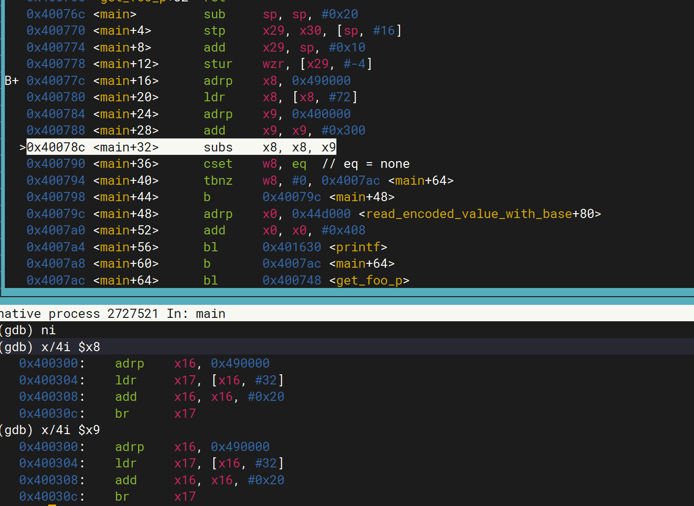

# ifunc问题分析

## 问题分析

clang构建的ifunc用例elf/ifuncmain1static，在调用到

```cpp
foo_p
get_foo_p (void)
{
  ret_foo = foo (); // foo为实际指向minus_one的ifunc
  return foo;
}

p = get_foo_p ();
if (p != foo)
  abort ();
```

函数获取foo地址的时候，get_foo_p ()获取到的地址为跳转序列的地址，与foo从got表中直接load出来的地址（即minus_one）不同

```cpp
(gdb) x/4i $x0
   0xfffff7f70550:      adrp    x16, 0xfffff7ff9000 <*ABS*@got.plt>
   0xfffff7f70554:      ldr     x17, [x16, #48]
   0xfffff7f70558:      add     x16, x16, #0x30
   0xfffff7f7055c:      br      x17
(gdb) x/4i $x20
   0xfffff7f707d0 <minus_one>:  mov     w0, #0xffffffff                 // #-1
   0xfffff7f707d4 <minus_one+4>:        ret
   0xfffff7f707d8 <zero>:       mov     w0, wzr
   0xfffff7f707dc <zero+4>:     ret
```

理论上这两个地址不同显然不影响ifunc正常调用，接下来对比下gcc和clang的默认行为，看看是不是默认差异导致

发现clang在添加-static的时候，就会由默认使用got表变成跳转序列



添加-static-pie之后就会出现got表和跳转序列混用的情况，此时就会出现用例中的地址不一致问题


而gcc在以上情况下都使用got表寻址，不会产生差异

这个现象可以用下面这个小例子复现

```cpp
#include <stdio.h>

static int
one(void)
{
    return 1;
}

void *foo_ifunc(void) __asm__("foo");
__asm__(".type foo, %gnu_indirect_function");

void *__attribute__((no_stack_protector))
foo_ifunc(void)
{
    return one;
}

extern int foo(void);

typedef int (*foo_p)(void);

foo_p get_foo_p(void)
{
    return foo;
}
foo_p foo_ptr = foo;
int main()
{
    foo_p p;
    if (foo_ptr != foo)
        printf("fail1\n");
    p = get_foo_p();
    if (p != foo)
        printf("fail\n");
    printf("foo_ptr = %p, p = %p, foo = %p\n", foo_ptr, p, foo);
    printf("foo_ptr() = %d, p = %d, foo = %d\n", (*foo_ptr)(), (*p)(), foo());
}
```

```cpp
# gcc ./ifunc.c -static-pie  -fPIE 
# ./a.out 
foo_ptr = 0xffff8b929814, p = 0xffff8b929814, foo = 0xffff8b929814
foo_ptr() = 1, p = 1, foo = 1
# clang ./ifunc.c -static-pie -fPIE
# ./a.out 
fail1
foo_ptr = 0xffff9bd1b820, p = 0xffff9bd1b4c0, foo = 0xffff9bd1b4c0
foo_ptr() = 1, p = 1, foo = 1
```

elf/ifuncmain4，同样的问题，添加-pie导致foo_ptr≠foo

```cpp
# clang ./ifunc.c -fPIE
# ./a.out 
fail1
foo_ptr = 0xffff9bd1b820, p = 0xffff9bd1b4c0, foo = 0xffff9bd1b4c0
foo_ptr() = 1, p = 1, foo = 1
```

elf/ifuncmain4static，同上-static -static-pie  导致

elf/ifuncmain6pie，同上添加-pie导致

elf/ifuncmain7 添加了 -pie -Wl,-z,relro应该是预期生成跳转序列，问题和之前相同，clang依旧是跳转序列和got取址混用

elf/ifuncmain7pic 同上，多加了个PIC

elf/ifuncmain7picstatic 同上

elf/ifuncmain7pie 同上

elf/ifuncmain7static 同上

至此所有用例分析清楚，为用例不适配llvm实现问题