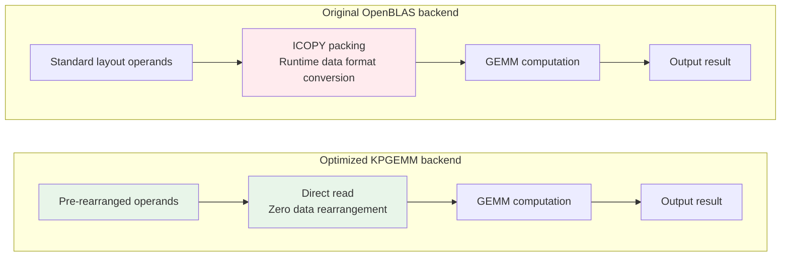

# Constant Folding

Constant folding is ANNC's end-to-end optimization scheme for General Matrix Multiplication (GEMM) operators. It comprises three parts: a front-end pre-rearrangement tool, compile-time pattern matching with operator transformation, and a tailored rearrangement-free backend. By shifting data layout transformations from runtime to compile time, it significantly reduces inference latency.

## 1 Optimization Principles

In conventional GEMM computations, high-performance libraries like OpenBLAS require input data to adopt specific blocked memory layouts to fully exploit SIMD instructions and CPU caches. This data rearrangement is typically executed at runtime, introducing additional performance overhead.

For MatMul operators containing constant operands (such as post-training fixed model parameters in inference scenarios), significant optimization headroom exists. Because constant data is fully determined at compile time, time-consuming data rearrangement operations can be shifted from runtime to compile time, thereby eliminating runtime transformation overhead.

ANNC's constant folding is tailored for this scenario and is implemented through the following architecture:

```text
┌─────────────────────────────────────────────────────────────────────────┐
│                  Compile-time (offline preprocessing)                   │
├─────────────────────────────────────────────────────────────────────────┤
│  annc-opt tool                                                          │
│                                                                         │
│  ├─ Identifies MatMul operators that contain constant operands.         |
│  ├─ Converts the constant operands of these operators from              |
|     the standard layout into the KPGEMM-optimized blocked layout.       │
│  └─ Saves the pre-rearranged model.                                     │
└──────────────────────┬──────────────────────────────────────────────────┘
                       │
                       ▼
┌─────────────────────────────────────────────────────────────────────────┐
│                    Compile-time (XLA compilation)                       │
├─────────────────────────────────────────────────────────────────────────┤
│  ANNC Flags: --layout-matmul                                            │
│                                                                         │
│  ├─ Identify MatMul operators that contain constant operands.           │
│  ├─ Transform them into a Fusion + CustomCall structure.                │
│  └─ Route the execution to the KPGEMM backend (rather than OpenBLAS).   │
└──────────────────────┬──────────────────────────────────────────────────┘
                       │
                       ▼
┌─────────────────────────────────────────────────────────────────────────┐
│                   Runtime (inference execution)                         │
├─────────────────────────────────────────────────────────────────────────┤
│  KPGEMM backend                                                         │
│                                                                         │
│  ├─ Directly reads the pre-rearranged operand data.                     │
│  ├─ Eliminates the need for runtime data transformation.                │
│  └─ Executes highly efficient GEMM computations.                        │
└─────────────────────────────────────────────────────────────────────────┘
```

**Core concept**: Shift the runtime rearrangement operations required by OpenBLAS forward to compile time via the annc-opt tool, and pair it with a tailored KPGEMM backend that directly consumes the pre-rearranged data, thereby achieving zero runtime transformation overhead.

## 2 Technical Architecture

### 2.1 Front-end Pre-rearrangement Tool (annc-opt)

Perform offline preprocessing on the TensorFlow SavedModel prior to model deployment.

```bash
annc-opt -I input_model.pb -O output_dir layout_matmul
```

Processing flow:

- **Constant operand identification**: Scan MatMul operators to identify operands of the constant type.
- **Layout transformation**: Convert the standard row/column layout of constant operands into the KPGEMM-optimized blocked layout:
  - LHS constant matrix: `(m, k)` → `(m/4, k/4, 4, 4)` 4D blocking
  - RHS constant matrix: `(k, n)` → `(n/4, k, 4)` 3D blocking
- **Boundary handling**: Follow the same boundary handling rules as OpenBLAS runtime data rearrangement to guarantee behavioral consistency with non-pre-rearranged scenarios.
- **Attribute tagging**: Append custom attribute tags to the identified and processed MatMul operators for recognition during compile-time pattern matching.
- **Model saving**: Save the rearranged constant operands and the tagged operators back into the output model.

### 2.2 Compile-Time Pattern Matching and Operator Transformation

Enable pattern matching and operator routing within the XLA compiler via the `--layout-matmul` flag.

```bash
export ANNC_FLAGS="--layout-matmul"
```

Compile-time processing flow:

- **Pattern matching**: Identify MatMul operators that meet the optimization criteria (for example, those containing constant operands).
- **Operator transformation**: Convert matched operators into a Fusion + CustomCall structure, invoking the customized matrix multiplication backend.
- **Backend routing**: Register the CustomCall with the KPGEMM backend to execute the tailored, rearrangement-free matrix multiplication at runtime.

### 2.3 KPGEMM Rearrangement-Free Backend

KPGEMM is a GEMM backend tailored by ANNC specifically for pre-rearranged data. Unlike standard OpenBLAS, KPGEMM is designed under the premise that input matrix A already adopts a specific blocked layout (generated via offline pre-rearrangement by the annc-opt tool); therefore, **it must be used in conjunction with pre-rearranged constant data**.

**Working principles:**

Standard OpenBLAS requires data packing operations at runtime to convert standard-layout matrices into optimized blocked layouts. KPGEMM is specifically designed around the characteristics of pre-rearranged data: it directly reads the pre-rearranged matrix data and bypasses the runtime ICOPY packing phase, thereby eliminating data transformation overhead.



*Note: Comparison between the original OpenBLAS backend and the optimized KPGEMM backend. The red node represents runtime data rearrangement overhead.*

## 3 Configuration and Usage

### 3.1 Complete Workflow

```bash
# Step 1: Execute offline preprocessing (compile-time).
annc-opt -I model.pb -O optimized_model layout_matmul

# Step 2: Set environment variables to enable layout-matmul optimization.
export ANNC_FLAGS="--layout-matmul"

# Step 3: Deploy the optimized model (the runtime will automatically route execution to the KPGEMM backend).
```

### 3.2 Combined Optimization

```bash
# Enable all GEMM-related optimizations (including layout-matmul).
export ANNC_FLAGS="--gemm-opt"
```

By coordinating compile-time preprocessing with a customized backend, this optimization scheme achieves zero runtime rearrangement overhead for GEMM operators with constant operands. It is particularly well-suited for deep learning serving scenarios that are highly sensitive to inference latency.
