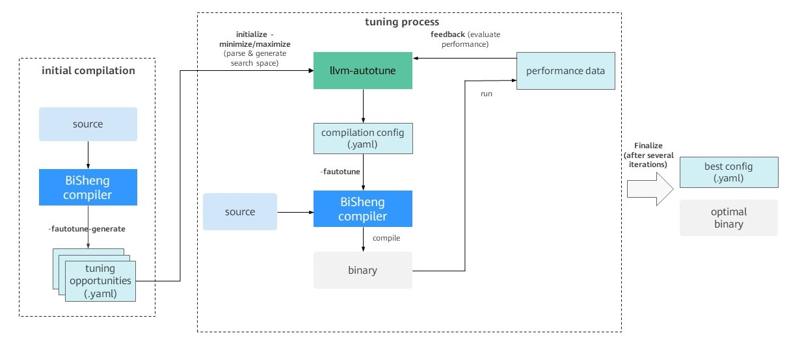

# BiSheng-Autotuner User Guide

## Introduction to BiSheng-Autotuner

[BiSheng-Autotuner](https://gitee.com/openeuler/BiSheng-Autotuner) is a command line tool based on BiSheng-OpenTuner and works with compilers (such as LLVM for openEuler and GCC for openEuler) that support tuning. It is responsible for generating search spaces, operating parameters, and driving the entire tuning process.

[BiSheng-opentuner](https://github.com/Huawei-CPLLab/bisheng-opentuner) is an open-source framework for building automatic tuners for multi-objective programs in specific domains.

This document describes the automatic tuning compilation process based on LLVM for openEuler. For automatic tuning based on GCC for openEuler, see [AI4C Usage Process](https://gitee.com/openeuler/AI4C).

## BiSheng-Autotuner Tuning Process

The tuning process (as shown in Figure 1) consists of two phases: initial compilation and tuning process.



Figure 1 BiSheng-Autotuner tuning process

### Initial Compilation

The initial compilation phase occurs before the tuning process begins. BiSheng-Autotuner first instructs the compiler to compile the target program code. During the compilation, the compiler generates YAML files that contain all tunable structures, informing developers which structures (such as modules, functions, and loops) in the target program can be used for tuning. For example, loop unrolling is one of the most common optimization methods in compilers. It replicates the loop body code multiple times to increase the instruction scheduling space and reduce the overhead of loop branch instructions. If the unroll factor is used as a tuning parameter, the compiler generates, in a YAML file, all loops that can be unrolled as tunable structures.

### Tuning Process

After the tunable structure is successfully generated, the tuning process starts.

1. BiSheng-Autotuner first reads the YAML file of the generated tunable structure to generate the corresponding search space. This includes defining the specific parameters and their ranges for each tunable code structure.

2. In the tuning process, the autotuner explores a parameter combination based on the specified search algorithm, and generates a compilation configuration file in YAML format. This file is then used by the compiler to compile the target program code and generate a binary file.

3. Finally, BiSheng-Autotuner runs the compiled file according to developer-defined methods and collects performance information as feedback.

4. After a certain number of iterations, BiSheng-Autotuner identifies the final optimal configuration, generates the optimal compilation configuration file, and stores the file in YAML format.

## Using BiSheng-Autotuner

### Environment Requirements

Mandatory:

- OS: openEuler 24.03 LTS series, openEuler 25.03, or later

- Architecture: AArch64 or x86_64

- Python 3.11.x

- SQLite 3.0

Optional:

- LibYAML: recommended for installation to improve the file parsing performance of BiSheng-Autotuner.

### Obtaining BiSheng-Autotuner

With the latest openEuler system, you can directly install the `BiSheng-Autotuner` and `clang` software packages.

```shell
yum install -y BiSheng-Autotuner
yum install -y clang
```

To build `BiSheng-Autotuner` from source code, refer to the following steps:

1. Install [BiSheng-opentuner](https://gitee.com/src-openeuler/BiSheng-opentuner/).

    ```shell
    yum install -y BiSheng-opentuner
    ```

2. Clone and install [BiSheng-Autotuner](https://gitee.com/openeuler/BiSheng-Autotuner/).

    ```shell
    cd BiSheng-Autotuner
    ./dev_install.sh
    ```

### Running BiSheng-Autotuner

This section uses CoreMark as an example to describe how to run automatic tuning. You can obtain the CoreMark source code from the [GitHub community](https://github.com/eembc/coremark). For more details about how to use llvm-autotune, refer to the [Help](# Help) section. The following is an example script for tuning CoreMark with 20 iterations:

```bash
export AUTOTUNE_DATADIR=/tmp/autotuner_data/
CompileCommand="clang -O2 -o coremark core_list_join.c core_main.c core_matrix.c core_state.c core_util.c posix/core_portme.c -DPERFORMANCE_RUN=1 -DITERATIONS=300000 -I. -Iposix -g -DFLAGS_STR=\"\""

$CompileCommand -fautotune-generate;
llvm-autotune minimize;
for i in $(seq 20)
do
  $CompileCommand -fautotune ;
  time=`{ /usr/bin/time -p ./coremark  0x0 0x0 0x66 300000; } 2>&1 | grep  "real" | awk '{print $2}'`;
  echo "iteration: " $i "cost time:" $time;
  llvm-autotune feedback $time;
done
llvm-autotune finalize;
```

The following provides step-by-step instructions:

1. Configure environment variables

    Use the environment variable `AUTOTUNE_DATADIR` to specify the directory for storing tuning-related data. The specified directory must be empty.

    ```shell
    export AUTOTUNE_DATADIR=/tmp/autotuner_data/
    ```

2. Initial compilation

    Add the compiler option `-fautotune-generate` to compile and generate tunable code structures.

    ```shell
    cd  examples/coremark/
    clang -O2 -o coremark core_list_join.c core_main.c core_matrix.c core_state.c core_util.c posix/core_portme.c -DPERFORMANCE_RUN=1 -DITERATIONS=300000 -I. -Iposix -g -DFLAGS_STR=\"\" -fautotune-generate
    ```

    > [!WARNING]Warning
    > You are advised to apply this option only to hotspot code files that require focused tuning. If it is applied to too many files (more than 500 files), a large number of tunable code structure files will be generated. This may lead to a long initialization time (which can last several minutes) in step 3, as well as issues such as an excessively large search space, less effective tuning results, and longer convergence time.

3. Tuning initialization

    Run the `llvm-autotune` command to initialize the tuning task. This step generates the initial compilation configuration for the next compilation stage.

    ```shell
    llvm-autotune minimize
    ```

    `minimize` specifies the tuning objective, aiming to minimize the target metric (e.g., program execution time). Alternatively, `maximize` can be used to maximize the target metric (e.g., program throughput).

4. Tuning compilation

    Add the BiSheng compiler option `-fautotune` to read the current `AUTOTUNE_DATADIR` configuration and perform compilation.

    ```shell
    clang -O2 -o coremark core_list_join.c core_main.c core_matrix.c core_state.c core_util.c posix/core_portme.c -DPERFORMANCE_RUN=1 -DITERATIONS=300000 -I. -Iposix -g -DFLAGS_STR=\"\" -fautotune
    ```

5. Performance feedback

    Run the program and collect performance metrics based on your requirements. Then, provide feedback using `llvm-autotune feedback`. If you want to use the CoreMark execution time as the tuning metric, use the following method:

    ```shell
    time -p ./coremark  0x0 0x0 0x66 300000  2>&1 1>/dev/null | grep real | awk '{print $2}'
    # Returns the actual execution time: 31.09
    ```

    ```shell
    llvm-autotune feedback 31.09
    ```

    > [!WARNING]Warning
    > Before using the `llvm-autotune feedback` command, you are advised to check whether the compilation in step 4 is normal and whether the compiled program runs correctly. If any compilation or runtime issues occur, enter the worst-case value corresponding to the tuning objective. For example, if the tuning objective is `minimize`, enter `llvm-autotune feedback 9999`. If the tuning objective is `maximize`, enter `0` or `-9999`.
    >
    > Incorrect performance feedback may affect the final tuning results.

6. Tuning iteration

    Based on the specified number of iterations, repeat steps 4 and 5 for tuning iteration.

7. End tuning

    After multiple iterations, end the tuning process and save the optimal configuration file. The configuration file is stored in the directory specified by the environment variable `AUTOTUNE_DATADIR`.

    ```shell
    llvm-autotune finalize
    ```

8. Final compilation

    Use the optimal configuration file obtained in step 7 to perform the final compilation. If the environment variables remain unchanged, you can directly use the `-fautotune` option:

    ```shell
    clang -O2 -o coremark core_list_join.c core_main.c core_matrix.c core_state.c core_util.c posix/core_portme.c -DPERFORMANCE_RUN=1 -DITERATIONS=300000 -I. -Iposix -g -DFLAGS_STR=\"\" -fautotune
    ```

    Alternatively, use `-mllvm -auto-tuning-input=` to directly point to the configuration file.

    ```shell
    clang -O2 -o coremark core_list_join.c core_main.c core_matrix.c core_state.c core_util.c posix/core_portme.c -DPERFORMANCE_RUN=1 -DITERATIONS=300000 -I. -Iposix -g -DFLAGS_STR=\"\" -mllvm -auto-tuning-input=/tmp/autotuner_data/config.yaml
    ```

### Help

The execution format of llvm-autotune is as follows:

```shell
llvm-autotune [-h] {minimize,maximize,feedback,dump,finalize}
```

Optional commands:

- `minimize`: Initializes tuning and generates the initial compiler configuration file, aiming to minimize the target metric (e.g., execution time).

- `maximize`: Initializes tuning and generates the initial compiler configuration file, aiming to maximize the target metric (e.g., throughput).

- `feedback`: Submits performance tuning results and generates a new compiler configuration.

- `dump`: Generates the current optimal configuration without terminating the tuning process (`feedback` can continue to be applied).

- `finalize`: Terminates the tuning process and generates the optimal compiler configuration (no further `feedback` is allowed).

### Compiler-related Options

llvm-autotune must be used in conjunction with the LLVM compiler options `-fautotune-generate` and `-fautotune`.

- `-fautotune-generate`:

    - Generates a list of tunable code structures in the `autotune_datadir` directory. The default directory can be overridden by the environment variable `AUTOTUNE_DATADIR`.

    - As the first step of the tuning preparation process, it is typically used before running the `llvm-autotune minimize/maximize` command.

    - This option can also be assigned a value to change the tuning granularity. Available values include: `Other`, `Function`, `Loop`, `CallSite`, `MachineBasicBlock`, `Switch`, `LLVMParam`, and `ProgramParam`, where `LLVMParam` and `ProgramParam` correspond to coarse-grained tuning. For example, `-fautotune-generate=Loop` enables tunable code structures only for loops, and each loop will be assigned different parameter values during tuning. `Other` indicates the global scope, where the generated tunable code structures correspond to each compilation unit (code file).

    - `-fautotune-generate` is equivalent to `-fautotune-generate=Function,Loop,CallSite` by default. The default value is generally recommended.

    - To enable option tuning (`LLVMParam` and `ProgramParam`), you need to specify an extended search space for llvm-autotune. The default search space does not contain preset tuning options.

        ```shell
        llvm-autotune minimize --search-space /usr/lib64/python<version>/site-packages/autotuner/search_space_config/extended_search_space.yaml
        ```

        The `site-packages` directory can be found using the `pip show autotuner` command.

- `-fautotune`:

    - Use the compiler configuration in `autotune_datadir` to perform tuning compilation. The default directory can be overridden by the environment variable `AUTOTUNE_DATADIR`.

    - It is typically used during the tuning iteration process, after running `llvm-autotune minimize/maximize/feedback` commands.
