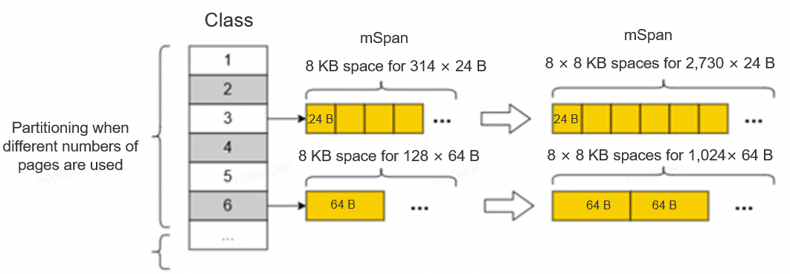

# Introduction to Go Optimization

## Overview

The Go compiler is one of the core tools of the Go programming language (also referred to as Golang), and is responsible for converting readable Go source code into machine code that can be executed by a computer. It is known for its high efficiency, simplicity, and high integration.

## New Features

| No. | Feature | Description | How to Use |
| ---- | ------- | ----------- | ---------- |
| 1  | hashmap hash-match false-positive elimination | Eliminates false positives in the short-hash fast match of hashmap. | GOARM64=v8.5,intrinsicmatchh2 |
| 2  | hashtriemap tree structure optimization | Increases the number of child nodes of hashtriemap to reduce the tree height. | GOEXPERIMENT=widetrie |
| 3  | crc32c optimization | Optimizes the ARM64 crc32c assembly (multi-way parallel CRC32CX + loop unrolling); enabled automatically at runtime via cpu.ARM64.HasCRC32. | Enabled by default |
| 4  | Step function optimization | Optimizes the implementation of the step function. | GOEXPERIMENT=stepopt |
| 5  | Revert hash-value copy | Reverts an upstream change that degrades map performance. | GOEXPERIMENT=revertcopyhashkeys |
| 6  | SSA compare-pattern optimization | Adds SSA rewrite and compare-instruction pattern rules. | -gcflags="all=-aggressivepatterns" |
| 7  | pprof PMU/BRBE sampling support | Adds PMU hardware-event sampling and BRBE branch tracing in pprof. | API/HTTP (see usage) |
| 8  | forceinline optimization | Forces inlining of subfunctions such as mallocgc. | -gcflags="all=-d forceinline=1" |
| 9  | pagesize optimization | Increases the Go heap allocation page size to 16K. | GOEXPERIMENT=pageshift14 |
| 10 | Span zero-clear on first use | Clears the whole span at once when the span is first used. | GOEXPERIMENT=clearspan |
| 11 | tinysize adjustment | Increases the tiny allocation unit from 16 to 32 bytes. | GOEXPERIMENT=tinysize |
| 12 | Configurable GC background CPU utilization | Makes the GC background target CPU utilization configurable (GOGCRATIO/100, default 25). | GOGCRATIO=25 |
| 13 | reflect read-lock fast path | Takes a read-lock fast path on reflect.FuncOf cache hits. | GOEXPERIMENT=reflectrwlock |
| 14 | Conditional-compare instruction optimization | Converts nested conditional branches into CCMP/CCMN instructions. | -gcflags="all=-ccmp_gen" |
| 15 | Enhanced LoopRotate optimization | Enhances loop rotation, keeping nested loops in place. | -gcflags="all=-aggressivelooprotate" |
| 16 | atomic optimization | Replaces the DMB barrier with an atomic operation to update freeIndexForScan. | GOEXPERIMENT=atomicvar |
| 17 | malloc prefetch optimization | Inserts a prefetch operation in the mallocgc fast path. | GOEXPERIMENT=prefetchmalloc |
| 18 | SVE instruction support | The assembler adds SVE register parsing and instruction encoding; runtime use is decided by cpu.ARM64.HasSVE. | Enabled by default (assembler) |
| 19 | []byte(string([]byte)) optimization | Converts []byte(string([]byte)) to makeslicecopy to reduce memory allocation. | -gcflags="all=-bytesstringbytesopt" |
| 20 | Optimizing the number of span pages | Increases the number of pages in a span on Kunpeng. | GOARM64=v8.2,kpmemopt |
| 21 | malloc optimization parameter printing | Prints malloc optimization parameters (pageSize, etc.) for diagnosis. | GOEXPERIMENT=mallocoptprint |
| 22 | Enhanced DSE optimization | Extends the scenarios covered by dead store elimination. | -gcflags="all=-aggressivedse" |
| 23 | memmove optimization | Optimizes memory copy with address alignment, 128-bit vector instructions, and loop unrolling. | GOEXPERIMENT=memmoveopt |
| 24 | PGO multi-level inlining | PGO inlining decides by the hotness of actual edges in the inline chain, capturing nested-call inlining benefits. | -gcflags="all=-d pgoinline=2" (requires -pgo) |
| 25 | memmove range prefetch optimization | Enables the RPRFM range-prefetch instruction on top of the memmove optimization. | GOEXPERIMENT=memmoveopt GOARM64=v8.9,rprfm |
| 26 | ARM64 LDP/STP instruction optimization | Merges consecutive LDR/STR into LDP/STP instructions. | -gcflags="all=-d aarch64ldst=all" |
| 27 | Basic-block branch-prediction reordering | Reorders basic blocks based on branch-prediction information. | -gcflags="all=-d blockpredict=2" |
| 28 | RCpc feature enablement | Enables LDAPR-series instructions for load-acquire scenarios. | GOARM64=v8.3,rcpc |
| 29 | Enhanced Prove optimization | Strengthens bound-check proving to eliminate more bound checks. | -gcflags="all=-aggressiveprove" |
| 30 | bytealg assembly ABI switch | Switches bytealg assembly from ABI0 to the ABIInternal convention. | GOARM64=v8.2,abiinternal |
| 31 | Function alignment | Sets the function alignment in bytes to optimize icache alignment. | -ldflags="all=-funcalign=32" |

## Feature Usage Description

### hashmap Hash-Match False-Positive Elimination Optimization

In hashmap, a lookup consists of two steps: short-hash match and key match, and the key match is performed only when the short-hash match succeeds. In the current open-source code, the short-hash match has a 1/128 probability of producing a false positive (returns true when it should return false). This does not cause a correctness error, but increases the number of full key comparisons. This optimization rewrites the short-hash match algorithm at the instruction level, completely eliminating false positives and improving hashmap performance.

```bash
# Perform service compilation or a singleton test.
GOARM64="v8.5,intrinsicmatchh2" GOMAXPROCS=1 go test -bench=.
```

### hashtriemap Tree Structure Optimization

In sync.hashtriemap, increasing the number of child nodes per node (from a 16-ary tree to a 128-ary tree) effectively reduces the tree height and the number of iterations when inserting, deleting, querying, or updating data.

```bash
# Perform service compilation or a singleton test.
GOEXPERIMENT="widetrie" GOMAXPROCS=1 go test -bench=HashTrieMap -v -run=^$ ./internal/sync
```

### crc32c Optimization

Optimizes the crc32c (Castagnoli polynomial) assembly implementation for the ARM64 platform, using multi-way parallel CRC32CX instructions together with loop unrolling to improve the CRC32C checksum throughput of large data blocks. This optimization is enabled by default and requires no compile options or environment variables; whether it is used is decided at runtime by cpu.ARM64.HasCRC32, and it falls back automatically on platforms without the CRC32 instruction.

```bash
# No special options needed; crc32c optimization is enabled by default.
GOMAXPROCS=1 go test -bench=BenchmarkCRC32 -v -run=^$ hash/crc32
```

### Optimizing the step Function

The `readvarint` function is executed one or two times within a loop in the step function in most cases (accounting for more than 99.9%). The one-iteration loop and two-iteration loop are discussed separately and optimized using the Load Pair (LDP) instructions.

```bash
# Perform service compilation or a singleton test.
GOEXPERIMENT="stepopt" GOMAXPROCS=1 go test -bench=BenchmarkMalloc -v -run=^$ runtime/
```

### Revert Hash-Value Copy

Reverts an upstream change that "copies the hash value of the key instead of the key itself". This change introduces performance degradation in some scenarios; reverting it restores the original map implementation performance.

```bash
# Perform service compilation or a singleton test.
GOEXPERIMENT="revertcopyhashkeys" GOMAXPROCS=1 go test -bench=BenchmarkMapAccess -v -run=^$ runtime/
```

### SSA Compare-Pattern Optimization

Adds rewrite and pattern-matching rules at the SSA level, such as comparison with zero and slice-bound patterns (SUB/SUBconst, NEG(SUB)).

```bash
# Perform service compilation.
go build -gcflags="all=-aggressivepatterns" .
```

### pprof PMU/BRBE Sampling Support

Adds support in pprof for PMU (Performance Monitoring Unit) hardware-event sampling and BRBE (Branch Record Buffer Extension) branch tracing. Profiling can be driven by CPU hardware events (such as cycles, cache-miss, etc.), and branch records can be collected for hotspot analysis. Both an API and an HTTP interface are provided.

```go
// API: start a PMU profile by hardware event (event, sampling frequency, BRBE on/off).
import "runtime/pprof"

// pprof.StartPMUProfile(w, *PMUAttr)
// ... pprof.StopPMUProfile() when finished
```

```bash
# HTTP (with import _ "net/http/pprof" in the program): collect by PMU event + BRBE branch tracing.
go tool pprof "http://localhost:6060/debug/pprof/profile?event=<event>&freq=<freq>&brbe=true&seconds=30"
```

### forceinline Optimization

Forces inlining of subfunctions such as mallocgc, eliminating function call overhead on hot paths.

```bash
# Perform service compilation.
go build -gcflags="all=-d forceinline=1" .
```

### pagesize Optimization

Increases the page size of Go heap memory allocation to 16K, improving allocation locality. Note that this feature and kpmemopt (optimizing the number of span pages) both adjust the page/span layout and are not recommended to be enabled at the same time: prefer kpmemopt on devices that support GOARM64=v9.0 (such as Kunpeng 950); otherwise use pageshift14.

```bash
# Perform service compilation or a singleton test.
GOEXPERIMENT="pageshift14" GOMAXPROCS=1 go test -bench=BenchmarkMalloc -v -run=^$ runtime/
```

### Span Zero-Clear on First Use

When a span is allocated and used for the first time, the entire span memory is cleared at once, avoiding the repeated overhead of clearing objects one by one.

```bash
# Perform service compilation or a singleton test.
GOEXPERIMENT="clearspan" GOMAXPROCS=1 go test -bench=BenchmarkMalloc -v -run=^$ runtime/
```

### tinysize Adjustment

Increases the allocation unit of the tiny allocator from 16 bytes to 32 bytes, reducing the number of span requests when allocating small objects.

```bash
# Perform service compilation or a singleton test.
GOEXPERIMENT="tinysize" GOMAXPROCS=1 go test -bench=BenchmarkMalloc -v -run=^$ runtime/
```

### Configurable GC Background CPU Utilization

Makes the GC background marking target CPU utilization (gcBackgroundUtilization, fixed at 25% upstream) configurable through an environment variable, where the value equals GOGCRATIO/100. GOGCRATIO ranges from 1 to 99, defaulting to 25. A larger value lets background GC consume more CPU and finish marking faster; a smaller value does the opposite. Note that this is a **runtime** environment variable, not a build-time option.

```bash
# Set at runtime (note: this is a runtime environment variable, not a build-time option).
GOGCRATIO=25 ./your_program
```

### reflect Read-Lock Fast Path

When the function-type cache in reflect.FuncOf hits, a read-lock (RLock) fast path is taken instead of a mutex, reducing lock contention under highly concurrent reflection calls.

```bash
# Perform service compilation or a singleton test.
GOEXPERIMENT="reflectrwlock" GOMAXPROCS=1 go test -bench=. -v -run=^$ reflect
```

### Conditional-Compare Instruction Optimization

On the ARM64 platform, nested conditional branches are converted into conditional-compare instructions (CCMP/CCMN), performing an if-conversion optimization to reduce branch mispredictions. It is recommended to use this together with function alignment (-funcalign).

```bash
# Perform service compilation.
go build -gcflags="all=-ccmp_gen" -ldflags="all=-funcalign=32" .
```

### Enhanced LoopRotate Optimization

Enhances loop rotation by keeping the basic blocks of the inner loop in the middle of the outer loop, reducing jumps between basic blocks (including keeping nested loops in place).

```bash
# Perform service compilation.
go build -gcflags="all=-aggressivelooprotate" .
```

### atomic Optimization

Uses an atomic operation instead of the DMB barrier to update freeIndexForScan, reducing synchronization overhead while preserving the memory visibility required by GC scanning. This feature is ARM64-only.

```bash
# Perform service compilation or a singleton test.
GOEXPERIMENT="atomicvar" GOMAXPROCS=1 go test -bench=BenchmarkMalloc -v -run=^$ runtime/
```

### malloc Prefetch Optimization

Inserts a prefetch operation in the mallocgc fast path to prefetch the memory addresses that will be accessed next, reducing cache misses.

```bash
# Perform service compilation or a singleton test.
GOEXPERIMENT="prefetchmalloc" GOMAXPROCS=1 go test -bench=BenchmarkMalloc -v -run=^$ runtime/
```

### SVE Instruction Support

The assembler adds support for SVE (Scalable Vector Extension) register parsing and instruction encoding, so SVE vector instructions (such as whilele, ld1h, uaddv, ptrue) can be written directly in Plan 9 assembly. This capability is compiled into the toolchain by default and needs no switch; whether the related code path runs at runtime is decided by cpu.ARM64.HasSVE, and platforms without SVE skip it automatically.

```text
This is a toolchain/assembler capability and needs no compile option; it can be used in
.s assembly files that contain SVE instructions. At runtime cpu.ARM64.HasSVE decides
whether the SVE path is taken.
```

### []byte(string([]byte)) Optimization

Recognizes the `[]byte(string([]byte))` pattern and converts it directly into a makeslicecopy call, avoiding unnecessary temporary conversions and memory allocations.

```bash
# Perform service compilation.
go build -gcflags="all=-bytesstringbytesopt" .
```

### Optimizing the Number of Span Pages

The memory page partition expansion optimization solution lies in the generation and optimization of 67 different size classes. These size classes are generated before the service code is compiled, and then are compiled in combination with the content of the runtime library and the memory manager, and finally are linked to the service code to form an executable file. When memory needs to be allocated, the memory manager determines, based on the size class information variable, the page table data volume required by an object. This effectively reduces time consumed in allocating a large quantity of small objects.



This design increases the number of objects that can be contained in a single mSpan. As shown in the preceding figure, the memory of 8,192 B can be divided into 314 free object spaces for 24 B objects, and 8 × 8,192 B can be divided into 2,730 free object spaces. In this way, the native space can accommodate multiple times of objects than before. When a large number of small objects are used, the number of times for applying for and operating an mSpan can be effectively reduced.

Option enabling: Append the `kpmemopt` suffix to `GOARM64` to enable this optimization. Building the toolchain automatically turns on `GOEXPERIMENT=pagenum`. The `GOARM64` version must be `v8.2` or later, and the optimization takes effect only on Kunpeng (Kunpeng 920/920E/950) platforms with SVE. On other platforms, it falls back to the default layout with zero impact.

```bash
# Build the toolchain with kpmemopt (GOEXPERIMENT=pagenum is enabled automatically).
GOARM64="v8.2,kpmemopt" ./make.bash

# Perform service compilation or a singleton test.
GOARM64="v8.2,kpmemopt" GOMAXPROCS=1 go test -bench=BenchmarkMalloc -v -run=^$ runtime/
```

### malloc Optimization Parameter Printing

Prints the runtime parameters of malloc-related optimizations (such as pageSize and the number of pages per span) for diagnosis and for confirming that memory optimizations take effect as expected. This feature is for diagnostic purposes, not a performance optimization, and can be left off in production builds.

```bash
# Diagnosis: print malloc optimization parameters.
GOEXPERIMENT="mallocoptprint" GOMAXPROCS=1 go test -bench=BenchmarkMalloc -v -run=^$ runtime/
```

### Enhanced DSE Optimization

Extends the scenarios covered by Dead Store Elimination (DSE), for example pointer-plus-constant-offset and store-then-load (store-to-load forwarding), eliminating more redundant stores.

```bash
# Perform service compilation.
go build -gcflags="all=-aggressivedse" .
```

### memmove Optimization

The memmove implementation is rewritten for the ARM64 platform. By aligning the copy address, using 128-bit vector instructions (FLDPQ/FSTPQ), and unrolling loops, the throughput of large memory copies is improved.

```bash
# Perform service compilation or a singleton test.
GOEXPERIMENT="memmoveopt" GOMAXPROCS=1 go test -bench=BenchmarkMemmove -v -run=^$ runtime/
```

### PGO Multi-Level Inlining

Extends the inlining strategy of PGO (Profile-Guided Optimization) to support multi-level call chains: it decides whether to inline based on the hotness of actual edges in the inline chain (such as F2→F3) rather than only the top-level call, thereby capturing the inlining benefits of nested calls. PGO must be enabled first (such as -pgo=auto) before using this option.

```bash
# Enable PGO first (such as -pgo=auto), then enable multi-level inlining.
go build -pgo=auto -gcflags="all=-d pgoinline=2" .
```

### memmove Range Prefetch Optimization

On top of the memmove optimization (memmoveopt), the RPRFM range-prefetch instruction is enabled for qualifying large copies to further reduce memory access latency. This feature must be used together with memmoveopt and requires the `GOARM64` version to be `v8.9` or later (it is disabled automatically below v8.9).

```bash
# Perform service compilation or a singleton test.
GOEXPERIMENT="memmoveopt" GOARM64="v8.9,rprfm" GOMAXPROCS=1 go test -bench=BenchmarkMemmove -v -run=^$ runtime/
```

### ARM64 LDP/STP Instruction Optimization

For consecutive memory addresses being loaded or stored, LDP/STP instructions are used to replace paired LDR/STR instructions, reducing the number of memory access instructions. Optional values: none, off, load, store, all, on.

```bash
# Perform service compilation.
go build -gcflags="all=-d aarch64ldst=all" .
```

### Basic-Block Branch-Prediction Reordering

Based on the branch attributes likely / unlikely / errorlikely, the basic blocks are reordered according to branch-prediction information to reduce jumps.

```bash
# Perform service compilation.
go build -gcflags="all=-d blockpredict=2" .
```

### RCpc Feature Enablement

For load-acquire scenarios, the LDAPR-series RCpc instructions are enabled to optimize LoadAcq operations, reducing memory access latency compared with the DMB barrier.

```bash
# Perform service compilation or a singleton test.
GOARM64="v8.3,rcpc" GOMAXPROCS=1 go test -bench=. -v -run=^$ sync/atomic
```

### Enhanced Prove Optimization

Adds extra bound-check proving rules to further prove data upper bounds and eliminate more bound checks (such as the dead bound checks in mallocgc).

```bash
# Perform service compilation.
go build -gcflags="all=-aggressiveprove" .
```

### bytealg Assembly ABI Switch

The bytealg assembly functions such as Count, IndexByte, and Index are switched from ABI0 (stack-based calling convention) to ABIInternal (register-based calling convention), reducing function call overhead.

```bash
# Perform service compilation or a singleton test.
GOARM64="v8.2,abiinternal" GOMAXPROCS=1 go test -bench=. -v -run=^$ bytes
```

### Function Alignment

Sets the function alignment in bytes (must be a power of two) to optimize instruction-cache (icache) alignment and improve function execution performance. It is often used together with the conditional-compare instruction optimization (ccmp_gen).

```bash
# Perform service compilation.
go build -ldflags="all=-funcalign=32" .
```
