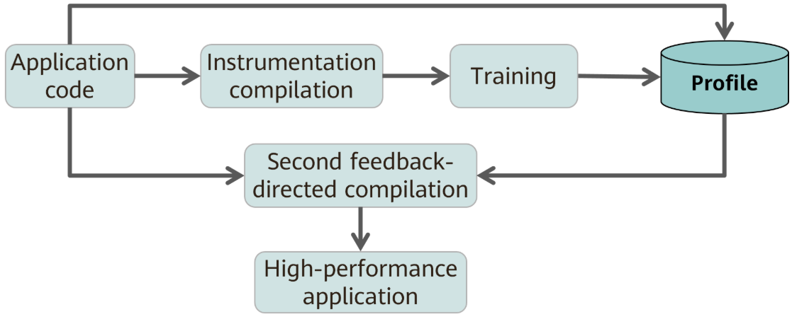
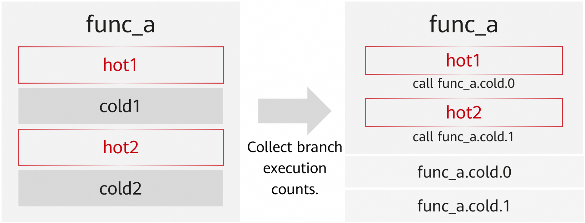
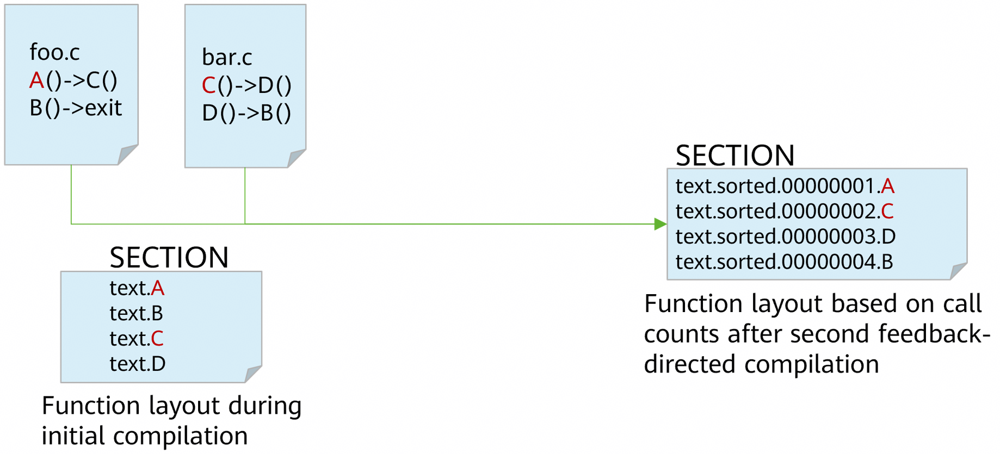
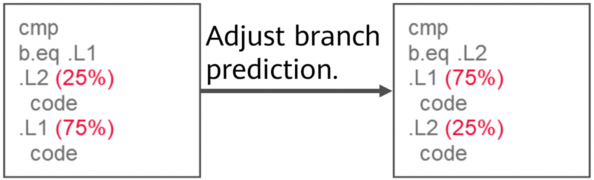
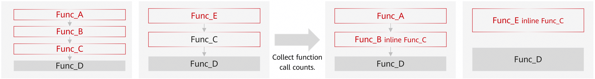
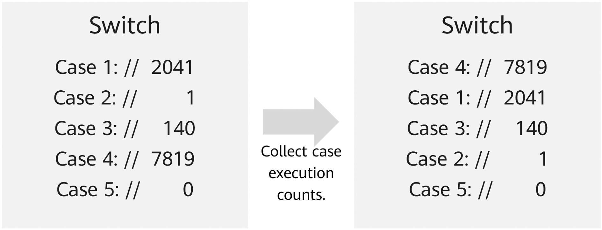

# LLVM PGO

## Introduction to PGO

Profile-guided optimization (PGO) is a compiler optimization technology. It collects performance data during program runtime and uses the data to optimize program performance during compilation. PGO requires two compilation processes. During the first compilation, PGO performs application code instrumentation. By running typical cases and services, PGO collects the number of execution times of functions and branches in the application code. During the second compilation, PGO performs further optimization based on the running statistics to generate a high-performance application. FDO technologies, such as PGO, have obvious effects in scenarios with high frontend bound, such as databases and distributed storage. The performance can be improved by 10% to 30%. It effectively reduces computing time and resource consumption, improves application performance, significantly reduces operation costs, and improves user experience.



## Optimization Principles

Traditional compilation optimization can only predict the execution behavior of programs through static program analysis and heuristic algorithms. By collecting program runtime information, PGO can accurately determine the cold, hot, and execution probability of code. In this way, PGO can efficiently optimize cold and hot partitioning, branch prediction, function rearrangement, register allocation, vectorization, and function inlining, improving the cache hit ratio, branch hit ratio, and data parallelism, and reducing the pressure on the register.

The typical optimization principles are described as follows:

1. Hot/Cold Partitioning

    Cold branches are removed to aggregate hot code and improve the cache hit ratio.

    

2. Function Rearrangement

    Code section functions are rearranged to aggregate hotspot functions and reduce iTLB and iCache miss rates.

    

3. Branch Prediction

    The branch sequence is adjusted to reduce the branch miss rate.

    

4. Function Inlining

    Feedback-based inlining: global analysis, precise inlining, optimized call stack, and better memory allocation.

    

5. Switch Optimization

    Structure branches are adjusted to reduce jumps and the branch miss rate.

    

## Optimization Effect

Database scenario: Database applications, such as MySQL and GaussDB, use LLVM LTO+PGO to improve performance by 20% to 30%.

Distributed storage: Distributed storage solutions, such as Ceph and LAVA, use LLVM LTO+PGO to improve performance by over 10%.

## How to Use

1. Add the compilation option `-fprofile-generate=$PROFILE_DATA_PATH` (`$PROFILE_DATA_PATH` indicates the path for storing sampling files) to compile the source code to obtain an executable file.

2. Give a group of representative inputs to the executable file and run the executable file for sampling. After sampling, the `xxxx.profraw` sampling file is generated in `$PROFILE_DATA_PATH`.

3. Run `cd $PROFILE_DATA_PATH` and then run the following command to process the sampling file to obtain the `.profdata` file:

    ```shell
    $LLVM_DIR/bin/llvm-profdata merge -output=foo.profdata ./*.profraw   #*$LLVM_DIR* indicates the path of compiler.
    ```

4. Add the `-fprofile-use=$PROFILE_DATA_PATH/foo.profdata` option to compile the source code to obtain the optimized executable file.

## Precautions

1. In the running phase after instrumentation, a sampling file can be generated only after a program ends normally. If you run the `kill -9` command, the sampling file cannot be generated normally.

2. If the program cannot exit normally, try the following method to generate a profile (MySQL is used as an example).

    ```shell
    echo "set height 0" > gdb.cmd
    echo "handle SIGPIPE SIGUSR1 SIGUSR2 SIG36 noprint nostop" >> gdb.cmd
    echo "call (void)__llvm_profile_write_file()" >> gdb.cmd
    echo "detach" >> gdb.cmd
    echo "q" >> gdb.cmd
    gdb -x gdb.cmd -p `pidof mysql` # **mysql** corresponds to the specific sampling process.
    ```

3. If the error message `counter overflow` is displayed when you merge profiles in step 3 in [How to Use](#how-to-use), you can add the environment variable `LLVM_PROFILE_FILE=$PROFILE_DATA_PATH/code-%p` to generate sampling files by process, reducing sampling exceptions caused by coupling between processes.
