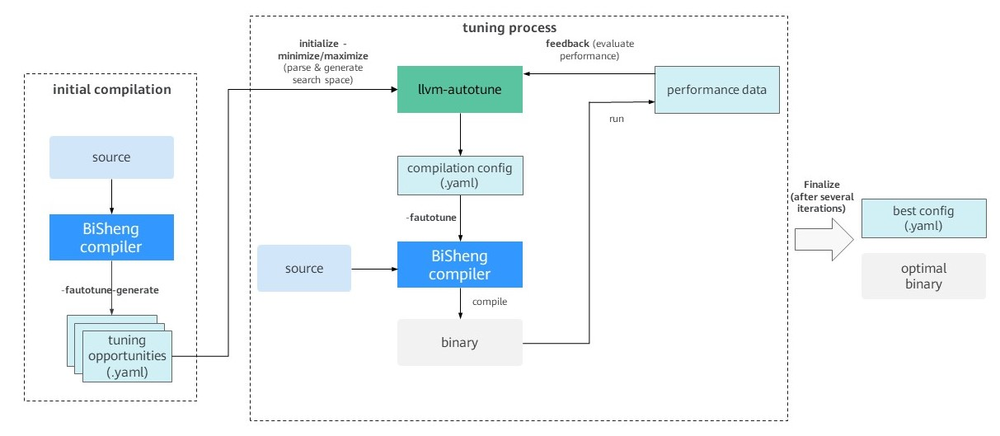

# BiSheng-Autotuner 使用手册

## BiSheng-Autotuner 介绍

[BiSheng-Autotuner](https://gitee.com/openeuler/BiSheng-Autotuner) 是一个基于 BiSheng-opentuner 的命令行工具，与支持调优的编译器（如 LLVM for openEuler、GCC for openEuler）配合使用。它负责生成搜索空间、操作参数并驱动整个调优过程。

[BiSheng-opentuner](https://github.com/Huawei-CPLLab/bisheng-opentuner) 是一个开源框架，用于构建特定领域的、多目标程序的自动调优器。

本文主要介绍基于 LLVM for openEuler 的自动调优编译流程，基于 GCC for openEuler 的自动调优请参考[AI4C 使用流程](https://gitee.com/openeuler/AI4C)。

## BiSheng-Autotuner 调优流程

调优流程（如图1所示）由两个阶段组成：初始编译阶段（initial compilation）和调优阶段（tuning process）。



图1 BiSheng-Autotuner调优流程

### 初始编译阶段

初始编译阶段发生在调优开始之前，BiSheng-Autotuner 首先会让编译器对目标程序代码做一次编译，在编译的过程中，编译器会生成一些包含所有可调优结构的 YAML 文件，告诉开发者在这个目标程序中哪些结构可以用来调优，比如模块（module）、函数（function）、循环（loop）。例如，循环展开是编译器中最常见的优化方法之一，它通过多次复制循环体代码，达到增大指令调度空间、减少循环分支指令开销的优化效果。若以循环展开次数（unroll factor）为对象进行调优，编译器会在 YAML 文件中生成所有可被循环展开的循环作为可调优结构。

### 调优阶段

当可调优结构顺利生成之后，调优阶段便会开始：

1. BiSheng-Autotuner 首先读取生成好的可调优结构的 YAML 文件，从而产生对应的搜索空间，也就是生成针对每个可调优代码结构的具体的参数和范围。

2. 调优阶段会根据设定的搜索算法尝试一组参数的值，生成一个 YAML 格式的编译配置文件（compilation config），从而让编译器编译目标程序代码产生二进制文件。

3. 最后 BiSheng-Autotuner 将编译好的文件以开发者定义的方式运行并取得性能信息作为反馈。

4. 经过一定数量的迭代之后，BiSheng-Autotuner 将找出最终的最优配置，生成最优编译配置文件，以 YAML 的形式储存。

## BiSheng-Autotuner 使用

### 环境要求

必选：

- 操作系统：openEuler 24.03 LTS 系列、openEuler 25.03 及高于 openEuler 25.03 的版本

- 架构：AArch64、x86_64

- Python 3.11.x

- SQLite 3.0

可选：

- LibYAML：推荐安装，可提升 BiSheng-Autotuner 文件解析速度

### BiSheng-Autotuner 获取

若开发者使用最新的 openEuler 系统，可以直接安装 `BiSheng-Autotuner` 和 `clang` 软件包。

```shell
yum install -y BiSheng-Autotuner
yum install -y clang
```

若需源码构建 `BiSheng-Autotuner`，可以参考以下步骤。

1. 安装 [BiSheng-opentuner](https://gitee.com/src-openeuler/BiSheng-opentuner/)

    ```shell
    yum install -y BiSheng-opentuner
    ```

2. 克隆并安装 [BiSheng-Autotuner](https://gitee.com/openeuler/BiSheng-Autotuner/)

    ```shell
    cd BiSheng-Autotuner
    ./dev_install.sh
    ```

### BiSheng-Autotuner 运行

本文将以 coremark 为示例展示如何运行自动调优，coremark 源码请从 [github 社区](https://github.com/eembc/coremark)获取。更多 llvm-autotune 的详细用法，请参阅[帮助信息](#帮助信息)章节。以下为以 20 次迭代调优 coremark 的脚本示例：

```bash
export AUTOTUNE_DATADIR=/tmp/autotuner_data/
CompileCommand="clang -O2 -o coremark core_list_join.c core_main.c core_matrix.c core_state.c core_util.c posix/core_portme.c -DPERFORMANCE_RUN=1 -DITERATIONS=300000 -I. -Iposix -g -DFLAGS_STR=\"\""

$CompileCommand -fautotune-generate;
llvm-autotune minimize;
for i in $(seq 20)
do
  $CompileCommand -fautotune ;
  time=`{ /usr/bin/time -p ./coremark  0x0 0x0 0x66 300000; } 2>&1 | grep  "real" | awk '{print $2}'`;
  echo "iteration: " $i "cost time:" $time;
  llvm-autotune feedback $time;
done
llvm-autotune finalize;
```

以下为分步说明：

1. 配置环境变量

    使用环境变量 `AUTOTUNE_DATADIR` 指定调优相关的数据的存放位置（指定目录需要为空）。

    ```shell
    export AUTOTUNE_DATADIR=/tmp/autotuner_data/
    ```

2. 初始编译步骤

    添加编译器选项 `-fautotune-generate`，编译生成可调优代码结构。

    ```shell
    cd  examples/coremark/
    clang -O2 -o coremark core_list_join.c core_main.c core_matrix.c core_state.c core_util.c posix/core_portme.c -DPERFORMANCE_RUN=1 -DITERATIONS=300000 -I. -Iposix -g -DFLAGS_STR=\"\" -fautotune-generate
    ```

    > [!WARNING]注意
    > 建议仅将此选项应用于需要重点调优的热点代码文件。若应用的代码文件过多（超过 500 个文件），则会生成数量庞大的可调优代码结构的文件，进而可能导致步骤3的初始化时间长（可长达数分钟），以及巨大的搜索空间导致的调优效果不显著、收敛时间长等问题。

3. 初始化调优

    运行 `llvm-autotune` 命令，初始化调优任务。生成最初的编译配置供下一次编译使用。

    ```shell
    llvm-autotune minimize
    ```

    `minimize` 表示调优目标，旨在最小化指标（例如程序运行时间）。也可使用 `maximize`，旨在最大化指标（例如程序吞吐量）。

4. 调优编译步骤

    添加毕昇编译器选项 `-fautotune`，读取当前 `AUTOTUNE_DATADIR` 配置并编译。

    ```shell
    clang -O2 -o coremark core_list_join.c core_main.c core_matrix.c core_state.c core_util.c posix/core_portme.c -DPERFORMANCE_RUN=1 -DITERATIONS=300000 -I. -Iposix -g -DFLAGS_STR=\"\" -fautotune
    ```

5. 性能反馈

    开发者运行程序，并根据自身需求获取性能数字，使用 `llvm-autotune feedback` 反馈。如果开发者想以 coremark 运行时间为指标进行调优，可以采用如下方式：

    ```shell
    time -p ./coremark  0x0 0x0 0x66 300000  2>&1 1>/dev/null | grep real | awk '{print $2}'
    # 返回实际执行时间 31.09
    ```

    ```shell
    llvm-autotune feedback 31.09
    ```

    > [!WARNING]注意
    > 建议在使用 `llvm-autotune feedback` 之前，先验证步骤 4 编译是否正常以及编译好的程序是否运行正确。若出现编译或者运行异常的情况，请输入相应调优目标的最差值（例如，调优目标为 minimize，可输入 `llvm-autotune feedback 9999`；maximize 可输入 0 或者 -9999）。
    >
    > 若输入的性能反馈不正确，可能会影响最终调优的结果。

6. 调优迭代

    根据开发者设定的迭代次数，重复4和5进行调优迭代。

7. 结束调优

    进行多次迭代后，开发者可选择终止调优，并保存最优的配置文件。配置文件会被保存在环境变量 `AUTOTUNE_DATADIR` 指定的目录下。

    ```shell
    llvm-autotune finalize
    ```

8. 最终编译

    使用步骤7得到最优配置文件，进行最后编译。在环境变量未改变的情况下，可直接使用 `-fautotune` 选项：

    ```shell
    clang -O2 -o coremark core_list_join.c core_main.c core_matrix.c core_state.c core_util.c posix/core_portme.c -DPERFORMANCE_RUN=1 -DITERATIONS=300000 -I. -Iposix -g -DFLAGS_STR=\"\" -fautotune
    ```

    或者使用 `-mllvm -auto-tuning-input=` 直接指向配置文件。

    ```shell
    clang -O2 -o coremark core_list_join.c core_main.c core_matrix.c core_state.c core_util.c posix/core_portme.c -DPERFORMANCE_RUN=1 -DITERATIONS=300000 -I. -Iposix -g -DFLAGS_STR=\"\" -mllvm -auto-tuning-input=/tmp/autotuner_data/config.yaml
    ```

### 帮助信息

llvm-autotune 执行格式如下所示：

```shell
llvm-autotune [-h] {minimize,maximize,feedback,dump,finalize}
```

可选指令：

- `minimize`：初始化调优并生成初始的编译器配置文件，旨在最小化指标（例如运行时间）。

- `maximize`：初始化调优并生成初始的编译器配置文件，旨在最大程度地提高指标（例如吞吐量）。

- `feedback`：反馈性能调优结果并生成新的编译器配置。

- `dump`：生成当前的最优配置，而不终止调优（可继续执行 `feedback`）。

- `finalize`：终止调优，并生成最佳的编译器配置（不可再执行 `feedback`）。

### 编译器相关选项

llvm-autotune 需要与 LLVM 编译器选项 `-fautotune-generate` 和 `-fautotune` 配合使用。

- `-fautotune-generate`：

    - 在 `autotune_datadir` 目录下生成可调优的代码结构列表，此默认目录可由环境变量 `AUTOTUNE_DATADIR` 改写。

    - 作为调优准备工作的第一步，通常需要在 `llvm-autotune minimize/maximize` 命令执行前使用。

    - 此选项还可以赋值来改变调优的颗粒度（可选值为`Other`、`Function`、`Loop`、`CallSite`、`MachineBasicBlock`、`Switch`、`LLVMParam`、`ProgramParam`，其中 `LLVMParam` 和 `ProgramParam` 对应粗粒度选项调优）。例如 `-fautotune-generate=Loop` 会开启类型仅为循环的可调优代码结构，每个循环在调优过程中会被赋予不同的参数值；而 `Other` 表示全局，生成的可调优代码结构对应每个编译单元（代码文件）。

    - `-fautotune-generate`默认等效于`-fautotune-generate=Function,Loop,CallSite`。通常建议使用默认值。

    - 若要启用选项调优（`LLVMParam`和`ProgramParam`），需要为 llvm-autotune 指定拓展搜索空间，默认的搜索空间不包含预设调优选项。

        ```shell
        llvm-autotune minimize --search-space /usr/lib64/python<version>/site-packages/autotuner/search_space_config/extended_search_space.yaml
        ```

        `site-packages`目录可以通过 `pip show autotuner` 指令找到。

- `-fautotune`：

    - 使用`autotune_datadir`下的编译器配置进行调优编译（此默认目录可由环境变量`AUTOTUNE_DATADIR`改写）。

    - 通常在调优迭代过程中，`llvm-autotune minimize/maximize/feedback` 命令之后使用。
