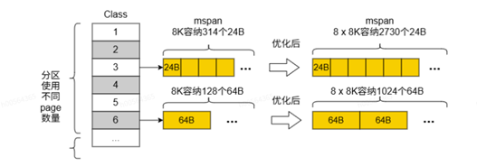

# Go优化介绍

## 介绍

GO编译器是Go语言（又称Golang）的核心工具之一，负责将可读的Go源代码转换为计算机可以执行的机器码。它以高效、简洁和集成度高而著称。

## 新增特性列表

| 序号 | 特性名称               | 描述                       | 使用说明                          |
|----|--------------------|--------------------------|-------------------------------|
| 1  | span page数量优化      | 增加span中page数量            | GOEXPERIMENT=pagenum          |
| 2  | step优化方案2          | 优化step函数的实现              | GOEXPERIMENT=stepopt2         |
| 3  | hashtriemap树结构优化   | 扩大hashtriemap的子节点数量，降低树高 | GOEXPERIMENT=widetrie         |
| 4  | hashmap哈希匹配假阳性消除优化 | 消除hashmap短哈希快速匹配时的假阳性现象  | GOARM64=v8.5,intrinsicmatchh2 |

## 特性使用说明

### span page数量优化

内存页分区扩展优化方案的核心在于67种不同sizeclasses的生成与优化。这些sizeclasses在编译业务代码之前生成，随后与runtime库和内存管理器的内容结合进行编译，最终与业务代码链接形成执行文件。当需要分配内存时，内存管理器会依据sizeclasses信息变量，确定对象所需的页表数据量，从而有效减少在大量小对象分配上的耗时。



该设计的改进，扩大了单个mspn可以容纳的对象个数，如上图所示，对于24B的对象类型，从8192B中可划分出314个24B空闲对象，而从8 * 8192B中可划分出高达2730个空闲的对象空间，比原生空间扩展多倍。在大量的使用小对象的场景下，能够有效的减少申请和操作mspn的次数。

选项使能：在编译业务时通过参数进行开关控制。

```bash
# 进行业务编译或单例测试
GOEXPERIMENT="pagenum" GOMAXPROCS=1 go test -bench=BenchmarkMalloc -v -run=^$ runtime/
```

### step函数优化

step中的readvarint函数，循环次数集中在1次到2次（占比超99.9%），针对此现象对循环进行展开，讨论1次循环和2次循环的场景，并使用ldp指令优化读取。

```bash
# 进行业务编译或单例测试
GOEXPERIMENT="stepopt2" GOMAXPROCS=1 go test -bench=BenchmarkMalloc -v -run=^$ runtime/
```

### hashtriemap树结构优化

在sync.hashtriemap中，增加每个节点的子节点数（由16叉树变更为128叉树），可有效降低树高，减少增删查改数据时的循环次数。

```bash
# 进行业务编译或单例测试
GOEXPERIMENT="widetrie" GOMAXPROCS=1 go test -bench=HashTrieMap -v -run=^$ ./internal/sync
```

### hashmap哈希匹配假阳性消除优化

在hashmap中，lookup分为短哈希匹配和key匹配两步，当且仅当短哈希匹配时才会进行key匹配。当前开源代码中，短哈希匹配有1/128的概率出现假阳性（应当返回false，实际返回true），该现象不会导致正确性错误，但会导致完整key比较次数增加。此优化通过指令层面的重写，优化了短哈希匹配算法，彻底消除了假阳性现象，可提升hashmap的性能。

```bash
# 进行业务编译或单例测试
GOARM64="v8.5,intrinsicmatchh2" GOMAXPROCS=1 go test -bench=.
```
