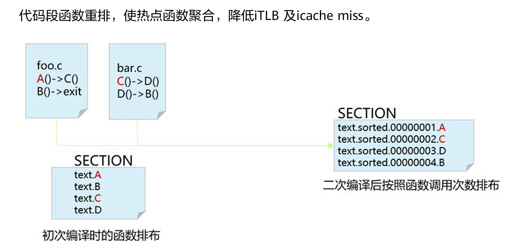

# LLVM 反馈优化用户指南

## PGO 简介

PGO （Profile-Guided Optimization）是一种编译器优化技术。它通过在程序运行时收集性能数据，并在编译阶段使用这些数据来优化程序的性能。PGO 需要两次编译过程，第一次编译时在应用代码中插桩，通过运行典型用例和业务，收集应用代码中函数及分支的执行次数信息，第二次编译时根据运行统计信息近一步优化，生成高性能应用。PGO 等反馈优化技术在数据库、分布式存储等数据和计算密集型等前端瓶颈较高的场景效果显著，性能可提升 10%~30%。它能够有效减少计算时间和资源消耗，提升应用性能，显著降低运营成本并提高用户体验。


## 优化原理

传统编译优化只能通过静态的程序分析及启发式算法预测程序的执行行为。PGO 通过采集程序运行时信息，可以精准的判断代码的冷热、执行的概率，从而完成高效的冷热分区、分支预测、函数重排、寄存器分配、向量化、函数内联等优化，提升 cache 命中率、分支命中率和数据并行度，减少寄存器压力。

典型优化原理说明如下：

1. 冷热分区

    剥离冷分支，使热点代码聚合，提升 cache 命中率。

    

2. 函数重排

    代码段函数重排，使热点函数聚合，降低 iTLB 及 icache miss。

    

3. 分支预测

    调整分支顺序，降低 branch miss 率。

    

4. 函数内联

    基于反馈的 inline：全局分析，精准内联，优化调用栈，内存排布更优。

    

5. switch优化

    结构分支调整，减少跳转，降低 branch miss 率。

    

## 优化效果

数据库场景： MySQL、GaussDB 等数据库应用，使用 LLVM LTO+PGO 优化，性能提升 20%~30%。

分布式存储：Ceph、LAVA 等分布式存储解决方案，使用 LLVM LTO+PGO 优化，性能提升 10%+。

## 使用方法

1. 增加编译选项 `-fprofile-generate=$PROFILE_DATA_PATH`（`$PROFILE_DATA_PATH` 为用于存放采样文件的路径）编译源码得到可执行文件。

2. 给可执行文件一组有代表性的输入，并运行可执行文件进行采样，采样后在 `$PROFILE_DATA_PATH` 路径下会得到 `xxxx.profraw` 采样文件。

3. `cd $PROFILE_DATA_PATH` ，使用下述命令处理采样文件，得到优化指导文件（`.profdata`）：

    ```shell
    $LLVM_DIR/bin/llvm-profdata merge -output=foo.profdata ./*.profraw   #$LLVM_DIR表示编译器路径
    ```

4. 增加选项 `-fprofile-use=$PROFILE_DATA_PATH/foo.profdata` 编译源码得到优化后的可执行文件。

## 注意事项

1. 插桩之后的运行阶段，程序需要正常结束才能正常生成采样文件，直接 `kill -9` 不能正常生成采样文件。

2. 如果程序无法正常退出，可以尝试以下方法生成 profile。（以 MySQL 为例）

    ```shell
    echo "set height 0" > gdb.cmd
    echo "handle SIGPIPE SIGUSR1 SIGUSR2 SIG36 noprint nostop" >> gdb.cmd
    echo "call (void)__llvm_profile_write_file()" >> gdb.cmd
    echo "detach" >> gdb.cmd
    echo "q" >> gdb.cmd
    gdb -x gdb.cmd -p `pidof mysql` # mysql 对应具体采样进程
    ```

3. 在[使用方法](#使用方法)步骤 3 中 merge profile 时，如果出现 `counter overflow` 的错误提示，可以通过增加环境变量 `LLVM_PROFILE_FILE=$PROFILE_DATA_PATH/code-%p`，按照每个进程生成采样文件，减少进程间耦合导致采样异常的问题。
